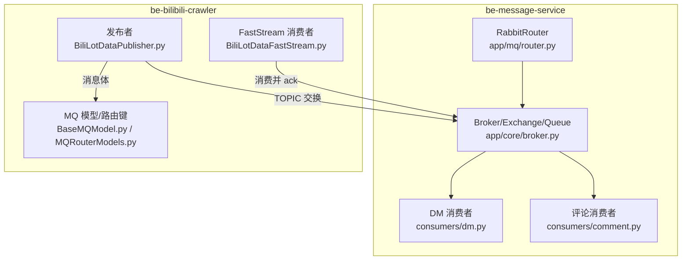
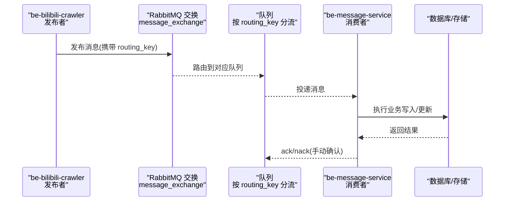
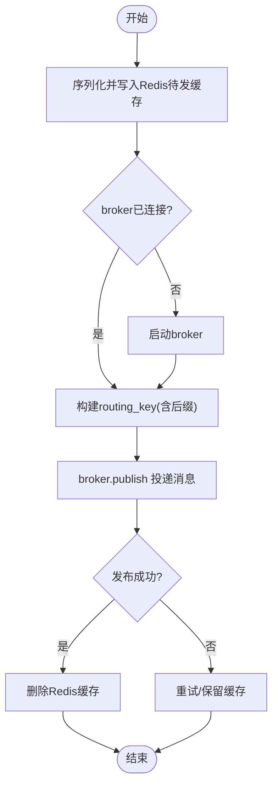
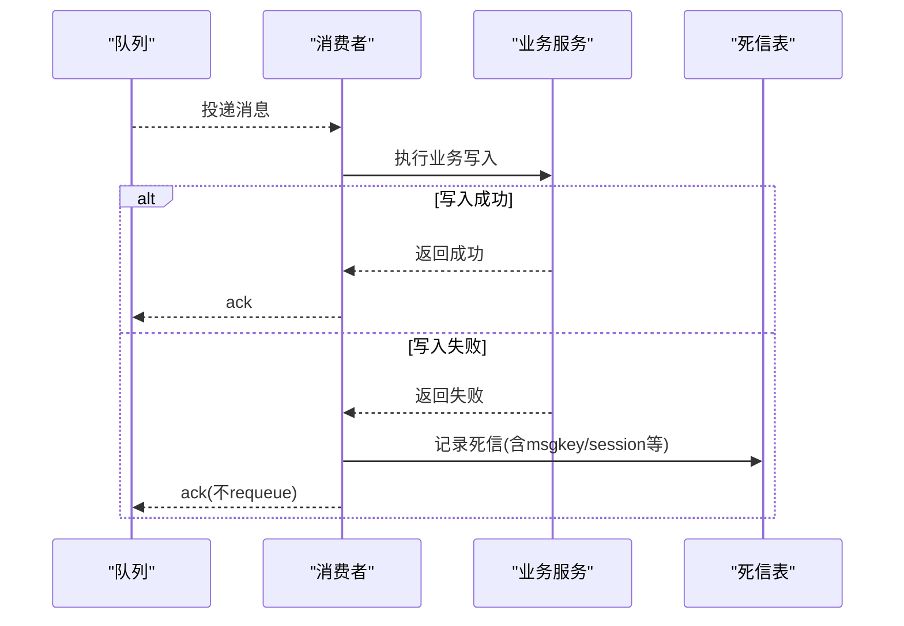
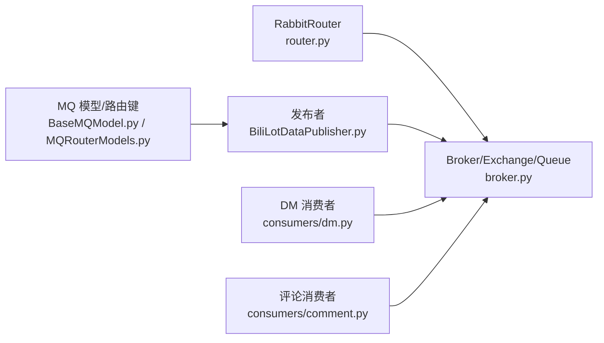

# 消息队列处理

<cite>
**本文引用的文件**
- [be-message-service/app/mq/router.py](file://be-message-service/app/mq/router.py)
- [be-message-service/app/core/broker.py](file://be-message-service/app/core/broker.py)
- [be-message-service/app/mq/consumers/dm.py](file://be-message-service/app/mq/consumers/dm.py)
- [be-message-service/app/consumers/dm.py](file://be-message-service/app/consumers/dm.py)
- [be-message-service/app/mq/consumers/comment.py](file://be-message-service/app/mq/consumers/comment.py)
- [be-message-service/app/consumers/retry.py](file://be-message-service/app/consumers/retry.py)
- [be-bilibili-crawler/Service/MQ/base/MQClient/BiliLotDataPublisher.py](file://be-bilibili-crawler/Service/MQ/base/MQClient/BiliLotDataPublisher.py)
- [be-bilibili-crawler/Models/MQ/BaseMQModel.py](file://be-bilibili-crawler/Models/MQ/BaseMQModel.py)
- [be-bilibili-crawler/Models/MQ/MQRouterModels.py](file://be-bilibili-crawler/Models/MQ/MQRouterModels.py)
- [be-bilibili-crawler/Service/MQ/base/MQClient/BiliLotDataFastStream.py](file://be-bilibili-crawler/Service/MQ/base/MQClient/BiliLotDataFastStream.py)
- [be-bilibili-crawler/Models/MQ/UpsertLotDataModel.py](file://be-bilibili-crawler/Models/MQ/UpsertLotDataModel.py)
- [be-bilibili-crawler/test/test_mq.py](file://be-bilibili-crawler/test/test_mq.py)
- [be-message-service/tests/test_phase_c_scheduler.py](file://be-message-service/tests/test_phase_c_scheduler.py)
</cite>

## 目录
1. [简介](#简介)
2. [项目结构](#项目结构)
3. [核心组件](#核心组件)
4. [架构总览](#架构总览)
5. [详细组件分析](#详细组件分析)
6. [依赖关系分析](#依赖关系分析)
7. [性能考量](#性能考量)
8. [故障排查指南](#故障排查指南)
9. [结论](#结论)
10. [附录](#附录)

## 简介
本文件面向 BilibiliExplosion 项目的消息队列子系统，系统性阐述基于 RabbitMQ 的消息系统设计：生产者、消费者与路由器的实现原理；消息模型定义（格式规范、序列化方式、版本兼容策略）；消息处理流程（接收、业务处理、结果返回、错误处理）；可靠性保障机制（确认机制、重试策略、死信队列、消息去重）；以及配置示例与最佳实践。文档同时覆盖 be-message-service（站内消息与通用 MQ 能力）与 be-bilibili-crawler（抽奖数据入库等场景）两大服务中的 MQ 实现。

## 项目结构
- be-message-service
  - 统一 broker 生命周期管理（RabbitRouter）、共享 exchange/queue 定义、按 routing_key 分流的 TOPIC 模式。
  - 消费者集中在 app/mq/consumers，通过 router.subscriber 注册，使用 MANUAL ack。
  - 提供私信内容异步落库、评论备用通道、用户注销、互动统计等专用队列。
- be-bilibili-crawler
  - 统一的发布器封装 publisher_producer，结合 Redis 待发缓存与重试。
  - 多种 MQ 模型与路由键枚举，支撑不同目标数据库的入库任务。
  - FastStream 消费者类，统一异常处理与 ack/nack 策略。

图表来源
- [be-message-service/app/mq/router.py:1-57](file://be-message-service/app/mq/router.py#L1-L57)
- [be-message-service/app/core/broker.py:1-125](file://be-message-service/app/core/broker.py#L1-L125)
- [be-bilibili-crawler/Service/MQ/base/MQClient/BiliLotDataPublisher.py:1-374](file://be-bilibili-crawler/Service/MQ/base/MQClient/BiliLotDataPublisher.py#L1-L374)
- [be-bilibili-crawler/Models/MQ/BaseMQModel.py:1-74](file://be-bilibili-crawler/Models/MQ/BaseMQModel.py#L1-L74)
- [be-bilibili-crawler/Models/MQ/MQRouterModels.py:1-37](file://be-bilibili-crawler/Models/MQ/MQRouterModels.py#L1-L37)
- [be-bilibili-crawler/Service/MQ/base/MQClient/BiliLotDataFastStream.py:1-332](file://be-bilibili-crawler/Service/MQ/base/MQClient/BiliLotDataFastStream.py#L1-L332)

章节来源
- [be-message-service/app/mq/router.py:1-57](file://be-message-service/app/mq/router.py#L1-L57)
- [be-message-service/app/core/broker.py:1-125](file://be-message-service/app/core/broker.py#L1-L125)
- [be-bilibili-crawler/Service/MQ/base/MQClient/BiliLotDataPublisher.py:1-374](file://be-bilibili-crawler/Service/MQ/base/MQClient/BiliLotDataPublisher.py#L1-L374)

## 核心组件
- 路由器与 Broker
  - RabbitRouter 统一管理 broker 生命周期，启动时连接 MQ，关闭时断开连接；after_startup/on_broker_shutdown 钩子用于调度器启停。
  - 单一 broker 实例被 HTTP 接口、RPC、健康检查与消费者复用，避免多连接开销。
- Exchange/Queue 与 Routing Key
  - 全局 TOPIC 交换 message_exchange，按 routing_key 分流到独立队列，确保链路解耦与隔离。
  - 关键队列：message.push（外部推送）、message.dm.content（私信内容落库）、评论三类备用队列、用户注销队列、互动统计队列。
- 发布者
  - publisher_producer 将消息写入 Redis 待发缓存，再经 broker.publish 投递；成功后清理缓存；支持 extra_routing_key 拼接。
  - 批量封装方法针对不同业务场景（如抽奖数据入库、凭证校验等）。
- 消费者
  - 采用 MANUAL ack 策略，成功写库后 ack；失败路径不 requeue，转死信表或记录日志，避免坏消息无限循环。
  - 统一重试计数工具从 x-death 头读取重投次数，超过阈值丢弃并告警。

章节来源
- [be-message-service/app/mq/router.py:1-57](file://be-message-service/app/mq/router.py#L1-L57)
- [be-message-service/app/core/broker.py:1-125](file://be-message-service/app/core/broker.py#L1-L125)
- [be-bilibili-crawler/Service/MQ/base/MQClient/BiliLotDataPublisher.py:1-374](file://be-bilibili-crawler/Service/MQ/base/MQClient/BiliLotDataPublisher.py#L1-L374)
- [be-message-service/app/consumers/retry.py:1-30](file://be-message-service/app/consumers/retry.py#L1-L30)

## 架构总览
系统采用“生产者 → TOPIC 交换 → 路由键 → 独立队列 → 消费者”的经典模式。be-bilibili-crawler 作为主要生产者，be-message-service 作为主要消费者与消息中枢。两者通过共享的 exchange 与明确的 routing_key 约定进行通信。

图表来源
- [be-message-service/app/core/broker.py:1-125](file://be-message-service/app/core/broker.py#L1-L125)
- [be-bilibili-crawler/Service/MQ/base/MQClient/BiliLotDataPublisher.py:1-374](file://be-bilibili-crawler/Service/MQ/base/MQClient/BiliLotDataPublisher.py#L1-L374)
- [be-message-service/app/mq/consumers/dm.py:1-25](file://be-message-service/app/mq/consumers/dm.py#L1-L25)

## 详细组件分析

### 路由器与 Broker（be-message-service）
- 职责
  - 创建 RabbitRouter，设置日志级别，暴露 broker 供其他模块复用。
  - 在 after_startup 启动定时任务，on_broker_shutdown 停止定时任务，保证资源安全释放。
- 关键点
  - 所有消费者与 HTTP/RPC 共用同一 broker 实例，减少连接数与内存占用。
  - 健康检查与连通性探测也复用该 broker。

章节来源
- [be-message-service/app/mq/router.py:1-57](file://be-message-service/app/mq/router.py#L1-L57)

### 消息模型与路由键（be-bilibili-crawler）
- 模型定义
  - 使用 Pydantic 模型定义消息体，支持类型校验与序列化/反序列化。
  - 自定义基础模型对大整数进行字符串化，避免前端精度丢失。
- 路由键与队列
  - 集中枚举 QueueName、RoutingKey、ExchangeName，便于统一管理与扩展。
  - MQPropBase 动态生成 RabbitQueue，支持 get_publish_routing_key 拼接后缀。
- 兼容性策略
  - 通过 extra_fields 允许扩展字段，向后兼容新增字段。
  - 测试用例验证 model_dump/model_validate 往返一致性，确保序列化稳定。

章节来源
- [be-bilibili-crawler/Models/MQ/BaseMQModel.py:1-74](file://be-bilibili-crawler/Models/MQ/BaseMQModel.py#L1-L74)
- [be-bilibili-crawler/Models/MQ/MQRouterModels.py:1-37](file://be-bilibili-crawler/Models/MQ/MQRouterModels.py#L1-L37)
- [be-bilibili-crawler/Models/MQ/UpsertLotDataModel.py:1-31](file://be-bilibili-crawler/Models/MQ/UpsertLotDataModel.py#L1-L31)
- [be-bilibili-crawler/test/test_mq.py:41-75](file://be-bilibili-crawler/test/test_mq.py#L41-L75)

### 发布者与待发缓存（be-bilibili-crawler）
- 发布流程
  - 序列化消息为 CachedMessage 并写入 Redis 待发缓存。
  - 获取 broker，若未连接则启动；计算完整 routing_key（含可选后缀）。
  - 调用 broker.publish 投递消息；成功后删除缓存。
- 重试与恢复
  - 提供 retry_pending_messages 扫描 Redis 中待发消息并重试发送。
  - 对外暴露多个业务发布方法，统一包装 @_mq_retry_wrapper。

图表来源
- [be-bilibili-crawler/Service/MQ/base/MQClient/BiliLotDataPublisher.py:1-374](file://be-bilibili-crawler/Service/MQ/base/MQClient/BiliLotDataPublisher.py#L1-L374)

章节来源
- [be-bilibili-crawler/Service/MQ/base/MQClient/BiliLotDataPublisher.py:1-374](file://be-bilibili-crawler/Service/MQ/base/MQClient/BiliLotDataPublisher.py#L1-L374)

### 消费者与处理流程（be-message-service）
- 私信内容消费者
  - 订阅 dm_content_queue，使用 MANUAL ack。
  - 调用 DmContentService.write 写入分库分表；成功标记 content_ready；失败写入死信表并 ack，避免阻塞。
- 评论备用消费者
  - 分别订阅通知、审核、计数三类队列，均使用 MANUAL ack，handler 内做防御式 ack/nack。
- 重试计数
  - 从 x-death 头读取重投次数，超过默认上限丢弃并记录错误，防止死循环。

图表来源
- [be-message-service/app/mq/consumers/dm.py:1-25](file://be-message-service/app/mq/consumers/dm.py#L1-L25)
- [be-message-service/app/consumers/dm.py:1-54](file://be-message-service/app/consumers/dm.py#L1-L54)
- [be-message-service/app/mq/consumers/comment.py:1-58](file://be-message-service/app/mq/consumers/comment.py#L1-L58)
- [be-message-service/app/consumers/retry.py:1-30](file://be-message-service/app/consumers/retry.py#L1-L30)

章节来源
- [be-message-service/app/mq/consumers/dm.py:1-25](file://be-message-service/app/mq/consumers/dm.py#L1-L25)
- [be-message-service/app/consumers/dm.py:1-54](file://be-message-service/app/consumers/dm.py#L1-L54)
- [be-message-service/app/mq/consumers/comment.py:1-58](file://be-message-service/app/mq/consumers/comment.py#L1-L58)
- [be-message-service/app/consumers/retry.py:1-30](file://be-message-service/app/consumers/retry.py#L1-L30)

### 消费者与处理流程（be-bilibili-crawler）
- 多类消费者
  - OfficialReserveChargeLot、UpsertOfficialReserveChargeLot、UpsertLotDataByDynamicId、UpsertTopicLot、UpsertMilvusBiliLotData、UpsertBiliAtari、BiliVoucher 等。
- 统一异常处理
  - handle_exception 记录日志、推送告警、执行 nack，避免消息丢失。
- 并发控制
  - 针对 Milvus 高并发场景使用全局锁串行化处理，避免崩溃。

章节来源
- [be-bilibili-crawler/Service/MQ/base/MQClient/BiliLotDataFastStream.py:1-332](file://be-bilibili-crawler/Service/MQ/base/MQClient/BiliLotDataFastStream.py#L1-L332)

## 依赖关系分析
- 模块耦合
  - be-message-service 的 router 与 broker 被各消费者与 HTTP/RPC 复用，降低耦合度。
  - be-bilibili-crawler 的发布者通过 MQPropBase 与路由键枚举解耦具体队列细节。
- 外部依赖
  - RabbitMQ（broker/exchange/queue）、Redis（待发缓存）、数据库（分库分表、死信表）。
- 潜在风险
  - 循环导入：router 与 broker 通过 lazy import 规避。
  - 连接泄漏：统一由 router lifespan 管理 broker 生命周期。

图表来源
- [be-message-service/app/mq/router.py:1-57](file://be-message-service/app/mq/router.py#L1-L57)
- [be-message-service/app/core/broker.py:1-125](file://be-message-service/app/core/broker.py#L1-L125)
- [be-bilibili-crawler/Service/MQ/base/MQClient/BiliLotDataPublisher.py:1-374](file://be-bilibili-crawler/Service/MQ/base/MQClient/BiliLotDataPublisher.py#L1-L374)
- [be-bilibili-crawler/Models/MQ/BaseMQModel.py:1-74](file://be-bilibili-crawler/Models/MQ/BaseMQModel.py#L1-L74)
- [be-bilibili-crawler/Models/MQ/MQRouterModels.py:1-37](file://be-bilibili-crawler/Models/MQ/MQRouterModels.py#L1-L37)

章节来源
- [be-message-service/app/mq/router.py:1-57](file://be-message-service/app/mq/router.py#L1-L57)
- [be-message-service/app/core/broker.py:1-125](file://be-message-service/app/core/broker.py#L1-L125)
- [be-bilibili-crawler/Service/MQ/base/MQClient/BiliLotDataPublisher.py:1-374](file://be-bilibili-crawler/Service/MQ/base/MQClient/BiliLotDataPublisher.py#L1-L374)

## 性能考量
- 连接复用
  - 单一 broker 实例被多模块复用，减少连接数与内存占用。
- 队列隔离
  - 按业务拆分队列，避免热点消息互相影响。
- 确认机制
  - MANUAL ack 确保业务完成后再确认，提高可靠性。
- 重试与死信
  - 基于 x-death 的重试计数与死信表补偿，避免无限重投与数据丢失。
- 并发控制
  - 在高并发写场景（如向量库写入）使用全局锁串行化，避免下游压力过大。

[本节为通用指导，无需特定文件来源]

## 故障排查指南
- 常见问题
  - 消息未消费：检查路由键与队列绑定是否正确；确认消费者是否订阅对应队列。
  - 无限重试：检查 x-death 头与重试上限；确认 handler 是否正确 ack/nack。
  - 死信堆积：检查死信表记录与补偿任务；必要时人工介入修复脏数据。
- 定位手段
  - 查看消费者日志与告警信息；核对 Redis 待发缓存与 broker 连接状态。
  - 使用测试端点与单元测试验证发布/消费链路。

章节来源
- [be-message-service/tests/test_phase_c_scheduler.py:149-159](file://be-message-service/tests/test_phase_c_scheduler.py#L149-L159)
- [be-bilibili-crawler/test/test_mq.py:294-365](file://be-bilibili-crawler/test/test_mq.py#L294-L365)

## 结论
本项目通过统一的 RabbitMQ 路由器与共享 exchange/queue 设计，实现了生产者和消费者的解耦与可扩展性。be-message-service 提供稳定的消息中枢与消费者能力，be-bilibili-crawler 提供健壮的发布器与模型定义。结合 MANUAL ack、重试计数、死信表与待发缓存，系统在可靠性与性能之间取得良好平衡。建议在生产环境中持续监控队列积压、重试次数与死信量，并结合业务特性调整队列容量与消费者并发。

[本节为总结性内容，无需特定文件来源]

## 附录
- 配置示例与最佳实践
  - 使用 TOPIC 交换与明确 routing_key，避免通配符滥用导致消息误收。
  - 为关键链路启用持久化队列与交换，提升容灾能力。
  - 合理设置 prefetch_count 与消费者并发，避免过载。
  - 定期清理 Redis 待发缓存与死信表，避免资源膨胀。
  - 对敏感业务增加幂等校验与去重逻辑（如基于 msgkey 的去重）。

[本节为通用指导，无需特定文件来源]