# RESTful API 通信

<cite>
**本文引用的文件**
- [be-bilibili-crawler/ApiRoutes/__init__.py](file://be-bilibili-crawler/ApiRoutes/__init__.py)
- [RPA-Browser/app/routes.py](file://RPA-Browser/app/routes.py)
- [be-gateway/ExpressServerEnd/MiddleWare/Limiter.js](file://be-gateway/ExpressServerEnd/MiddleWare/Limiter.js)
- [be-gateway/ExpressServerEnd/Service/user_permission_module/JwtModule.js](file://be-gateway/ExpressServerEnd/Service/user_permission_module/JwtModule.js)
- [be-gateway/ExpressServerEnd/app.js](file://be-gateway/ExpressServerEnd/app.js)
- [be-gateway/ExpressServerEnd/config/config.yml](file://be-gateway/ExpressServerEnd/config/config.yml)
- [be-message-service/app/services/infrastructure/jwt_service.py](file://be-message-service/app/services/infrastructure/jwt_service.py)
- [docs/_archive/response-code-design.md](file://docs/_archive/response-code-design.md)
- [Vue3FrontEndDemoExercise/src/api/bili_lottery_data/hey-api/types.gen.ts](file://Vue3FrontEndDemoExercise/src/api/bili_lottery_data/hey-api/types.gen.ts)
</cite>

## 目录
1. [简介](#简介)
2. [项目结构](#项目结构)
3. [核心组件](#核心组件)
4. [架构总览](#架构总览)
5. [详细组件分析](#详细组件分析)
6. [依赖关系分析](#依赖关系分析)
7. [性能考量](#性能考量)
8. [故障排查指南](#故障排查指南)
9. [结论](#结论)
10. [附录](#附录)

## 简介
本文件面向 BilibiliExplosion 项目的 RESTful API 通信机制，聚焦以下目标：
- 基于 HTTP 的 API 设计原则：资源命名、HTTP 方法、状态码与统一响应体。
- API 网关路由转发：负载均衡、请求拦截、响应转换与错误映射。
- 认证授权：JWT 令牌验证、权限控制、访问日志。
- API 版本管理：向后兼容与废弃接口策略。
- 文档生成、测试策略与性能监控方案。
- 常见 API 设计模式与最佳实践。

## 项目结构
本项目采用多服务协作的网关化架构：
- be-gateway（Node/Express）：统一入口，负责鉴权、限流、跨域、超时、上游健康检查、错误映射与路由转发。
- RPA-Browser（FastAPI）：浏览器自动化与执行控制相关 API，集中注册路由与异常处理器。
- be-bilibili-crawler（FastAPI）：爬虫与数据服务，提供 V1 版本化的 API 路由前缀与标签。
- be-message-service（FastAPI）：消息推送与用户相关能力，包含 JWT 签发服务。
- Vue3 前端：通过 SDK/类型定义消费后端 API，并遵循统一的响应契约。

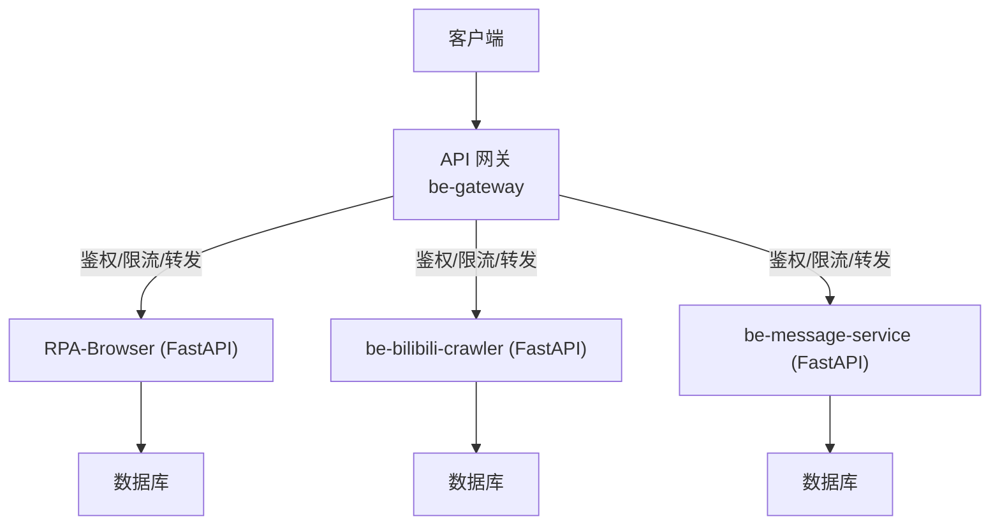

**图表来源**
- [be-gateway/ExpressServerEnd/app.js:33-117](file://be-gateway/ExpressServerEnd/app.js#L33-L117)
- [RPA-Browser/app/routes.py:20-48](file://RPA-Browser/app/routes.py#L20-L48)
- [be-bilibili-crawler/ApiRoutes/__init__.py:26-75](file://be-bilibili-crawler/ApiRoutes/__init__.py#L26-L75)

**章节来源**
- [be-gateway/ExpressServerEnd/app.js:33-117](file://be-gateway/ExpressServerEnd/app.js#L33-L117)
- [RPA-Browser/app/routes.py:20-48](file://RPA-Browser/app/routes.py#L20-L48)
- [be-bilibili-crawler/ApiRoutes/__init__.py:26-75](file://be-bilibili-crawler/ApiRoutes/__init__.py#L26-L75)

## 核心组件
- 统一响应与业务码：对外 HTTP 状态恒为 200，业务状态通过 body.code 表达；未登录使用 -101。
- 网关鉴权：基于 HttpOnly Cookie 的 JWT 校验，支持可选登录与白名单路径。
- 网关限流：基于 Redis 的分布式限流，支持自定义 key 与跳过策略。
- 路由与版本：V1 前缀统一，按模块划分标签，便于 OpenAPI 分组与文档生成。
- 异常处理：各后端统一注册业务异常处理器，保证一致的错误响应格式。

**章节来源**
- [docs/_archive/response-code-design.md:1-80](file://docs/_archive/response-code-design.md#L1-L80)
- [be-gateway/ExpressServerEnd/Service/user_permission_module/JwtModule.js:1-157](file://be-gateway/ExpressServerEnd/Service/user_permission_module/JwtModule.js#L1-L157)
- [be-gateway/ExpressServerEnd/MiddleWare/Limiter.js:1-69](file://be-gateway/ExpressServerEnd/MiddleWare/Limiter.js#L1-L69)
- [be-bilibili-crawler/ApiRoutes/__init__.py:26-75](file://be-bilibili-crawler/ApiRoutes/__init__.py#L26-L75)
- [RPA-Browser/app/routes.py:20-48](file://RPA-Browser/app/routes.py#L20-L48)

## 架构总览
网关作为唯一入口，承担安全与治理职责；下游服务专注业务实现。请求流经中间件链完成鉴权、限流、解析、路由转发与错误映射。

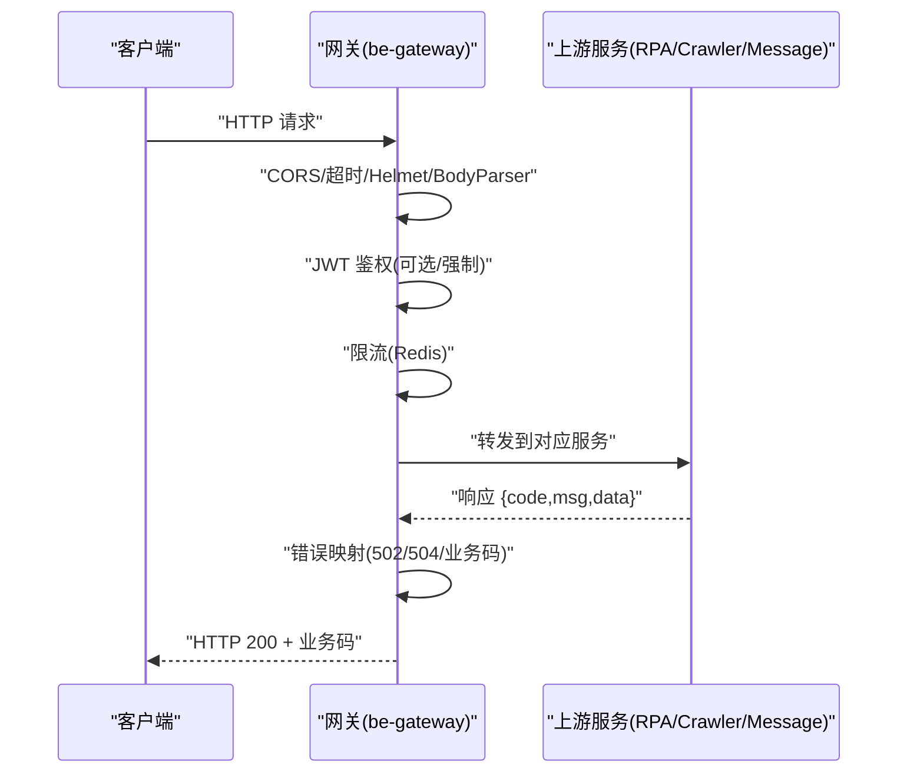

**图表来源**
- [be-gateway/ExpressServerEnd/app.js:33-117](file://be-gateway/ExpressServerEnd/app.js#L33-L117)
- [be-gateway/ExpressServerEnd/Service/user_permission_module/JwtModule.js:85-131](file://be-gateway/ExpressServerEnd/Service/user_permission_module/JwtModule.js#L85-L131)
- [be-gateway/ExpressServerEnd/MiddleWare/Limiter.js:20-50](file://be-gateway/ExpressServerEnd/MiddleWare/Limiter.js#L20-L50)

## 详细组件分析

### 统一响应与业务码规范
- 对外 HTTP 状态始终为 200，业务成败由 body.code 决定。
- 未登录统一返回 code=-101，msg 提示明确。
- 公共业务码集中在 bili-common，禁止在各后端硬编码。

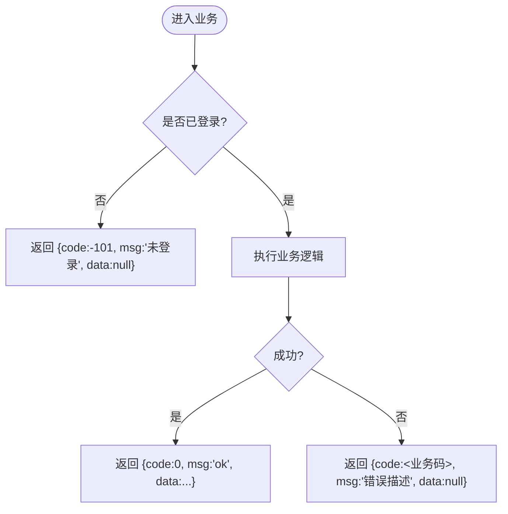

**图表来源**
- [docs/_archive/response-code-design.md:1-80](file://docs/_archive/response-code-design.md#L1-L80)

**章节来源**
- [docs/_archive/response-code-design.md:1-80](file://docs/_archive/response-code-design.md#L1-L80)

### 网关鉴权与权限控制
- JWT 从 HttpOnly Cookie 读取，避免 XSS 窃取。
- 支持强制鉴权与可选鉴权两种模式，部分公开读接口可豁免。
- 黑名单撤销：通过 Redis 查询签名是否在黑名单中。
- 配置项：jwt_secret、过期时间等来自配置文件。

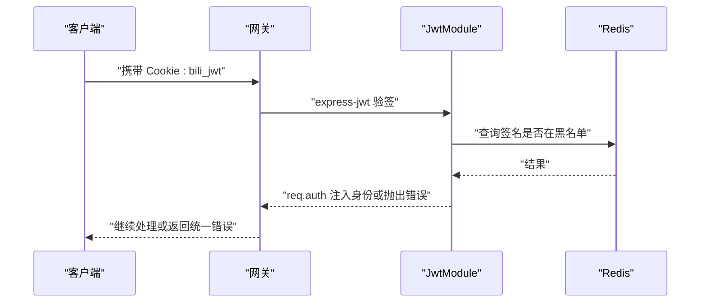

**图表来源**
- [be-gateway/ExpressServerEnd/Service/user_permission_module/JwtModule.js:20-70](file://be-gateway/ExpressServerEnd/Service/user_permission_module/JwtModule.js#L20-L70)
- [be-gateway/ExpressServerEnd/Service/user_permission_module/JwtModule.js:85-131](file://be-gateway/ExpressServerEnd/Service/user_permission_module/JwtModule.js#L85-L131)
- [be-gateway/ExpressServerEnd/config/config.yml:1-29](file://be-gateway/ExpressServerEnd/config/config.yml#L1-L29)

**章节来源**
- [be-gateway/ExpressServerEnd/Service/user_permission_module/JwtModule.js:1-157](file://be-gateway/ExpressServerEnd/Service/user_permission_module/JwtModule.js#L1-L157)
- [be-gateway/ExpressServerEnd/config/config.yml:1-29](file://be-gateway/ExpressServerEnd/config/config.yml#L1-L29)

### 网关限流与访问控制
- 基于 express-rate-limit + RedisStore 的分布式限流。
- 支持自定义 keyGenerator（如 IP）、窗口大小、限制次数、成功/失败计数策略。
- 本地访问限制：通过 x-bili-ip 判断是否为私有地址，非本地拒绝。

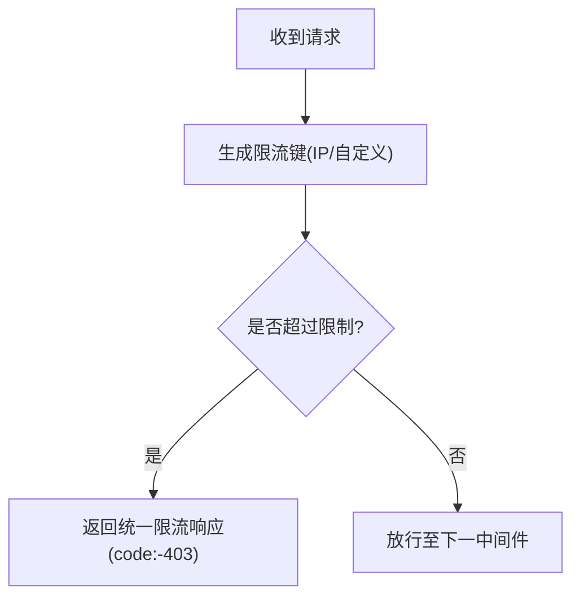

**图表来源**
- [be-gateway/ExpressServerEnd/MiddleWare/Limiter.js:20-69](file://be-gateway/ExpressServerEnd/MiddleWare/Limiter.js#L20-L69)

**章节来源**
- [be-gateway/ExpressServerEnd/MiddleWare/Limiter.js:1-69](file://be-gateway/ExpressServerEnd/MiddleWare/Limiter.js#L1-L69)

### 路由与版本管理
- V1 前缀统一：/api/v1/*，按模块划分 RouterTags，便于 OpenAPI 分组。
- 路由枚举集中管理：RouterPrefix、RouterPaths、RouterNames、RouterModule。
- 版本演进遵循 SemVer：MAJOR 不兼容变更，MINOR 兼容新增，PATCH 修复。

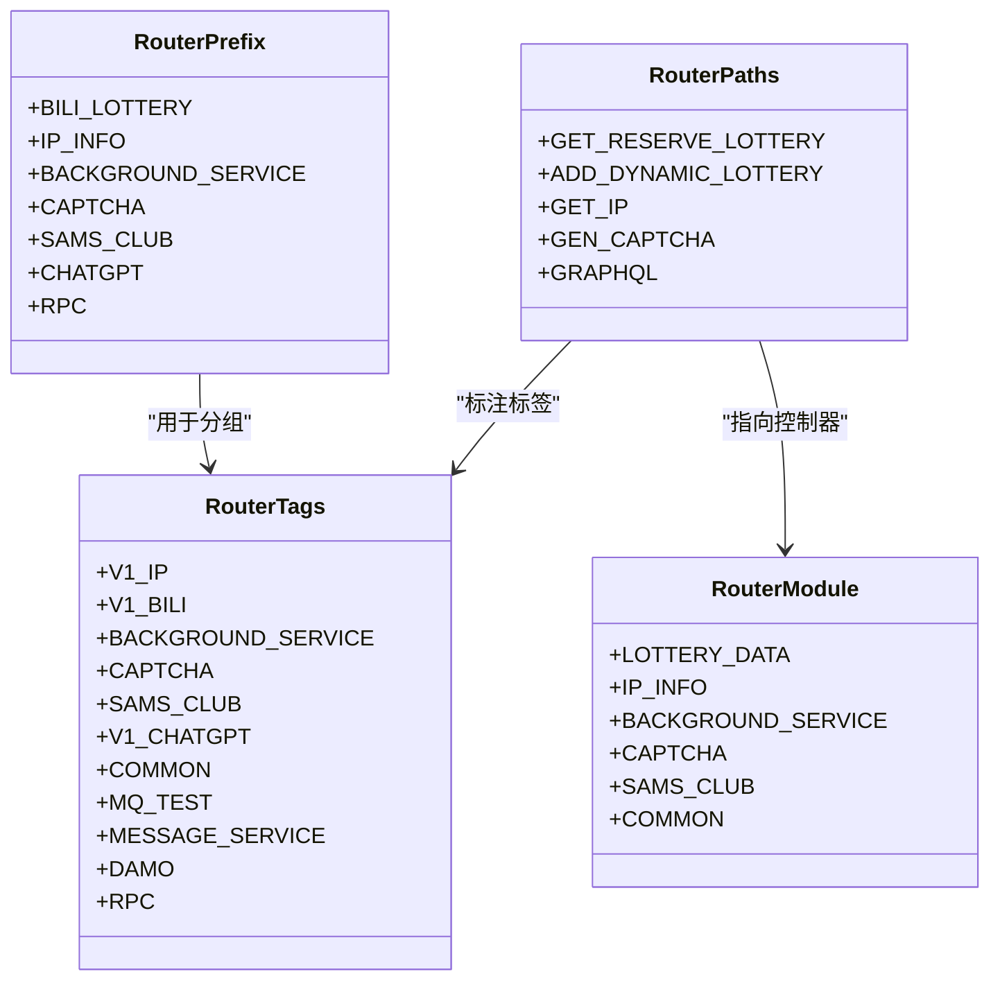

**图表来源**
- [be-bilibili-crawler/ApiRoutes/__init__.py:26-75](file://be-bilibili-crawler/ApiRoutes/__init__.py#L26-L75)
- [be-bilibili-crawler/ApiRoutes/__init__.py:77-170](file://be-bilibili-crawler/ApiRoutes/__init__.py#L77-L170)
- [be-bilibili-crawler/ApiRoutes/__init__.py:172-280](file://be-bilibili-crawler/ApiRoutes/__init__.py#L172-L280)

**章节来源**
- [be-bilibili-crawler/ApiRoutes/__init__.py:26-280](file://be-bilibili-crawler/ApiRoutes/__init__.py#L26-L280)
- [docs/_archive/response-code-design.md:85-101](file://docs/_archive/response-code-design.md#L85-L101)

### 认证授权流程（含消息服务签发）
- 网关侧负责验签与权限控制；消息服务侧负责签发新 token，载荷与算法与网关保持一致。
- 当网关将 /api/v1/user 代理至消息服务时，仍由网关进行鉴权，消息服务仅签发。

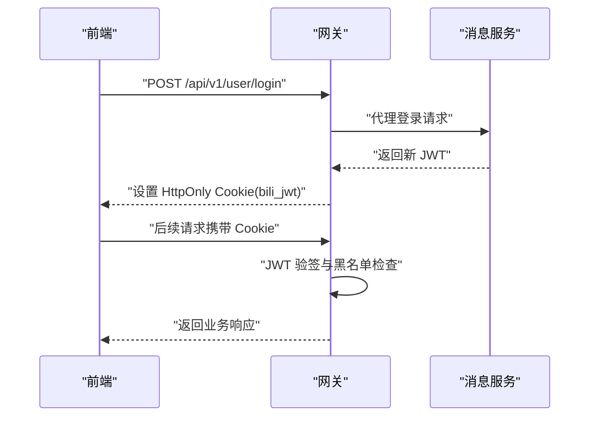

**图表来源**
- [be-gateway/ExpressServerEnd/Service/user_permission_module/JwtModule.js:43-70](file://be-gateway/ExpressServerEnd/Service/user_permission_module/JwtModule.js#L43-L70)
- [be-message-service/app/services/infrastructure/jwt_service.py:1-52](file://be-message-service/app/services/infrastructure/jwt_service.py#L1-L52)

**章节来源**
- [be-gateway/ExpressServerEnd/Service/user_permission_module/JwtModule.js:1-157](file://be-gateway/ExpressServerEnd/Service/user_permission_module/JwtModule.js#L1-L157)
- [be-message-service/app/services/infrastructure/jwt_service.py:1-52](file://be-message-service/app/services/infrastructure/jwt_service.py#L1-L52)

### 错误映射与响应转换
- 超时与上游网络错误映射为 504/502。
- 业务错误保持 HTTP 200，body.code 区分语义。
- 开发环境打印请求日志，生产环境关闭。

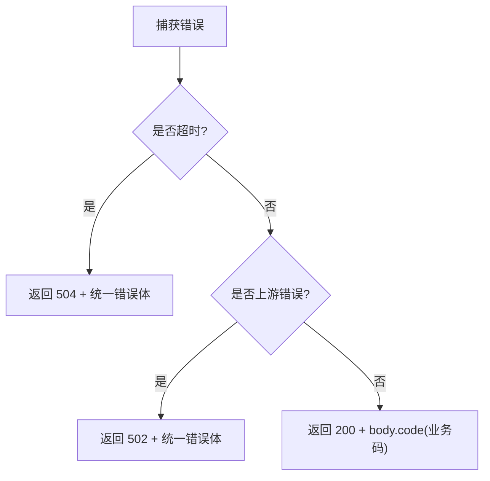

**图表来源**
- [be-gateway/ExpressServerEnd/app.js:33-66](file://be-gateway/ExpressServerEnd/app.js#L33-L66)
- [be-gateway/ExpressServerEnd/app.js:119-161](file://be-gateway/ExpressServerEnd/app.js#L119-L161)
- [docs/_archive/response-code-design.md:1-80](file://docs/_archive/response-code-design.md#L1-L80)

**章节来源**
- [be-gateway/ExpressServerEnd/app.js:33-161](file://be-gateway/ExpressServerEnd/app.js#L33-L161)
- [docs/_archive/response-code-design.md:1-80](file://docs/_archive/response-code-design.md#L1-L80)

### 上游健康检查与负载均衡
- 定期对所有上游服务发起健康检查，输出连接状态与耗时。
- 结合网关错误映射，快速定位不可用上游。

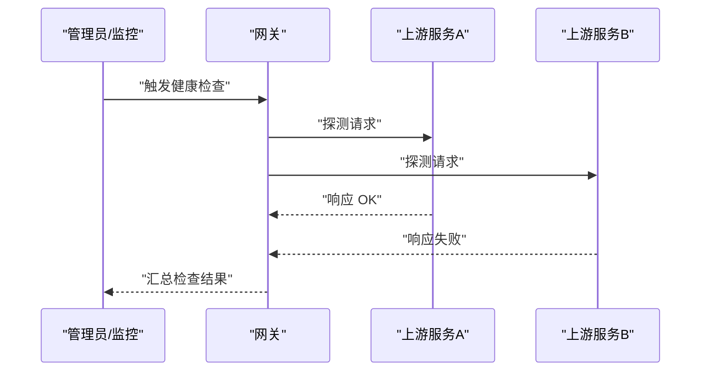

**图表来源**
- [be-gateway/ExpressServerEnd/Service/upstream_health_module/upstream_health_service.js:93-124](file://be-gateway/ExpressServerEnd/Service/upstream_health_module/upstream_health_service.js#L93-L124)

**章节来源**
- [be-gateway/ExpressServerEnd/Service/upstream_health_module/upstream_health_service.js:93-124](file://be-gateway/ExpressServerEnd/Service/upstream_health_module/upstream_health_service.js#L93-L124)

### 前端 SDK 与文档生成
- 前端通过 hey-api 生成 SDK 与类型定义，暴露 /asyncapi.json/.yaml 等端点供拉取。
- 生产接入约束：禁止直接修改生成的 SDK，统一通过分类 Service 模块调用。

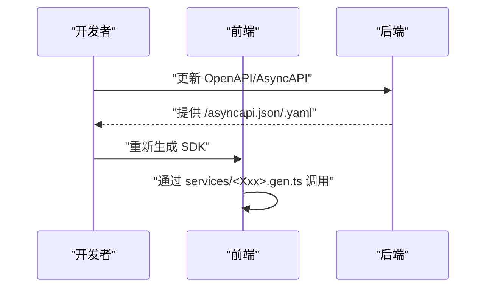

**图表来源**
- [Vue3FrontEndDemoExercise/src/api/bili_lottery_data/hey-api/types.gen.ts:5303-5385](file://Vue3FrontEndDemoExercise/src/api/bili_lottery_data/hey-api/types.gen.ts#L5303-L5385)
- [.codebuddy/rules/前端hey-api.mdc:13-18](file://.codebuddy/rules/前端hey-api.mdc#L13-L18)

**章节来源**
- [Vue3FrontEndDemoExercise/src/api/bili_lottery_data/hey-api/types.gen.ts:5303-5385](file://Vue3FrontEndDemoExercise/src/api/bili_lottery_data/hey-api/types.gen.ts#L5303-L5385)
- [.codebuddy/rules/前端hey-api.mdc:13-18](file://.codebuddy/rules/前端hey-api.mdc#L13-L18)

## 依赖关系分析
- 网关依赖 JwtModule、Limiter、app.js 中的错误映射与健康检查。
- 各后端依赖 bili-common 的统一异常与响应模型。
- 前端依赖生成的 SDK 与类型定义，遵循统一响应契约。

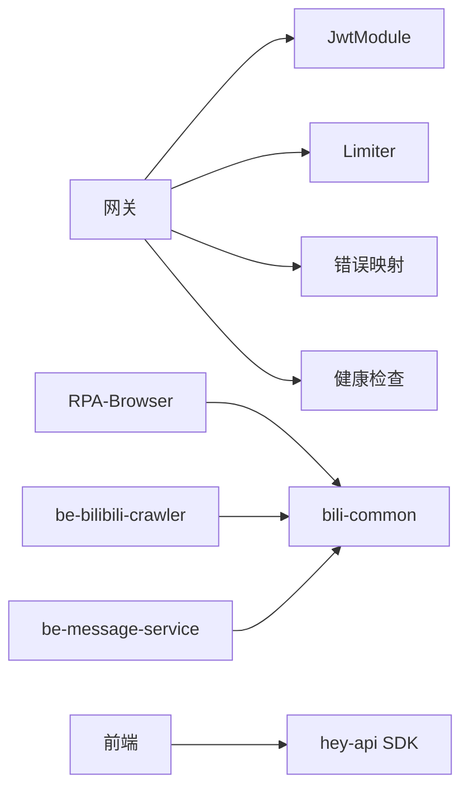

**图表来源**
- [be-gateway/ExpressServerEnd/app.js:33-161](file://be-gateway/ExpressServerEnd/app.js#L33-L161)
- [be-gateway/ExpressServerEnd/Service/user_permission_module/JwtModule.js:1-157](file://be-gateway/ExpressServerEnd/Service/user_permission_module/JwtModule.js#L1-L157)
- [be-gateway/ExpressServerEnd/MiddleWare/Limiter.js:1-69](file://be-gateway/ExpressServerEnd/MiddleWare/Limiter.js#L1-L69)
- [docs/_archive/response-code-design.md:1-80](file://docs/_archive/response-code-design.md#L1-L80)

**章节来源**
- [be-gateway/ExpressServerEnd/app.js:33-161](file://be-gateway/ExpressServerEnd/app.js#L33-L161)
- [be-gateway/ExpressServerEnd/Service/user_permission_module/JwtModule.js:1-157](file://be-gateway/ExpressServerEnd/Service/user_permission_module/JwtModule.js#L1-L157)
- [be-gateway/ExpressServerEnd/MiddleWare/Limiter.js:1-69](file://be-gateway/ExpressServerEnd/MiddleWare/Limiter.js#L1-L69)
- [docs/_archive/response-code-design.md:1-80](file://docs/_archive/response-code-design.md#L1-L80)

## 性能考量
- 超时与重试：网关统一超时（30s），对上游不可达返回 502，超时返回 504，避免长尾请求。
- 限流与缓存：Redis 分布式限流，降低突发流量冲击；可按需启用缓存层减少重复计算。
- 健康检查：定期探测上游可用性，及时剔除不可用节点。
- 日志与监控：开发环境记录请求耗时；建议在生产引入结构化日志与指标采集（QPS、延迟、错误率）。

[本节为通用指导，无需特定文件引用]

## 故障排查指南
- 未登录问题：确认 Cookie 是否设置且有效，检查 jwt_secret 与过期时间配置。
- 限流触发：检查 Redis 存储键前缀与 keyGenerator，确认窗口与限制值是否合理。
- 上游不可达：查看健康检查日志，确认 DNS、网络与端口可达性。
- 业务错误：依据 body.code 定位具体错误码，结合上游服务日志排查。

**章节来源**
- [be-gateway/ExpressServerEnd/Service/user_permission_module/JwtModule.js:20-70](file://be-gateway/ExpressServerEnd/Service/user_permission_module/JwtModule.js#L20-L70)
- [be-gateway/ExpressServerEnd/MiddleWare/Limiter.js:20-69](file://be-gateway/ExpressServerEnd/MiddleWare/Limiter.js#L20-L69)
- [be-gateway/ExpressServerEnd/app.js:33-161](file://be-gateway/ExpressServerEnd/app.js#L33-L161)

## 结论
本项目通过网关集中治理（鉴权、限流、错误映射、健康检查）与各后端统一响应契约，实现了稳定、可观测、易维护的 RESTful API 体系。配合版本化管理与文档生成，确保前后端协同高效、向后兼容可控。

[本节为总结，无需特定文件引用]

## 附录
- 常见 API 设计模式
  - 资源导向：以名词表示资源，使用 GET/POST/PUT/DELETE 表达操作。
  - 版本化：通过 URL 前缀 /api/v1 管理版本，逐步迁移旧接口。
  - 幂等性：GET/PUT/DELETE 应幂等，POST 用于创建资源。
  - 分页与过滤：列表接口支持 skip/limit、排序与筛选参数。
  - 错误统一：HTTP 200 + body.code，避免前端误判。
- 最佳实践
  - 敏感信息走 HttpOnly Cookie，避免 localStorage。
  - 严格输入校验，统一异常处理。
  - 开启 CORS 与 Helmet，保障跨域与安全头。
  - 使用 OpenAPI/AsyncAPI 生成 SDK，保持前后端类型一致。

[本节为通用指导，无需特定文件引用]