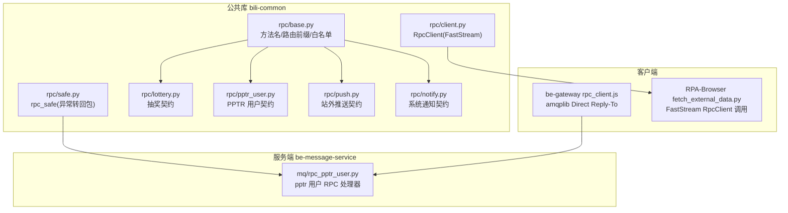
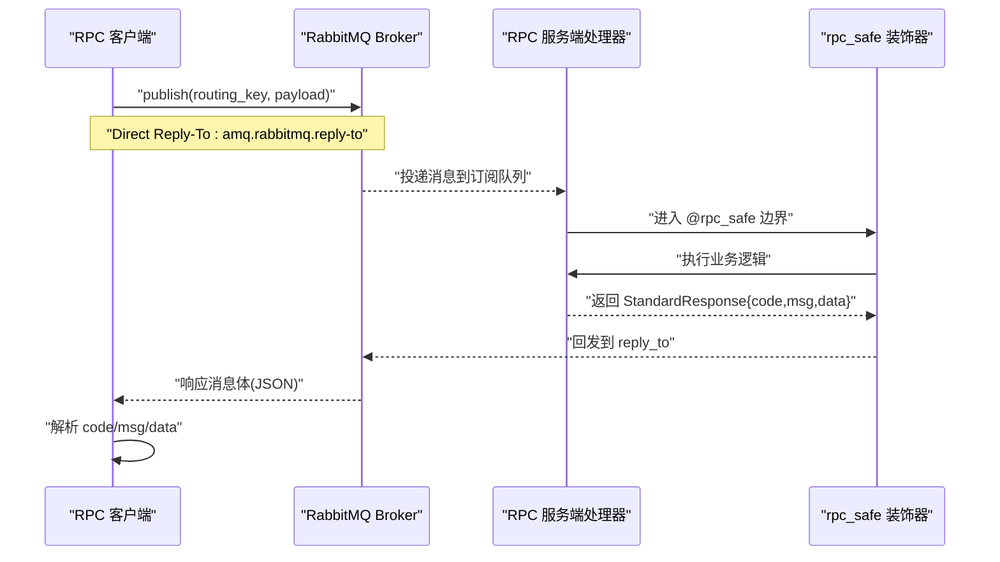
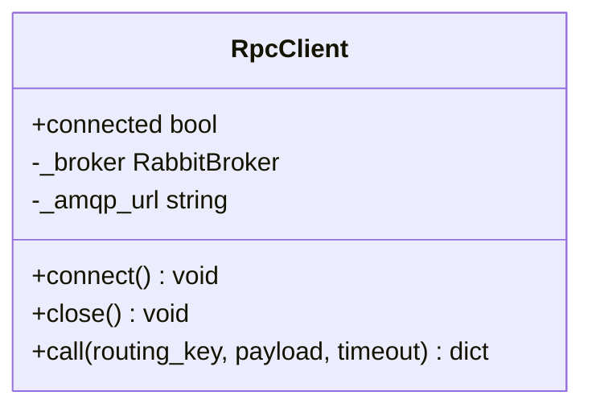
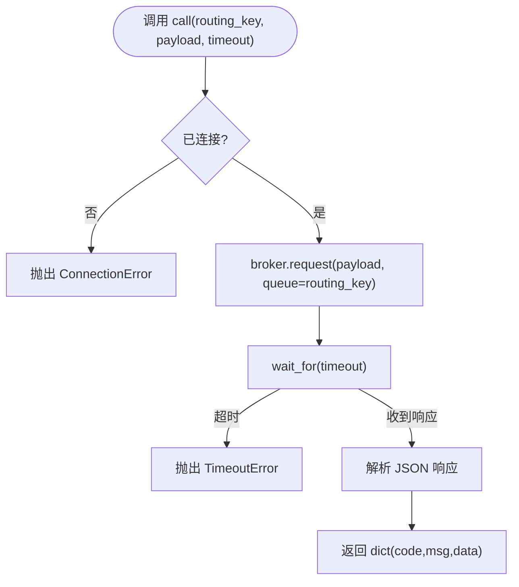
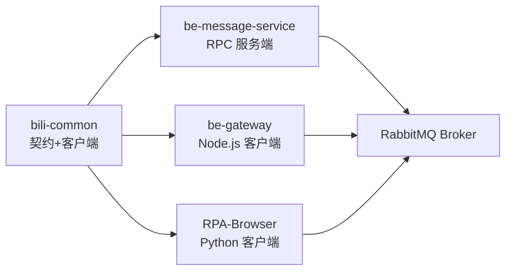

# RPC 远程调用

<cite>
**本文引用的文件**
- [bili-common/bili_common/rpc/__init__.py](file://bili-common/bili_common/rpc/__init__.py)
- [bili-common/bili_common/rpc/base.py](file://bili-common/bili_common/rpc/base.py)
- [bili-common/bili_common/rpc/client.py](file://bili-common/bili_common/rpc/client.py)
- [bili-common/bili_common/rpc/safe.py](file://bili-common/bili_common/rpc/safe.py)
- [bili-common/bili_common/rpc/lottery.py](file://bili-common/bili_common/rpc/lottery.py)
- [bili-common/bili_common/rpc/pptr_user.py](file://bili-common/bili_common/rpc/pptr_user.py)
- [bili-common/bili_common/rpc/push.py](file://bili-common/bili_common/rpc/push.py)
- [bili-common/bili_common/rpc/notify.py](file://bili-common/bili_common/rpc/notify.py)
- [be-message-service/app/mq/rpc_pptr_user.py](file://be-message-service/app/mq/rpc_pptr_user.py)
- [be-gateway/ExpressServerEnd/Service/mq/rpc_client.js](file://be-gateway/ExpressServerEnd/Service/mq/rpc_client.js)
- [RPA-Browser/app/services/execution/actions/fetch_external_data.py](file://RPA-Browser/app/services/execution/actions/fetch_external_data.py)
</cite>

## 目录
1. [简介](#简介)
2. [项目结构](#项目结构)
3. [核心组件](#核心组件)
4. [架构总览](#架构总览)
5. [详细组件分析](#详细组件分析)
6. [依赖关系分析](#依赖关系分析)
7. [性能与可靠性](#性能与可靠性)
8. [故障排查指南](#故障排查指南)
9. [结论](#结论)
10. [附录：最佳实践清单](#附录最佳实践清单)

## 简介
本文件系统性阐述 BilibiliExplosion 项目中基于 FastStream Direct Reply-To 的同步 RPC 机制，覆盖服务注册发现、路由键管理、请求响应模式；深入解析 RPC 客户端与服务端实现（RpcClient、rpc_safe、业务契约）；并给出抽奖系统、PPTR 用户管理、推送服务、通知系统等模块的 RPC 契约设计与使用建议。文末提供错误重试、熔断降级、性能监控等最佳实践及故障排查指引。

## 项目结构
RPC 相关代码主要分布在 bili-common（公共契约与通用客户端）、be-message-service（RPC 服务端）、be-gateway（Node.js RPC 客户端）、RPA-Browser（Python RPC 客户端）。

图表来源
- [bili-common/bili_common/rpc/base.py:23-40](file://bili-common/bili_common/rpc/base.py#L23-L40)
- [bili-common/bili_common/rpc/client.py:34-119](file://bili-common/bili_common/rpc/client.py#L34-L119)
- [bili-common/bili_common/rpc/safe.py:22-55](file://bili-common/bili_common/rpc/safe.py#L22-L55)
- [be-message-service/app/mq/rpc_pptr_user.py:97-189](file://be-message-service/app/mq/rpc_pptr_user.py#L97-L189)
- [be-gateway/ExpressServerEnd/Service/mq/rpc_client.js:1-28](file://be-gateway/ExpressServerEnd/Service/mq/rpc_client.js#L1-L28)
- [RPA-Browser/app/services/execution/actions/fetch_external_data.py:167-196](file://RPA-Browser/app/services/execution/actions/fetch_external_data.py#L167-L196)

章节来源
- [bili-common/bili_common/rpc/__init__.py:1-28](file://bili-common/bili_common/rpc/__init__.py#L1-L28)
- [bili-common/bili_common/rpc/base.py:23-40](file://bili-common/bili_common/rpc/base.py#L23-L40)

## 核心组件
- 路由与方法契约
  - 统一的方法名枚举、各系统路由键前缀、路由键生成函数与白名单集中在 base.py，确保两端一致。
  - 各业务模块在对应子模块中定义请求/响应模型与契约映射。
- 通用客户端
  - RpcClient 基于 FastStream RabbitBroker，使用 Direct Reply-To 进行同步请求/响应，封装连接生命周期与超时控制。
- 服务端安全包装
  - rpc_safe 装饰器将 handler 异常转换为结构化 error_response，避免客户端永久等待。

章节来源
- [bili-common/bili_common/rpc/base.py:43-113](file://bili-common/bili_common/rpc/base.py#L43-L113)
- [bili-common/bili_common/rpc/client.py:34-119](file://bili-common/bili_common/rpc/client.py#L34-L119)
- [bili-common/bili_common/rpc/safe.py:22-55](file://bili-common/bili_common/rpc/safe.py#L22-L55)

## 架构总览
下图展示 FastStream Direct Reply-To 的同步 RPC 流程：客户端通过 broker.request 发送消息到指定 routing_key，服务端订阅该队列处理并返回 StandardResponse，客户端解析后返回业务结果。

图表来源
- [bili-common/bili_common/rpc/client.py:69-119](file://bili-common/bili_common/rpc/client.py#L69-L119)
- [bili-common/bili_common/rpc/safe.py:22-55](file://bili-common/bili_common/rpc/safe.py#L22-L55)
- [be-message-service/app/mq/rpc_pptr_user.py:97-189](file://be-message-service/app/mq/rpc_pptr_user.py#L97-L189)

## 详细组件分析

### RpcClient 客户端设计
- 职责
  - 管理 RabbitMQ 连接生命周期（start/stop）。
  - 通过 broker.request 发起同步 RPC，使用 asyncio.wait_for 控制整体等待超时。
  - 解析响应 JSON 为 dict（StandardResponse 序列化后的结构）。
- 关键点
  - 必须使用 start() 以启用 Direct Reply-To 所需队列。
  - 未连接时直接抛出 ConnectionError。
  - 超时抛出 TimeoutError，便于上层重试或降级。
- 典型用法
  - 构造时传入 amqp_url，启动时 connect()，关闭时 close()，调用 call(routing_key, payload, timeout)。

图表来源
- [bili-common/bili_common/rpc/client.py:34-119](file://bili-common/bili_common/rpc/client.py#L34-L119)

章节来源
- [bili-common/bili_common/rpc/client.py:34-119](file://bili-common/bili_common/rpc/client.py#L34-L119)

### 路由键管理与服务注册发现
- 路由键前缀
  - 抽奖 RPC：FastapiApp.rpc.*
  - PPTR 用户 RPC：message.pptr.rpc.*
  - 站外推送 RPC：message.push.rpc.*
  - RPA 资源 RPC：message.rpa.rpc.*
  - 系统通知 RPC：message.notify.rpc.*
- 路由键生成
  - 通过 base.py 中的 pptr_routing_key_for / push_rpc_routing_key_for / notify_rpc_routing_key_for 等方法生成完整 routing_key。
- 服务注册
  - 服务端使用 @broker.subscriber(queue=RabbitQueue(...), exchange=message_exchange) 声明订阅队列，绑定具体 routing_key。
  - 客户端通过统一的 routing_key 发布消息，无需手动创建回调队列（Direct Reply-To）。

章节来源
- [bili-common/bili_common/rpc/base.py:23-40](file://bili-common/bili_common/rpc/base.py#L23-L40)
- [bili-common/bili_common/rpc/base.py:84-113](file://bili-common/bili_common/rpc/base.py#L84-L113)
- [be-message-service/app/mq/rpc_pptr_user.py:97-189](file://be-message-service/app/mq/rpc_pptr_user.py#L97-L189)

### 请求响应模式与异常处理
- 请求/响应协议
  - 客户端发送强类型参数模型的 JSON dict。
  - 服务端由 FastStream 自动校验为 Pydantic/SQLModel，handler 返回 StandardResponse{code,msg,data}。
  - 客户端解析响应为 dict，按 code/msg/data 判断成功与否。
- 异常处理
  - 服务端：@rpc_safe 捕获所有异常，记录堆栈并返回 error_response(code,msg)，避免客户端无限等待。
  - 客户端：连接失败抛 ConnectionError；请求超时抛 TimeoutError；响应解析失败抛 ValueError。

图表来源
- [bili-common/bili_common/rpc/client.py:69-119](file://bili-common/bili_common/rpc/client.py#L69-L119)
- [bili-common/bili_common/rpc/safe.py:22-55](file://bili-common/bili_common/rpc/safe.py#L22-L55)

章节来源
- [bili-common/bili_common/rpc/safe.py:22-55](file://bili-common/bili_common/rpc/safe.py#L22-L55)
- [bili-common/bili_common/rpc/client.py:69-119](file://bili-common/bili_common/rpc/client.py#L69-L119)

### 业务模块 RPC 契约

#### 抽奖系统（be-bilibili-crawler ↔ RPA-Browser）
- 路由键前缀：FastapiApp.rpc.*
- 方法示例：get_reserve_lottery、get_official_lottery、get_charge_lottery、get_topic_lottery、get_all_lottery、get_others_lot_dyn_list
- 参数模型：BaseLotteryRpcParams 及其子类，支持分页与高级筛选
- 内部校验：check_lottery_exist（供 be-message 客户端调用，不进入前端白名单）

章节来源
- [bili-common/bili_common/rpc/lottery.py:23-143](file://bili-common/bili_common/rpc/lottery.py#L23-L143)
- [bili-common/bili_common/rpc/lottery.py:146-186](file://bili-common/bili_common/rpc/lottery.py#L146-L186)
- [bili-common/bili_common/rpc/base.py:54-62](file://bili-common/bili_common/rpc/base.py#L54-L62)

#### PPTR 用户管理（be-message 服务端 ↔ be-gateway 客户端）
- 路由键前缀：message.pptr.rpc.*
- 方法示例：get_user_info、get_user_card、create_user、update_user_info、get_user_level、set_user_level、set_user_detail、add_exp、add_daily_login_exp、get_user_nav
- 数据一致性：整型字段通过 _IntStrMixin 保证 JS/Python 间精度无损传输
- 服务端处理器：在 be-message-service 中以 @broker.subscriber 注册，并使用 @rpc_safe 包裹

章节来源
- [bili-common/bili_common/rpc/pptr_user.py:42-320](file://bili-common/bili_common/rpc/pptr_user.py#L42-L320)
- [be-message-service/app/mq/rpc_pptr_user.py:97-189](file://be-message-service/app/mq/rpc_pptr_user.py#L97-L189)
- [be-gateway/ExpressServerEnd/Service/mq/rpc_client.js:1-28](file://be-gateway/ExpressServerEnd/Service/mq/rpc_client.js#L1-L28)

#### 推送服务（be-message 服务端 ↔ 其它系统客户端）
- 路由键前缀：message.push.rpc.*
- 方法示例：push_message（异步投递）、send_push_now（同步发送）
- 特点：HTTP 与 RPC 并存，均落到同一套 PushMessageService 执行体

章节来源
- [bili-common/bili_common/rpc/push.py:27-101](file://bili-common/bili_common/rpc/push.py#L27-L101)

#### 通知系统（be-message 服务端 ↔ 其它系统客户端）
- 路由键前缀：message.notify.rpc.*
- 方法示例：publish_notify（幂等写入 msg_notify，随后异步投递到用户会话）
- 特点：管理端 HTTP 与 RPC 并存，面向服务端系统调用

章节来源
- [bili-common/bili_common/rpc/notify.py:44-102](file://bili-common/bili_common/rpc/notify.py#L44-L102)

### 客户端调用示例与集成点
- Python 客户端（RPA-Browser）
  - 使用 RpcClient.call 调用 RPC，注意设置合理超时（需大于服务端 handler 超时 + buffer）
  - 解析响应 code/msg/data，非 0 视为业务错误
- Node.js 客户端（be-gateway）
  - 使用 amqplib 发布到 topic exchange message_exchange，routing_key 为 message.pptr.rpc.<method>
  - 使用 direct reply-to 收取响应，区分通信异常与业务错误

章节来源
- [RPA-Browser/app/services/execution/actions/fetch_external_data.py:167-196](file://RPA-Browser/app/services/execution/actions/fetch_external_data.py#L167-L196)
- [be-gateway/ExpressServerEnd/Service/mq/rpc_client.js:142-164](file://be-gateway/ExpressServerEnd/Service/mq/rpc_client.js#L142-L164)

## 依赖关系分析
- 耦合与内聚
  - bili-common 仅导出纯契约与通用客户端，保持低耦合；各微服务按需导入 safe/client。
  - 服务端通过 FastStream broker 单例注册处理器，内聚于 mq 模块。
- 外部依赖
  - FastStream/RabbitMQ：用于消息路由与 Direct Reply-To。
  - Pydantic/SQLModel：用于参数校验与数据模型。
  - loguru：用于服务端异常日志记录。
- 潜在循环依赖
  - 通过 bili-common 集中契约，避免多端重复定义导致的循环引用。

图表来源
- [bili-common/bili_common/rpc/__init__.py:1-28](file://bili-common/bili_common/rpc/__init__.py#L1-L28)
- [be-message-service/app/mq/rpc_pptr_user.py:97-189](file://be-message-service/app/mq/rpc_pptr_user.py#L97-L189)
- [be-gateway/ExpressServerEnd/Service/mq/rpc_client.js:1-28](file://be-gateway/ExpressServerEnd/Service/mq/rpc_client.js#L1-L28)
- [RPA-Browser/app/services/execution/actions/fetch_external_data.py:167-196](file://RPA-Browser/app/services/execution/actions/fetch_external_data.py#L167-L196)

章节来源
- [bili-common/bili_common/rpc/__init__.py:1-28](file://bili-common/bili_common/rpc/__init__.py#L1-L28)

## 性能与可靠性
- 超时控制
  - 客户端 call 使用 asyncio.wait_for 控制整体等待时间；RPA-Browser 侧建议设置略大于服务端 handler 超时的值。
- 重试策略
  - 对网络抖动导致的 TimeoutError/ConnectionError 可实施指数退避重试；业务错误（code!=0）不应重试。
- 熔断降级
  - 连续失败达到阈值触发熔断，切换至降级路径（如缓存、默认值或告警后跳过）。
- 监控指标
  - 记录每次调用的耗时、成功率、错误分类（超时/连接/业务），接入 APM 或日志聚合平台。
- 背压与限流
  - 在高并发场景下限制并发调用数，避免 Broker 过载；必要时引入令牌桶或信号量。

[本节为通用指导，不直接分析具体文件]

## 故障排查指南
- 常见问题定位
  - 客户端未连接：检查是否调用 connect()，确认 connected 状态。
  - 请求超时：核对服务端 handler 耗时与客户端 timeout 配置；确保服务端正常返回。
  - 响应解析失败：检查服务端是否正确返回 StandardResponse JSON。
  - 路由键不匹配：确认客户端使用的 routing_key 与服务端订阅队列一致。
  - 异常未返回：确认服务端 handler 被 @rpc_safe 包裹，避免异常吞没。
- 日志与调试
  - 服务端：查看 rpc_safe 记录的异常堆栈与错误详情。
  - 客户端：打印 routing_key、payload、timeout 与响应码。
- 快速验证
  - 使用最小化请求（如 get_user_card）验证链路连通性。
  - 对比路由键前缀与方法名是否与 base.py 一致。

章节来源
- [bili-common/bili_common/rpc/client.py:69-119](file://bili-common/bili_common/rpc/client.py#L69-L119)
- [bili-common/bili_common/rpc/safe.py:22-55](file://bili-common/bili_common/rpc/safe.py#L22-L55)
- [be-message-service/app/mq/rpc_pptr_user.py:97-189](file://be-message-service/app/mq/rpc_pptr_user.py#L97-L189)

## 结论
本项目通过 bili-common 集中定义 RPC 契约与通用客户端，结合 FastStream Direct Reply-To 实现了稳定高效的同步 RPC 机制。各业务模块（抽奖、PPTR 用户、推送、通知）遵循统一的路由键前缀与 StandardResponse 协议，配合 rpc_safe 保障异常可观测与契约一致性。建议在工程实践中补充重试、熔断与监控，进一步提升系统的鲁棒性与可维护性。

[本节为总结性内容，不直接分析具体文件]

## 附录：最佳实践清单
- 客户端
  - 始终设置合理的 timeout，并确保大于服务端 handler 超时。
  - 对通信异常（超时/连接失败）实施重试；对业务错误（code!=0）不重试。
  - 记录关键指标：耗时、成功率、错误分类。
- 服务端
  - 所有 RPC handler 使用 @rpc_safe 包裹，确保异常转为结构化错误。
  - 严格校验入参（Pydantic/SQLModel），减少无效请求。
  - 对热点接口考虑缓存与限流。
- 契约管理
  - 新增方法需在 base 中登记路由键前缀与方法名，并在对应模块定义请求/响应模型。
  - 保持前后端/多语言客户端契约一致，避免漂移。

[本节为通用指导，不直接分析具体文件]