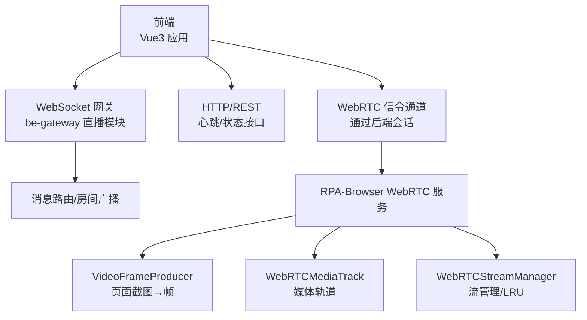
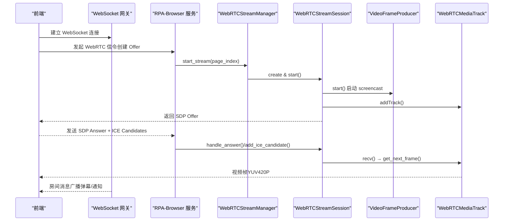
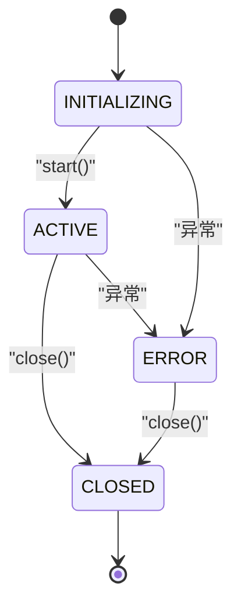
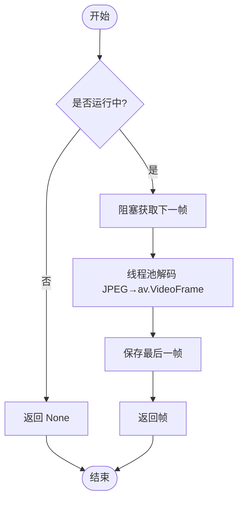
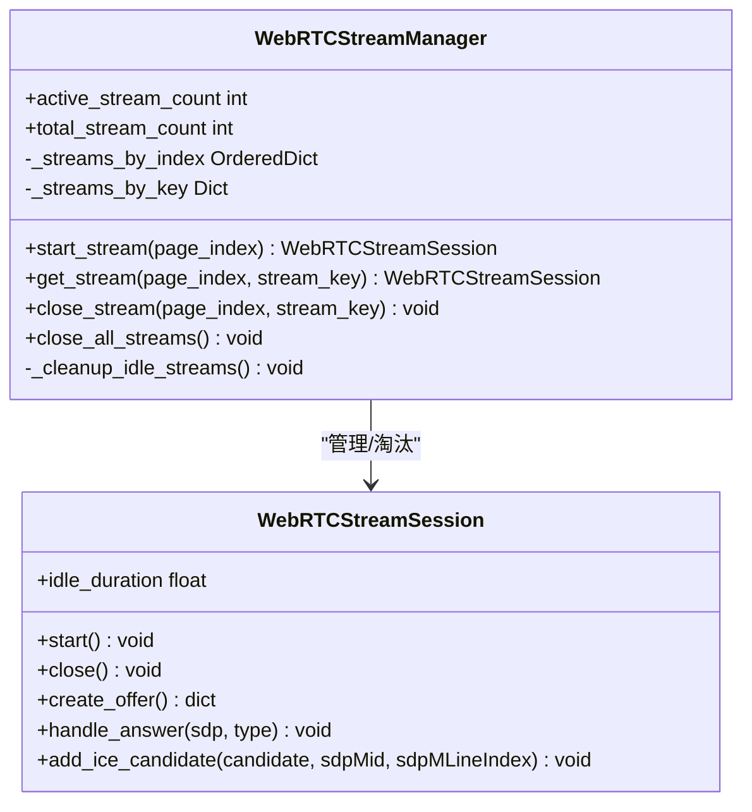
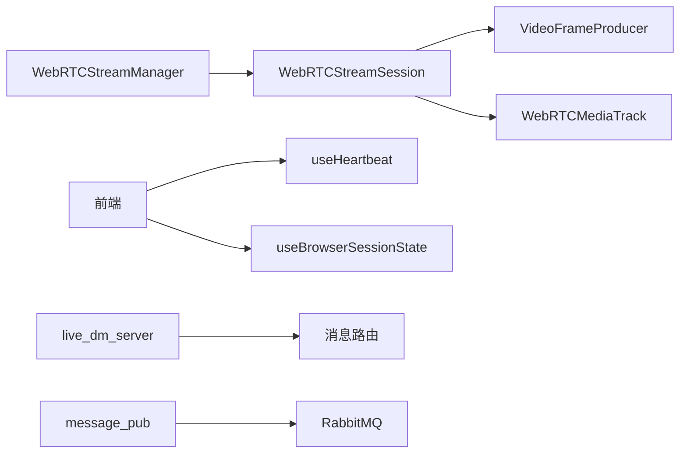

# WebSocket 实时通信

<cite>
**本文引用的文件**
- [RPA-Browser/app/services/RPA_browser/webrtc/__init__.py](file://RPA-Browser/app/services/RPA_browser/webrtc/__init__.py)
- [RPA-Browser/app/services/RPA_browser/webrtc/stream_session.py](file://RPA-Browser/app/services/RPA_browser/webrtc/stream_session.py)
- [RPA-Browser/app/services/RPA_browser/webrtc/video_frame_producer.py](file://RPA-Browser/app/services/RPA_browser/webrtc/video_frame_producer.py)
- [RPA-Browser/app/services/RPA_browser/webrtc/media_track.py](file://RPA-Browser/app/services/RPA_browser/webrtc/media_track.py)
- [RPA-Browser/app/services/RPA_browser/webrtc/stream_manager.py](file://RPA-Browser/app/services/RPA_browser/webrtc/stream_manager.py)
- [Vue3FrontEndDemoExercise/src/composables/useHeartbeat.ts](file://Vue3FrontEndDemoExercise/src/composables/useHeartbeat.ts)
- [Vue3FrontEndDemoExercise/src/composables/useBrowserSessionState.ts](file://Vue3FrontEndDemoExercise/src/composables/useBrowserSessionState.ts)
- [RPA-Browser/app/services/message/message_pub.py](file://RPA-Browser/app/services/message/message_pub.py)
- [be-gateway/直播模块/live_dm_server.js](file://be-gateway/直播模块/live_dm_server.js)
- [be-bilibili-crawler/Service/GrpcModule/Grpc/GrpcProto/bilibili/broadcast/message/ogv/freya.proto](file://be-bilibili-crawler/Service/GrpcModule/Grpc/GrpcProto/bilibili/broadcast/message/ogv/freya.proto)
- [be-bilibili-crawler/Service/GrpcModule/Grpc/GrpcProto/bilibili/broadcast/message/ticket/activitygame.proto](file://be-bilibili-crawler/Service/GrpcModule/Grpc/GrpcProto/bilibili/broadcast/message/ticket/activitygame.proto)
</cite>

## 目录
1. [简介](#简介)
2. [项目结构](#项目结构)
3. [核心组件](#核心组件)
4. [架构总览](#架构总览)
5. [详细组件分析](#详细组件分析)
6. [依赖关系分析](#依赖关系分析)
7. [性能与资源优化](#性能与资源优化)
8. [故障诊断与监控](#故障诊断与监控)
9. [前端集成指南](#前端集成指南)
10. [结论](#结论)

## 简介
本文件面向 BilibiliExplosion 项目的实时通信子系统，聚焦以下目标：
- 基于 WebSocket 的实时双向通信：连接建立、心跳检测、断线重连策略。
- WebRTC 视频流传输方案：媒体轨道管理、流会话控制、帧数据生产与编码。
- 实时消息广播机制：房间管理、用户状态同步、消息路由策略。
- 连接池管理与资源优化：内存控制、并发处理、性能调优。
- 前端集成指南：连接管理、错误处理、用户体验优化。
- 实时监控与故障诊断工具使用方法。

## 项目结构
本项目在多个子服务中实现实时通信能力：
- RPA-Browser：提供 WebRTC 视频流（从浏览器页面到客户端）以及消息推送桥接。
- Vue3FrontEndDemoExercise：前端心跳、会话状态机与 UI 交互。
- be-gateway：直播弹幕 WebSocket 服务，负责房间级消息转发。
- be-bilibili-crawler：定义广播协议（RoomUpdateEvent、RoomDestroyEvent、RoomTriggerEvent 等），用于房间事件与通知。

图表来源
- [RPA-Browser/app/services/RPA_browser/webrtc/stream_manager.py:24-71](file://RPA-Browser/app/services/RPA_browser/webrtc/stream_manager.py#L24-L71)
- [RPA-Browser/app/services/RPA_browser/webrtc/stream_session.py:67-125](file://RPA-Browser/app/services/RPA_browser/webrtc/stream_session.py#L67-L125)
- [RPA-Browser/app/services/RPA_browser/webrtc/video_frame_producer.py:18-43](file://RPA-Browser/app/services/RPA_browser/webrtc/video_frame_producer.py#L18-L43)
- [RPA-Browser/app/services/RPA_browser/webrtc/media_track.py:14-33](file://RPA-Browser/app/services/RPA_browser/webrtc/media_track.py#L14-L33)
- [be-gateway/直播模块/live_dm_server.js:27-72](file://be-gateway/直播模块/live_dm_server.js#L27-L72)

章节来源
- [RPA-Browser/app/services/RPA_browser/webrtc/__init__.py:1-18](file://RPA-Browser/app/services/RPA_browser/webrtc/__init__.py#L1-L18)
- [RPA-Browser/app/services/RPA_browser/webrtc/stream_manager.py:1-71](file://RPA-Browser/app/services/RPA_browser/webrtc/stream_manager.py#L1-L71)
- [RPA-Browser/app/services/RPA_browser/webrtc/stream_session.py:1-125](file://RPA-Browser/app/services/RPA_browser/webrtc/stream_session.py#L1-L125)
- [RPA-Browser/app/services/RPA_browser/webrtc/video_frame_producer.py:1-43](file://RPA-Browser/app/services/RPA_browser/webrtc/video_frame_producer.py#L1-L43)
- [RPA-Browser/app/services/RPA_browser/webrtc/media_track.py:1-33](file://RPA-Browser/app/services/RPA_browser/webrtc/media_track.py#L1-L33)
- [be-gateway/直播模块/live_dm_server.js:27-72](file://be-gateway/直播模块/live_dm_server.js#L27-L72)

## 核心组件
- WebRTC 流会话（WebRTCStreamSession）：封装单个页面的 WebRTC 生命周期，管理 SDP Offer/Answer、ICE Candidate、连接状态回调与活动计时。
- 帧生产者（VideoFrameProducer）：使用 Playwright screencast 捕获页面帧，队列化并解码为 av.VideoFrame，支持丢旧保新与绿屏恢复。
- 媒体轨道（WebRTCMediaTrack）：实现 aiortc VideoStreamTrack，将帧按时间戳输出给 PeerConnection。
- 流管理器（WebRTCStreamManager）：维护多路流的 LRU 索引、闲置淘汰、并行关闭与查询。
- 前端心跳（useHeartbeat）：周期性上报活跃心跳并刷新未读摘要，适配 keep-alive 场景。
- 前端会话状态机（useBrowserSessionState）：统一 UI 状态与后端生命周期映射，处理错误码与状态转换。
- 消息推送桥接（message_pub）：将推送请求发布至 message-service 的 RabbitMQ 队列。
- 直播弹幕 WebSocket（live_dm_server）：接收弹幕消息并按房间分发。

章节来源
- [RPA-Browser/app/services/RPA_browser/webrtc/stream_session.py:67-125](file://RPA-Browser/app/services/RPA_browser/webrtc/stream_session.py#L67-L125)
- [RPA-Browser/app/services/RPA_browser/webrtc/video_frame_producer.py:18-43](file://RPA-Browser/app/services/RPA_browser/webrtc/video_frame_producer.py#L18-L43)
- [RPA-Browser/app/services/RPA_browser/webrtc/media_track.py:14-33](file://RPA-Browser/app/services/RPA_browser/webrtc/media_track.py#L14-L33)
- [RPA-Browser/app/services/RPA_browser/webrtc/stream_manager.py:24-71](file://RPA-Browser/app/services/RPA_browser/webrtc/stream_manager.py#L24-L71)
- [Vue3FrontEndDemoExercise/src/composables/useHeartbeat.ts:1-61](file://Vue3FrontEndDemoExercise/src/composables/useHeartbeat.ts#L1-L61)
- [Vue3FrontEndDemoExercise/src/composables/useBrowserSessionState.ts:1-207](file://Vue3FrontEndDemoExercise/src/composables/useBrowserSessionState.ts#L1-L207)
- [RPA-Browser/app/services/message/message_pub.py:1-41](file://RPA-Browser/app/services/message/message_pub.py#L1-L41)
- [be-gateway/直播模块/live_dm_server.js:27-72](file://be-gateway/直播模块/live_dm_server.js#L27-L72)

## 架构总览
实时通信由“信令 + 媒体 + 消息”三部分组成：
- 信令通道：前端通过 HTTP/WebSocket 与后端交换 SDP/ICE，完成 WebRTC 握手。
- 媒体通道：后端以 Page screencast 产生帧，经 MediaTrack 输出到 PeerConnection，推送到前端。
- 消息通道：WebSocket 房间广播与 RabbitMQ 推送结合，实现跨模块消息路由。

图表来源
- [RPA-Browser/app/services/RPA_browser/webrtc/stream_manager.py:82-138](file://RPA-Browser/app/services/RPA_browser/webrtc/stream_manager.py#L82-L138)
- [RPA-Browser/app/services/RPA_browser/webrtc/stream_session.py:163-235](file://RPA-Browser/app/services/RPA_browser/webrtc/stream_session.py#L163-L235)
- [RPA-Browser/app/services/RPA_browser/webrtc/video_frame_producer.py:43-89](file://RPA-Browser/app/services/RPA_browser/webrtc/video_frame_producer.py#L43-L89)
- [RPA-Browser/app/services/RPA_browser/webrtc/media_track.py:33-69](file://RPA-Browser/app/services/RPA_browser/webrtc/media_track.py#L33-L69)
- [be-gateway/直播模块/live_dm_server.js:48-72](file://be-gateway/直播模块/live_dm_server.js#L48-L72)

## 详细组件分析

### WebRTC 流会话（WebRTCStreamSession）
- 职责：管理单个页面的 WebRTC 生命周期，包含状态机、SDP 处理、ICE 候选添加、连接状态回调与活动时间更新。
- 关键设计：
  - 状态机约束 INITIALIZING → ACTIVE → CLOSED，异常路径进入 ERROR。
  - 使用弱引用避免 page ↔ session 循环引用。
  - 每次活动（start/handle_answer/add_ice_candidate/回调）更新 idle_duration。

图表来源
- [RPA-Browser/app/services/RPA_browser/webrtc/stream_session.py:67-85](file://RPA-Browser/app/services/RPA_browser/webrtc/stream_session.py#L67-L85)
- [RPA-Browser/app/services/RPA_browser/webrtc/stream_session.py:163-199](file://RPA-Browser/app/services/RPA_browser/webrtc/stream_session.py#L163-L199)

章节来源
- [RPA-Browser/app/services/RPA_browser/webrtc/stream_session.py:67-301](file://RPA-Browser/app/services/RPA_browser/webrtc/stream_session.py#L67-L301)

### 帧生产者（VideoFrameProducer）
- 职责：从 Playwright screencast 捕获 JPEG 帧，入队并在线程池中解码为 av.VideoFrame（YUV420P）。
- 关键特性：
  - 丢旧保新：队列满时丢弃最旧帧，保证最新画面优先。
  - 错误恢复：解码失败或初始化阶段返回绿屏帧，避免黑屏。
  - 健壮性：检测到“已启动”异常时自动停止并重试。

图表来源
- [RPA-Browser/app/services/RPA_browser/webrtc/video_frame_producer.py:109-173](file://RPA-Browser/app/services/RPA_browser/webrtc/video_frame_producer.py#L109-L173)
- [RPA-Browser/app/services/RPA_browser/webrtc/video_frame_producer.py:175-218](file://RPA-Browser/app/services/RPA_browser/webrtc/video_frame_producer.py#L175-L218)

章节来源
- [RPA-Browser/app/services/RPA_browser/webrtc/video_frame_producer.py:1-229](file://RPA-Browser/app/services/RPA_browser/webrtc/video_frame_producer.py#L1-L229)

### 媒体轨道（WebRTCMediaTrack）
- 职责：实现 aiortc VideoStreamTrack，按需拉取帧并设置时间戳与时基，供 PeerConnection 消费。
- 关键点：
  - 使用 next_timestamp() 自动生成 90kHz 时钟的时间戳。
  - 生产者停止时抛出 StopIteration，结束轨道。

章节来源
- [RPA-Browser/app/services/RPA_browser/webrtc/media_track.py:1-69](file://RPA-Browser/app/services/RPA_browser/webrtc/media_track.py#L1-L69)

### 流管理器（WebRTCStreamManager）
- 职责：管理多路 WebRTC 流的生命周期，提供 O(1) 查找、LRU 淘汰、并行关闭与空闲清理。
- 数据结构：
  - _streams_by_index：OrderedDict 维护 LRU 顺序。
  - _streams_by_key：辅助索引，stream_key → stream。
  - 弱引用持有 session，打破循环引用。
- 清理策略：定期扫描，按 idle_timeout 淘汰超时流；清理孤儿索引。

图表来源
- [RPA-Browser/app/services/RPA_browser/webrtc/stream_manager.py:24-71](file://RPA-Browser/app/services/RPA_browser/webrtc/stream_manager.py#L24-L71)
- [RPA-Browser/app/services/RPA_browser/webrtc/stream_manager.py:82-138](file://RPA-Browser/app/services/RPA_browser/webrtc/stream_manager.py#L82-L138)
- [RPA-Browser/app/services/RPA_browser/webrtc/stream_manager.py:203-258](file://RPA-Browser/app/services/RPA_browser/webrtc/stream_manager.py#L203-L258)
- [RPA-Browser/app/services/RPA_browser/webrtc/stream_session.py:67-125](file://RPA-Browser/app/services/RPA_browser/webrtc/stream_session.py#L67-L125)

章节来源
- [RPA-Browser/app/services/RPA_browser/webrtc/stream_manager.py:1-294](file://RPA-Browser/app/services/RPA_browser/webrtc/stream_manager.py#L1-L294)

### 前端心跳与会话状态机
- useHeartbeat：在 keep-alive 场景下，激活时启动心跳定时器，失活时清除；默认每 60s 上报一次心跳并刷新未读摘要。
- useBrowserSessionState：统一 UI 状态（disconnected/connecting/connected/error）与后端生命周期，处理错误码映射与状态转换。

章节来源
- [Vue3FrontEndDemoExercise/src/composables/useHeartbeat.ts:1-61](file://Vue3FrontEndDemoExercise/src/composables/useHeartbeat.ts#L1-L61)
- [Vue3FrontEndDemoExercise/src/composables/useBrowserSessionState.ts:1-207](file://Vue3FrontEndDemoExercise/src/composables/useBrowserSessionState.ts#L1-L207)

### 消息广播与房间管理
- 直播弹幕 WebSocket：接收弹幕消息，按 room_id 组织发送者列表，进行房间级广播。
- 房间事件协议：RoomUpdateEvent、RoomDestroyEvent、RoomTriggerEvent 等，用于房间状态变更与通知。

章节来源
- [be-gateway/直播模块/live_dm_server.js:27-72](file://be-gateway/直播模块/live_dm_server.js#L27-L72)
- [be-bilibili-crawler/Service/GrpcModule/Grpc/GrpcProto/bilibili/broadcast/message/ogv/freya.proto:79-136](file://be-bilibili-crawler/Service/GrpcModule/Grpc/GrpcProto/bilibili/broadcast/message/ogv/freya.proto#L79-L136)
- [be-bilibili-crawler/Service/GrpcModule/Grpc/GrpcProto/bilibili/broadcast/message/ticket/activitygame.proto:1-21](file://be-bilibili-crawler/Service/GrpcModule/Grpc/GrpcProto/bilibili/broadcast/message/ticket/activitygame.proto#L1-L21)

## 依赖关系分析
- RPA-Browser 的 WebRTC 模块内部依赖：
  - stream_manager 依赖 stream_session、video_frame_producer、media_track。
  - stream_session 依赖 video_frame_producer、media_track 与 aiortc。
- 前端依赖：
  - useHeartbeat 依赖消息 API（sendHeartbeat、fetchUnreadSummary）。
  - useBrowserSessionState 依赖会话生命周期枚举与状态标签。
- 网关与服务间：
  - live_dm_server 作为 WebSocket 服务，负责房间消息路由。
  - message_pub 将推送消息发布到 RabbitMQ，交由 message-service 消费。

图表来源
- [RPA-Browser/app/services/RPA_browser/webrtc/stream_manager.py:24-71](file://RPA-Browser/app/services/RPA_browser/webrtc/stream_manager.py#L24-L71)
- [RPA-Browser/app/services/RPA_browser/webrtc/stream_session.py:67-125](file://RPA-Browser/app/services/RPA_browser/webrtc/stream_session.py#L67-L125)
- [RPA-Browser/app/services/RPA_browser/webrtc/video_frame_producer.py:18-43](file://RPA-Browser/app/services/RPA_browser/webrtc/video_frame_producer.py#L18-L43)
- [RPA-Browser/app/services/RPA_browser/webrtc/media_track.py:14-33](file://RPA-Browser/app/services/RPA_browser/webrtc/media_track.py#L14-L33)
- [Vue3FrontEndDemoExercise/src/composables/useHeartbeat.ts:1-61](file://Vue3FrontEndDemoExercise/src/composables/useHeartbeat.ts#L1-L61)
- [Vue3FrontEndDemoExercise/src/composables/useBrowserSessionState.ts:1-207](file://Vue3FrontEndDemoExercise/src/composables/useBrowserSessionState.ts#L1-L207)
- [RPA-Browser/app/services/message/message_pub.py:1-41](file://RPA-Browser/app/services/message/message_pub.py#L1-L41)
- [be-gateway/直播模块/live_dm_server.js:27-72](file://be-gateway/直播模块/live_dm_server.js#L27-L72)

章节来源
- [RPA-Browser/app/services/RPA_browser/webrtc/__init__.py:1-18](file://RPA-Browser/app/services/RPA_browser/webrtc/__init__.py#L1-L18)
- [RPA-Browser/app/services/message/message_pub.py:1-41](file://RPA-Browser/app/services/message/message_pub.py#L1-L41)

## 性能与资源优化
- 帧生产与解码：
  - 使用异步队列与线程池解码，避免阻塞事件循环。
  - 丢旧保新策略降低延迟，确保最新画面优先。
  - 绿屏帧作为错误恢复，提升容错性。
- 流管理：
  - LRU 淘汰与闲置超时清理，减少内存占用。
  - 并行关闭所有流，提高资源回收效率。
  - 弱引用打破循环引用，防止内存泄漏。
- 前端心跳：
  - keep-alive 场景下正确启停定时器，避免后台持续请求。
  - 可注入 onTick 钩子，统一未读刷新逻辑。

[本节为通用指导，不直接分析具体文件]

## 故障诊断与监控
- 日志定位：
  - 使用 loguru 记录 WebRTC 流创建、关闭、状态变更与错误信息。
  - 关注“非法状态转换”、“Screencast 已启动”、“JPEG 解码失败”等关键字。
- 指标采集：
  - 活跃流数量、总流数量、闲置时长、队列长度。
  - 前端心跳频率与未读摘要刷新成功率。
- 常见问题：
  - WebRTC 握手失败：检查 SDP Offer/Answer 与 ICE Candidate 格式。
  - 帧卡顿或黑屏：检查 screencast 会话状态与解码流程。
  - 房间消息丢失：确认 WebSocket 连接与房间订阅状态。

章节来源
- [RPA-Browser/app/services/RPA_browser/webrtc/stream_session.py:163-235](file://RPA-Browser/app/services/RPA_browser/webrtc/stream_session.py#L163-L235)
- [RPA-Browser/app/services/RPA_browser/webrtc/video_frame_producer.py:89-107](file://RPA-Browser/app/services/RPA_browser/webrtc/video_frame_producer.py#L89-L107)
- [RPA-Browser/app/services/RPA_browser/webrtc/media_track.py:63-69](file://RPA-Browser/app/services/RPA_browser/webrtc/media_track.py#L63-L69)
- [RPA-Browser/app/services/RPA_browser/webrtc/stream_manager.py:228-258](file://RPA-Browser/app/services/RPA_browser/webrtc/stream_manager.py#L228-L258)

## 前端集成指南
- 连接管理：
  - 使用 useBrowserSessionState 管理 UI 状态与后端生命周期映射。
  - 在 keep-alive 场景下，配合 useHeartbeat 启停定时器。
- 错误处理：
  - 根据错误码映射到对应状态（如 3001 → 会话终止）。
  - 对网络异常与 API 错误进行降级与提示。
- 用户体验优化：
  - 连接中显示加载态，连接成功切换为运行态。
  - 心跳失败时重试与告警，避免长时间无响应。

章节来源
- [Vue3FrontEndDemoExercise/src/composables/useBrowserSessionState.ts:1-207](file://Vue3FrontEndDemoExercise/src/composables/useBrowserSessionState.ts#L1-L207)
- [Vue3FrontEndDemoExercise/src/composables/useHeartbeat.ts:1-61](file://Vue3FrontEndDemoExercise/src/composables/useHeartbeat.ts#L1-L61)

## 结论
本项目的实时通信体系以 WebRTC 为核心，结合 WebSocket 房间广播与 RabbitMQ 推送，实现了高吞吐、低延迟的视频流传输与消息分发。通过严格的会话状态机、LRU 流管理与前端心跳机制，系统在资源占用与用户体验之间取得平衡。建议在生产环境中加强日志与指标监控，完善错误恢复与重试策略，进一步提升稳定性与可观测性。