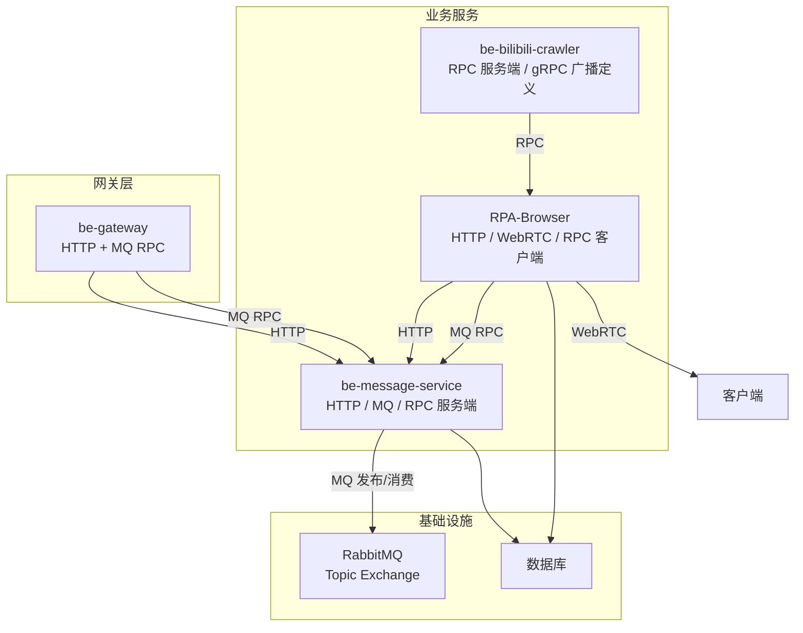
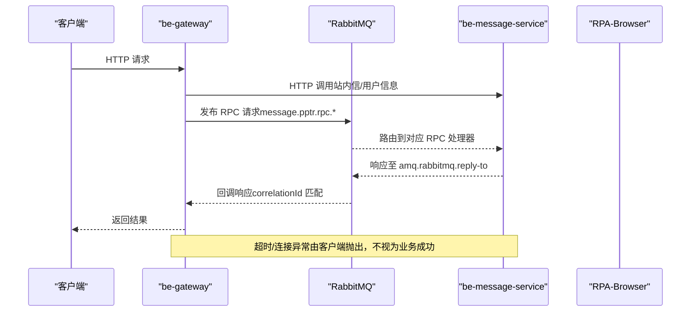
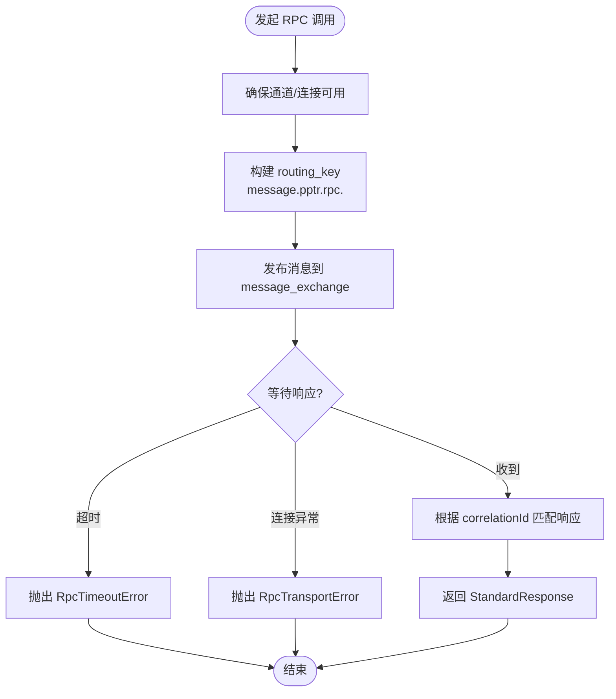
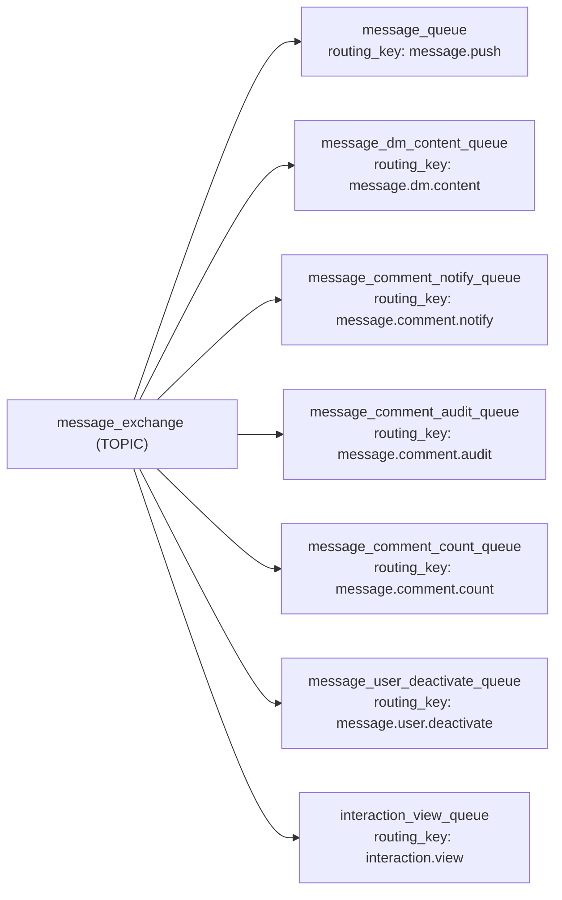
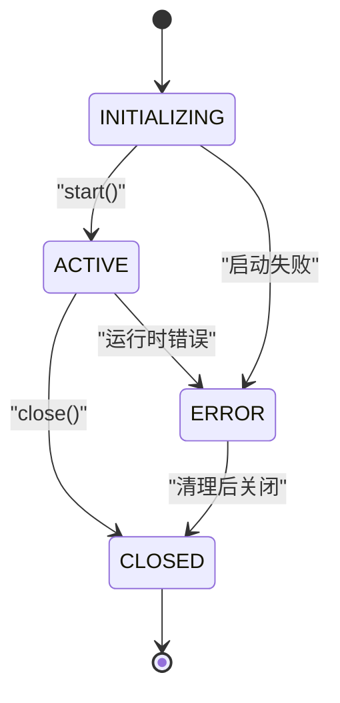
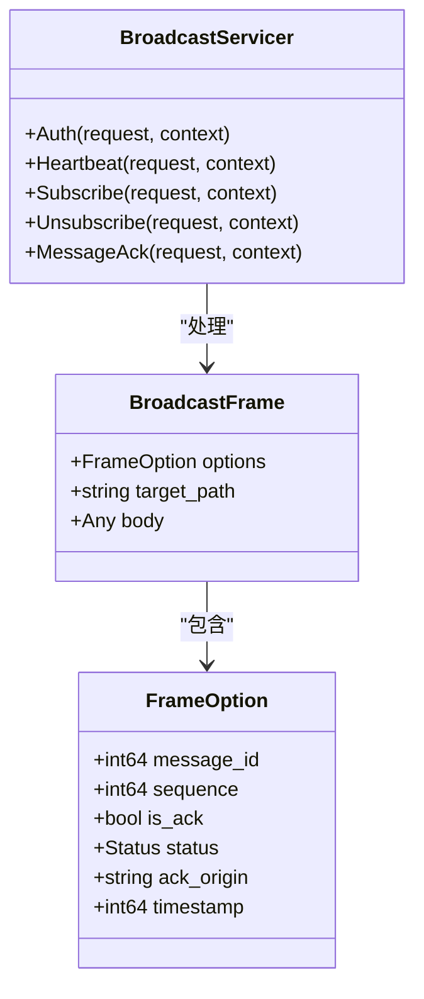
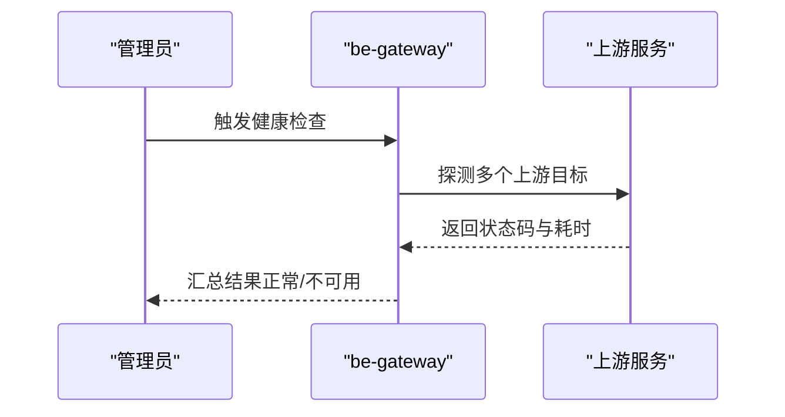
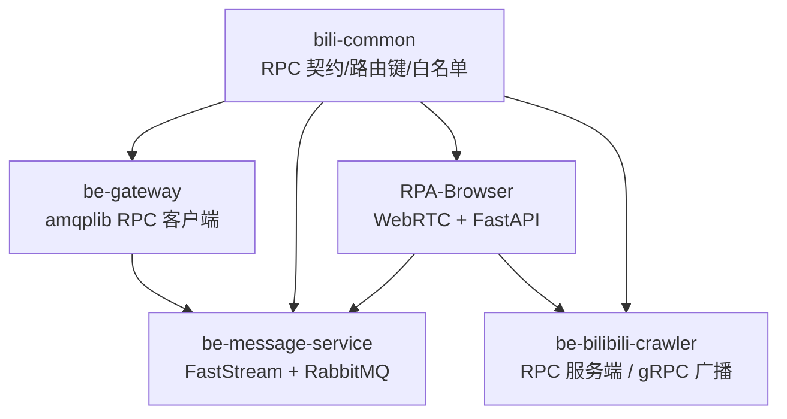

# 服务间通信机制

<cite>
**本文引用的文件**
- [bili-common/bili_common/rpc/__init__.py](file://bili-common/bili_common/rpc/__init__.py)
- [bili-common/bili_common/rpc/base.py](file://bili-common/bili_common/rpc/base.py)
- [be-message-service/app/core/broker.py](file://be-message-service/app/core/broker.py)
- [be-gateway/ExpressServerEnd/Service/mq/rpc_client.js](file://be-gateway/ExpressServerEnd/Service/mq/rpc_client.js)
- [RPA-Browser/app/services/RPA_browser/webrtc/stream_session.py](file://RPA-Browser/app/services/RPA_browser/webrtc/stream_session.py)
- [be-bilibili-crawler/Service/GrpcModule/Grpc/GrpcProto/bilibili/broadcast/v1/broadcast.proto](file://be-bilibili-crawler/Service/GrpcModule/Grpc/GrpcProto/bilibili/broadcast/v1/broadcast.proto)
- [be-bilibili-crawler/Service/GrpcModule/Grpc/GrpcProto/bilibili/broadcast/v1/broadcast_pb2_grpc.py](file://be-bilibili-crawler/Service/GrpcModule/Grpc/GrpcProto/bilibili/broadcast/v1/broadcast_pb2_grpc.py)
- [be-gateway/ExpressServerEnd/Service/upstream_health_module/upstream_health_service.js](file://be-gateway/ExpressServerEnd/Service/upstream_health_module/upstream_health_service.js)
- [be-gateway/ExpressServerEnd/Model/base_model/base_model.js](file://be-gateway/ExpressServerEnd/Model/base_model/base_model.js)
- [RPA-Browser/app/routes.py](file://RPA-Browser/app/routes.py)
</cite>

## 目录
1. [简介](#简介)
2. [项目结构](#项目结构)
3. [核心组件](#核心组件)
4. [架构总览](#架构总览)
5. [详细组件分析](#详细组件分析)
6. [依赖关系分析](#依赖关系分析)
7. [性能考虑](#性能考虑)
8. [故障排查指南](#故障排查指南)
9. [结论](#结论)
10. [附录](#附录)

## 简介
本文件面向 BilibiliExplosion 项目的“服务间通信机制”，系统性梳理并说明项目中使用的多种通信方式：RESTful API、基于消息队列的 RPC（请求-响应）、事件驱动的消息发布订阅、以及实时通信（WebRTC）。重点阐述 RPC 框架的设计与使用（路由键前缀、方法白名单、标准响应封装）、消息队列的通信模式（发布订阅、请求响应、事件驱动）、实时通信的连接管理与状态同步，并提供协议规范、错误处理策略与性能优化建议。

## 项目结构
本项目采用多语言微服务协作：
- be-message-service：消息与通知中心，提供 HTTP API、MQ 消费者与 RPC 服务端能力。
- be-gateway：Node.js 网关，聚合外部请求，调用上游服务，并通过 MQ 实现 RPC 调用。
- RPA-Browser：Python FastAPI 服务，暴露浏览器控制与 WebRTC 流媒体能力，同时作为部分 RPC 客户端。
- be-bilibili-crawler：爬虫与数据处理服务，提供 RPC 服务端（抽奖数据等），并包含 gRPC 广播协议定义。
- bili-common：跨服务共享的 RPC 契约、路由键前缀与方法白名单等公共库。

图表来源
- [be-gateway/ExpressServerEnd/Service/mq/rpc_client.js:1-165](file://be-gateway/ExpressServerEnd/Service/mq/rpc_client.js#L1-L165)
- [be-message-service/app/core/broker.py:1-125](file://be-message-service/app/core/broker.py#L1-L125)
- [RPA-Browser/app/routes.py:1-48](file://RPA-Browser/app/routes.py#L1-L48)
- [be-bilibili-crawler/Service/GrpcModule/Grpc/GrpcProto/bilibili/broadcast/v1/broadcast.proto:46-95](file://be-bilibili-crawler/Service/GrpcModule/Grpc/GrpcProto/bilibili/broadcast/v1/broadcast.proto#L46-L95)

章节来源
- [RPA-Browser/app/routes.py:1-48](file://RPA-Browser/app/routes.py#L1-L48)
- [be-message-service/app/core/broker.py:1-125](file://be-message-service/app/core/broker.py#L1-L125)
- [be-gateway/ExpressServerEnd/Service/mq/rpc_client.js:1-165](file://be-gateway/ExpressServerEnd/Service/mq/rpc_client.js#L1-L165)
- [be-bilibili-crawler/Service/GrpcModule/Grpc/GrpcProto/bilibili/broadcast/v1/broadcast.proto:46-95](file://be-bilibili-crawler/Service/GrpcModule/Grpc/GrpcProto/bilibili/broadcast/v1/broadcast.proto#L46-L95)

## 核心组件
- 统一 RPC 契约与路由键前缀：在 bili-common 中集中定义各系统 RPC 的方法名、路由键前缀与白名单，确保两端一致。
- 消息队列 Broker：be-message-service 通过 FastStream 管理 RabbitMQ 的 Topic Exchange 与各业务队列，解耦站内信与第三方推送。
- MQ RPC 客户端：be-gateway 使用 amqplib 通过 topic exchange 发送请求，并使用 direct reply-to 接收响应，实现同步等待。
- WebRTC 实时流：RPA-Browser 封装 WebRTC 会话生命周期，维护状态机与活动时长，支持视频帧生产与 ICE 协商。
- gRPC 广播协议：be-bilibili-crawler 定义了广播帧、心跳、鉴权等 proto 与 stub，为未来实时广播预留能力。

章节来源
- [bili-common/bili_common/rpc/__init__.py:1-177](file://bili-common/bili_common/rpc/__init__.py#L1-L177)
- [bili-common/bili_common/rpc/base.py:1-226](file://bili-common/bili_common/rpc/base.py#L1-L226)
- [be-message-service/app/core/broker.py:1-125](file://be-message-service/app/core/broker.py#L1-L125)
- [be-gateway/ExpressServerEnd/Service/mq/rpc_client.js:1-165](file://be-gateway/ExpressServerEnd/Service/mq/rpc_client.js#L1-L165)
- [RPA-Browser/app/services/RPA_browser/webrtc/stream_session.py:1-301](file://RPA-Browser/app/services/RPA_browser/webrtc/stream_session.py#L1-L301)
- [be-bilibili-crawler/Service/GrpcModule/Grpc/GrpcProto/bilibili/broadcast/v1/broadcast.proto:46-95](file://be-bilibili-crawler/Service/GrpcModule/Grpc/GrpcProto/bilibili/broadcast/v1/broadcast.proto#L46-L95)

## 架构总览
整体通信架构以“HTTP 入口 + MQ 异步化 + RPC 请求-响应 + WebRTC 实时流”为主：
- 外部请求经网关进入 be-message-service 或 RPA-Browser。
- 内部服务间通过 MQ 进行 RPC 调用（topic exchange + routing key）与事件发布订阅。
- 实时场景使用 WebRTC 建立点对点连接，RPA-Browser 负责流媒体采集与信令处理。
- gRPC 广播协议用于未来扩展（如直播弹幕、实时通知）。

图表来源
- [be-gateway/ExpressServerEnd/Service/mq/rpc_client.js:1-165](file://be-gateway/ExpressServerEnd/Service/mq/rpc_client.js#L1-L165)
- [be-message-service/app/core/broker.py:1-125](file://be-message-service/app/core/broker.py#L1-L125)

## 详细组件分析

### RPC 框架设计与使用（基于 MQ 的请求-响应）
- 路由键前缀与方法白名单：
  - 抽奖 RPC：FastapiApp.rpc.*
  - pptr 用户 RPC：message.pptr.rpc.*
  - 站外推送 RPC：message.push.rpc.*
  - RPA 资源 RPC：message.rpa.rpc.*
  - 系统通知 RPC：message.notify.rpc.*
  - 所有方法需通过白名单校验，避免任意方法被调用。
- 客户端实现（be-gateway）：
  - 使用 topic exchange “message_exchange”，按 routing_key 投递请求。
  - 使用 direct reply-to（amq.rabbitmq.reply-to）接收响应，通过 correlationId 关联请求与响应。
  - 超时与传输异常明确抛出，不得误判为“查无此人”。
- 服务端实现（be-message-service）：
  - 通过 FastStream 的 @broker.rpc 注册处理器，消费对应 routing_key 并返回 StandardResponse。
  - 统一异常包装，确保错误不会静默丢失。

图表来源
- [be-gateway/ExpressServerEnd/Service/mq/rpc_client.js:1-165](file://be-gateway/ExpressServerEnd/Service/mq/rpc_client.js#L1-L165)
- [bili-common/bili_common/rpc/base.py:1-226](file://bili-common/bili_common/rpc/base.py#L1-L226)

章节来源
- [bili-common/bili_common/rpc/__init__.py:1-177](file://bili-common/bili_common/rpc/__init__.py#L1-L177)
- [bili-common/bili_common/rpc/base.py:1-226](file://bili-common/bili_common/rpc/base.py#L1-L226)
- [be-gateway/ExpressServerEnd/Service/mq/rpc_client.js:1-165](file://be-gateway/ExpressServerEnd/Service/mq/rpc_client.js#L1-L165)

### 消息队列通信模式（发布订阅、请求响应、事件驱动）
- 发布订阅：
  - 使用 TOPIC exchange “message_exchange”，按 routing_key 将消息分发到不同队列。
  - 示例：message.push（外部渠道推送）、message.dm.content（私信内容落库）、评论审核/通知/计数等。
- 请求响应（RPC）：
  - 通过 direct reply-to 与 correlationId 实现同步等待响应。
  - 适用于需要即时结果的跨服务调用（如用户信息查询）。
- 事件驱动：
  - 将耗时或弱依赖逻辑（评论审核、统计累计、用户注销流程）异步化，提升主流程吞吐。

图表来源
- [be-message-service/app/core/broker.py:1-125](file://be-message-service/app/core/broker.py#L1-L125)

章节来源
- [be-message-service/app/core/broker.py:1-125](file://be-message-service/app/core/broker.py#L1-L125)

### 实时通信方案（WebRTC）
- 会话管理：
  - WebRTCStreamSession 封装单个页面的 WebRTC 视频流生命周期，维护状态机（INITIALIZING → ACTIVE → CLOSED/ERROR）。
  - PageWebRTCState 使用 weakref 持有 session，避免循环引用；记录最后活动时间，支持闲置时长查询。
- 信令处理：
  - create_offer/handle_answer/add_ice_candidate 完成 SDP 交换与 ICE 候选添加。
  - 监听 ICE 与连接状态变更，更新活跃时间并记录日志。
- 帧生产：
  - VideoFrameProducer 从 Playwright Page 捕获视频帧，封装为 WebRTCMediaTrack 推送到对端。

图表来源
- [RPA-Browser/app/services/RPA_browser/webrtc/stream_session.py:1-301](file://RPA-Browser/app/services/RPA_browser/webrtc/stream_session.py#L1-L301)

章节来源
- [RPA-Browser/app/services/RPA_browser/webrtc/stream_session.py:1-301](file://RPA-Browser/app/services/RPA_browser/webrtc/stream_session.py#L1-L301)

### gRPC 广播协议（预留能力）
- 协议定义：
  - BroadcastFrame：承载 target_path 与业务体，支持 is_ack 回执。
  - FrameOption：消息 id、序列号、是否回执、业务状态码、时间戳等。
  - HeartbeatReq/HeartbeatResp：心跳保活。
- 服务接口：
  - Auth、Heartbeat、Subscribe、Unsubscribe、MessageAck 等方法 stub 已生成，便于后续实现。

图表来源
- [be-bilibili-crawler/Service/GrpcModule/Grpc/GrpcProto/bilibili/broadcast/v1/broadcast.proto:46-95](file://be-bilibili-crawler/Service/GrpcModule/Grpc/GrpcProto/bilibili/broadcast/v1/broadcast.proto#L46-L95)
- [be-bilibili-crawler/Service/GrpcModule/Grpc/GrpcProto/bilibili/broadcast/v1/broadcast_pb2_grpc.py:66-103](file://be-bilibili-crawler/Service/GrpcModule/Grpc/GrpcProto/bilibili/broadcast/v1/broadcast_pb2_grpc.py#L66-L103)

章节来源
- [be-bilibili-crawler/Service/GrpcModule/Grpc/GrpcProto/bilibili/broadcast/v1/broadcast.proto:46-95](file://be-bilibili-crawler/Service/GrpcModule/Grpc/GrpcProto/bilibili/broadcast/v1/broadcast.proto#L46-L95)
- [be-bilibili-crawler/Service/GrpcModule/Grpc/GrpcProto/bilibili/broadcast/v1/broadcast_pb2_grpc.py:66-103](file://be-bilibili-crawler/Service/GrpcModule/Grpc/GrpcProto/bilibili/broadcast/v1/broadcast_pb2_grpc.py#L66-L103)

### RESTful API 与网关健康检查
- RPA-Browser 路由与异常处理：
  - 注册控制器路由、全局异常处理器与封禁中间件，统一业务异常。
- 网关上游健康检查：
  - 定期探测上游代理服务可用性，输出检查结果与不可用告警。

图表来源
- [be-gateway/ExpressServerEnd/Service/upstream_health_module/upstream_health_service.js:93-124](file://be-gateway/ExpressServerEnd/Service/upstream_health_module/upstream_health_service.js#L93-L124)
- [RPA-Browser/app/routes.py:1-48](file://RPA-Browser/app/routes.py#L1-L48)

章节来源
- [RPA-Browser/app/routes.py:1-48](file://RPA-Browser/app/routes.py#L1-L48)
- [be-gateway/ExpressServerEnd/Service/upstream_health_module/upstream_health_service.js:93-124](file://be-gateway/ExpressServerEnd/Service/upstream_health_module/upstream_health_service.js#L93-L124)

## 依赖关系分析
- 契约依赖：
  - bili-common 提供统一的 RPC 方法名、路由键前缀与白名单，供 be-bilibili-crawler、RPA-Browser、be-message-service、be-gateway 复用。
- 运行时依赖：
  - be-message-service 通过 FastStream 管理 RabbitMQ broker/exchange/queue，消费者与 HTTP 接口共用同一实例，避免重复建连。
  - be-gateway 的 MQ RPC 客户端依赖 amqplib，使用 topic exchange 与 direct reply-to。
  - RPA-Browser 的 WebRTC 模块依赖 aiortc 与 Playwright，封装会话与帧生产。

图表来源
- [bili-common/bili_common/rpc/__init__.py:1-177](file://bili-common/bili_common/rpc/__init__.py#L1-L177)
- [be-message-service/app/core/broker.py:1-125](file://be-message-service/app/core/broker.py#L1-L125)
- [be-gateway/ExpressServerEnd/Service/mq/rpc_client.js:1-165](file://be-gateway/ExpressServerEnd/Service/mq/rpc_client.js#L1-L165)
- [RPA-Browser/app/services/RPA_browser/webrtc/stream_session.py:1-301](file://RPA-Browser/app/services/RPA_browser/webrtc/stream_session.py#L1-L301)

章节来源
- [bili-common/bili_common/rpc/__init__.py:1-177](file://bili-common/bili_common/rpc/__init__.py#L1-L177)
- [be-message-service/app/core/broker.py:1-125](file://be-message-service/app/core/broker.py#L1-L125)
- [be-gateway/ExpressServerEnd/Service/mq/rpc_client.js:1-165](file://be-gateway/ExpressServerEnd/Service/mq/rpc_client.js#L1-L165)
- [RPA-Browser/app/services/RPA_browser/webrtc/stream_session.py:1-301](file://RPA-Browser/app/services/RPA_browser/webrtc/stream_session.py#L1-L301)

## 性能考虑
- 连接复用：
  - be-message-service 的 broker 实例由 router 统一管理，publisher/RPC/健康检查共用一条连接，减少开销。
  - be-gateway 的 MQ RPC 客户端在首次调用时建立连接并缓存 channel，避免重复建连。
- 超时与重试：
  - RPC 客户端设置超时时间，超时直接抛出异常，避免长时间阻塞。
  - 建议在调用方增加重试与退避策略（指数退避），提高鲁棒性。
- 削峰与解耦：
  - 高并发写路径（评论计数、互动统计）通过独立队列异步处理，降低主链路压力。
- 资源清理：
  - WebRTC 会话关闭时释放 producer 与 peer connection，避免内存泄漏。
  - 使用 weakref 避免页面与会话之间的循环引用。

[本节为通用指导，无需特定文件来源]

## 故障排查指南
- RPC 超时与通信异常：
  - be-gateway 的 rpc_client 会抛出 RpcTimeoutError 与 RpcTransportError，调用方必须向上抛出，不得当作业务成功处理。
  - 检查 RabbitMQ 连接配置、exchange/queue 绑定是否正确。
- 消息未消费：
  - 确认 consumer 已正确绑定到对应 queue，且 routing_key 匹配。
  - 查看消费者日志与 broker 监控，确认消息堆积情况。
- WebRTC 连接失败：
  - 检查 ICE candidate 格式与网络连通性。
  - 观察 PeerConnection 状态变更日志，定位握手阶段问题。
- 网关健康检查告警：
  - 根据健康检查输出定位不可用的上游服务，检查其端口、路由与健康接口。

章节来源
- [be-gateway/ExpressServerEnd/Service/mq/rpc_client.js:1-165](file://be-gateway/ExpressServerEnd/Service/mq/rpc_client.js#L1-L165)
- [be-message-service/app/core/broker.py:1-125](file://be-message-service/app/core/broker.py#L1-L125)
- [RPA-Browser/app/services/RPA_browser/webrtc/stream_session.py:1-301](file://RPA-Browser/app/services/RPA_browser/webrtc/stream_session.py#L1-L301)
- [be-gateway/ExpressServerEnd/Service/upstream_health_module/upstream_health_service.js:93-124](file://be-gateway/ExpressServerEnd/Service/upstream_health_module/upstream_health_service.js#L93-L124)

## 结论
本项目通过“HTTP + MQ RPC + 事件驱动 + WebRTC”的组合实现了灵活高效的服务间通信：
- 使用 bili-common 统一 RPC 契约与路由键前缀，确保跨服务一致性。
- 通过 RabbitMQ 的 topic exchange 实现发布订阅与请求响应，解耦强依赖与耗时逻辑。
- WebRTC 提供低延迟的实时视频流能力，配合状态机与资源管理保证稳定性。
- gRPC 广播协议为未来实时场景预留扩展空间。
建议在生产环境完善重试、熔断与降级策略，持续监控消息堆积与连接健康度，保障系统高可用。

[本节为总结，无需特定文件来源]

## 附录
- 协议规范要点：
  - RPC 路由键：message.pptr.rpc.*、message.push.rpc.*、FastapiApp.rpc.*、message.rpa.rpc.*、message.notify.rpc.*
  - 响应格式：StandardResponse{code, msg, data}
  - 消息回执：BroadcastFrame 的 is_ack 字段用于业务帧回执
- 错误处理策略：
  - 通信异常（超时/连接失败）必须向上抛出，不掩盖错误
  - 业务异常通过统一处理器转换为 HTTP 200 + 业务码
- 性能优化建议：
  - 连接复用、超时控制、异步削峰、资源及时释放
  - 合理拆分队列与路由键，避免热点竞争

[本节为补充说明，无需特定文件来源]