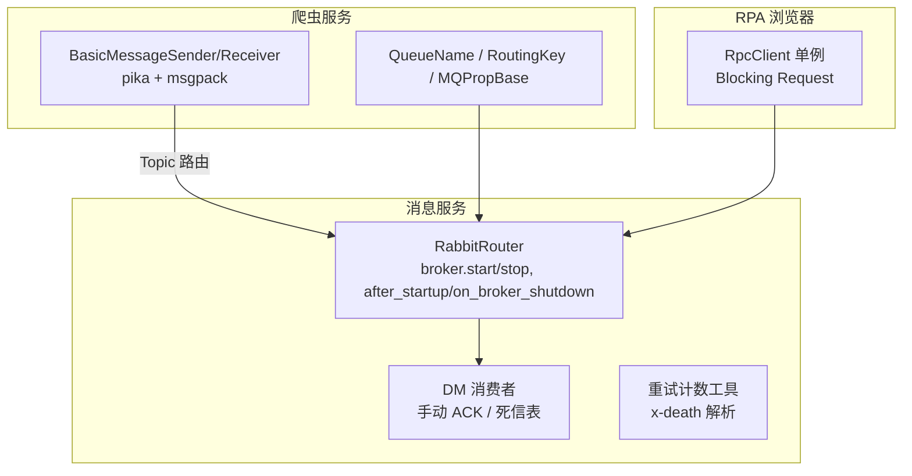
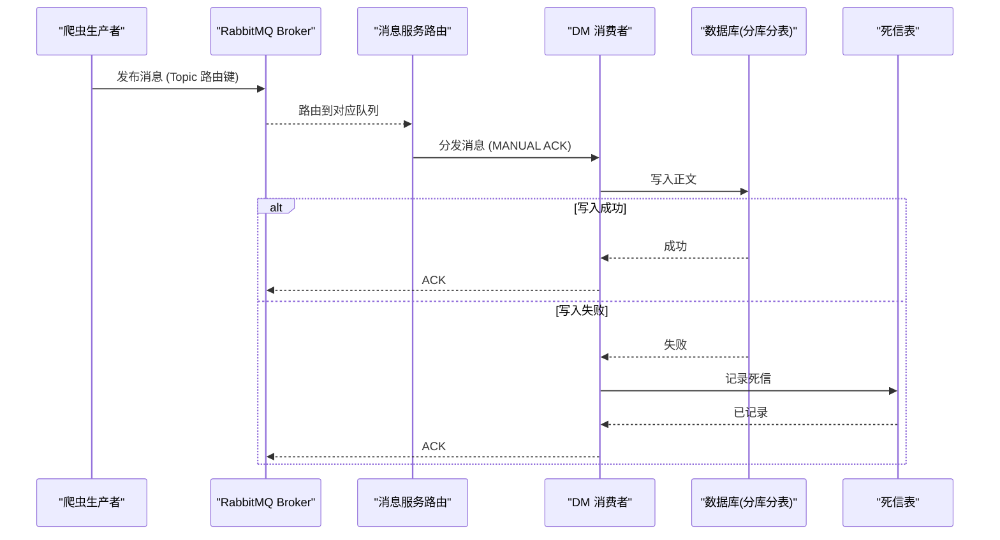
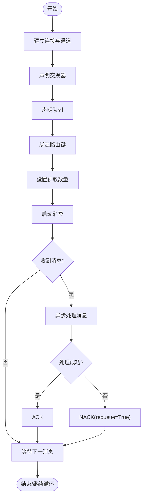
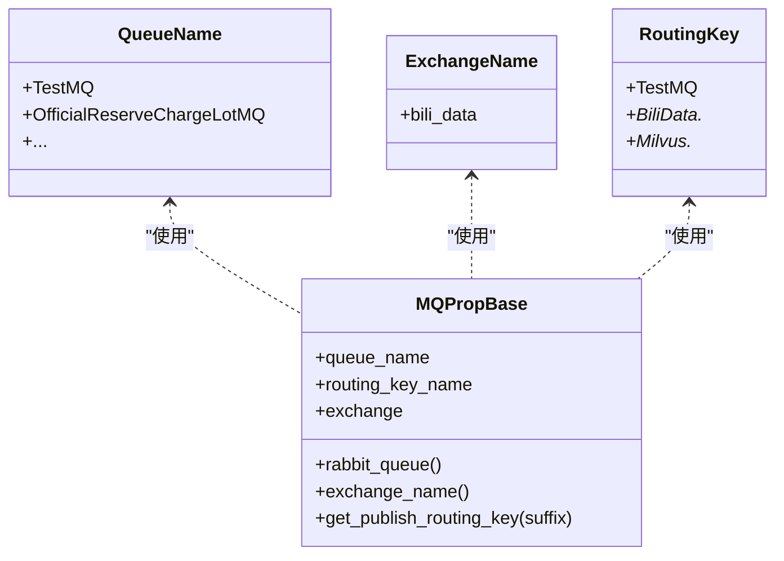
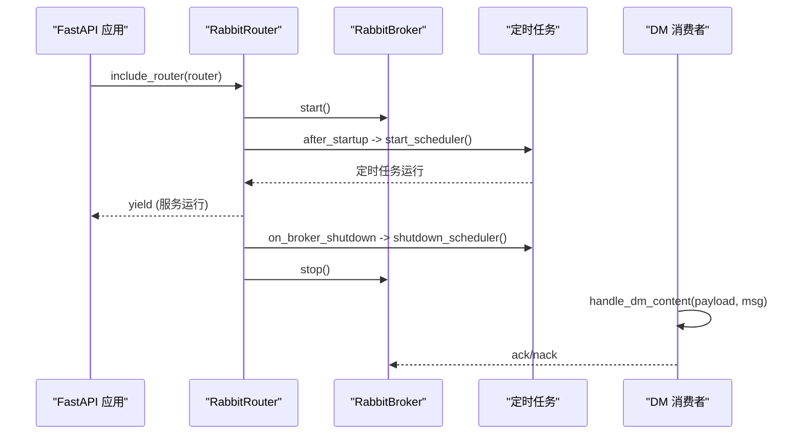
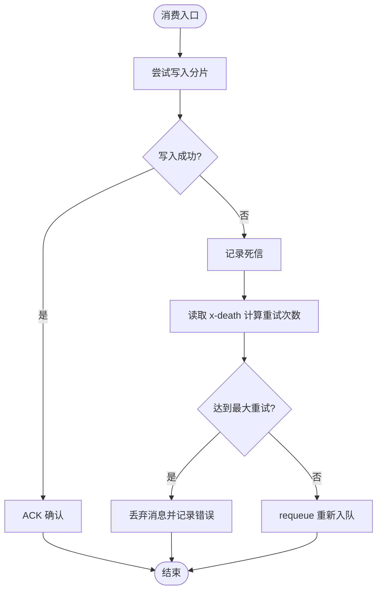
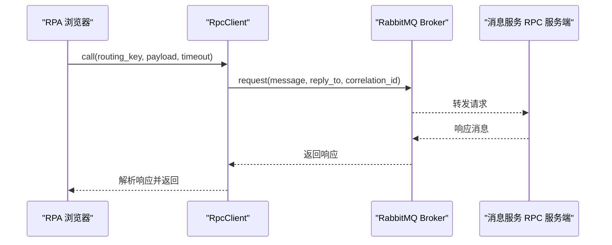
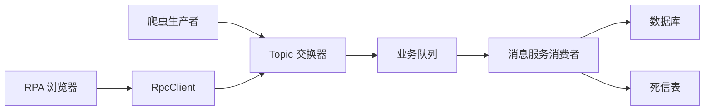

# 消息队列通信

<cite>
**本文引用的文件**
- [BasicAsyncClient.py](file://be-bilibili-crawler/Service/MQ/base/BasicAsyncClient.py)
- [BaseMQModel.py](file://be-bilibili-crawler/Models/MQ/BaseMQModel.py)
- [router.py](file://be-message-service/app/mq/router.py)
- [dm.py（消费者）](file://be-message-service/app/mq/consumers/dm.py)
- [dm.py（处理逻辑）](file://be-message-service/app/consumers/dm.py)
- [retry.py](file://be-message-service/app/consumers/retry.py)
- [rpc_client.py](file://RPA-Browser/app/services/mq/rpc_client.py)
- [test_mq.py](file://be-bilibili-crawler/test/test_mq.py)
</cite>

## 目录
1. [简介](#简介)
2. [项目结构](#项目结构)
3. [核心组件](#核心组件)
4. [架构总览](#架构总览)
5. [详细组件分析](#详细组件分析)
6. [依赖关系分析](#依赖关系分析)
7. [性能考虑](#性能考虑)
8. [故障排查指南](#故障排查指南)
9. [结论](#结论)
10. [附录](#附录)

## 简介
本文件面向 BilibiliExplosion 项目的消息队列通信机制，聚焦基于 RabbitMQ 的发布订阅与请求响应模式。内容涵盖交换机与队列配置、路由策略、事件驱动架构、生产者与消费者实现、异步任务与结果回调、持久化与重试、死信队列、消息模型与序列化、版本兼容、性能优化与故障排查方法。文档以仓库中实际代码为依据，提供可追溯的文件来源与图示。

## 项目结构
本项目在多个子服务中实现了消息队列能力：
- be-bilibili-crawler：提供基于 pika 的基础收发客户端、消息模型定义与测试用例，用于爬虫侧的消息投递与消费。
- be-message-service：基于 FastStream/RabbitMQ 的统一路由与消费者注册中心，集中管理 broker 生命周期、定时任务钩子与具体业务消费者。
- RPA-Browser：通过统一 RPC 客户端封装调用远端服务，形成请求响应式消息交互。

图表来源
- [BasicAsyncClient.py:63-200](file://be-bilibili-crawler/Service/MQ/base/BasicAsyncClient.py#L63-L200)
- [BaseMQModel.py:7-74](file://be-bilibili-crawler/Models/MQ/BaseMQModel.py#L7-L74)
- [router.py:1-57](file://be-message-service/app/mq/router.py#L1-L57)
- [dm.py（消费者）:1-25](file://be-message-service/app/mq/consumers/dm.py#L1-L25)
- [retry.py:1-30](file://be-message-service/app/consumers/retry.py#L1-L30)
- [rpc_client.py:1-25](file://RPA-Browser/app/services/mq/rpc_client.py#L1-L25)

章节来源
- [BasicAsyncClient.py:63-200](file://be-bilibili-crawler/Service/MQ/base/BasicAsyncClient.py#L63-L200)
- [BaseMQModel.py:7-74](file://be-bilibili-crawler/Models/MQ/BaseMQModel.py#L7-L74)
- [router.py:1-57](file://be-message-service/app/mq/router.py#L1-L57)

## 核心组件
- 基础收发客户端（爬虫侧）
  - BasicMessageReceiver：异步连接、声明交换器与队列、绑定路由键、设置 QoS、启动消费、手动 ACK/NACK、断线重连。
  - BasicMessageSender：阻塞连接、声明交换器、按路由键发送消息，使用 msgpack 序列化。
- 消息模型与路由（爬虫侧）
  - QueueName / ExchangeName / RoutingKey：枚举化的队列名、交换器名与路由键。
  - MQPropBase：构造 RabbitQueue 并自动附加通配符路由；提供 get_publish_routing_key 动态拼接路由键。
- 消息服务路由与消费者（消息服务侧）
  - RabbitRouter：统一管理 broker 生命周期，after_startup 启动定时任务，on_broker_shutdown 停止调度器。
  - DM 消费者：手动 ACK，成功写入后 ack，失败写入死信表后 ack，避免无限重投。
- 重试与死信（消息服务侧）
  - retry_count：从 x-death 头统计重投次数，配合默认最大重试次数控制。
  - 死信表：DmContentDeadLetter 记录失败消息，供定时任务补偿。
- RPC 客户端（RPA 浏览器侧）
  - RpcClient 单例：基于 FastStream Blocking Request 的请求响应模式，自动处理 correlation_id 与 reply_to。

章节来源
- [BasicAsyncClient.py:63-361](file://be-bilibili-crawler/Service/MQ/base/BasicAsyncClient.py#L63-L361)
- [BaseMQModel.py:7-74](file://be-bilibili-crawler/Models/MQ/BaseMQModel.py#L7-L74)
- [router.py:1-57](file://be-message-service/app/mq/router.py#L1-L57)
- [dm.py（消费者）:1-25](file://be-message-service/app/mq/consumers/dm.py#L1-L25)
- [dm.py（处理逻辑）:1-54](file://be-message-service/app/consumers/dm.py#L1-L54)
- [retry.py:1-30](file://be-message-service/app/consumers/retry.py#L1-L30)
- [rpc_client.py:1-25](file://RPA-Browser/app/services/mq/rpc_client.py#L1-L25)

## 架构总览
整体采用“发布订阅 + 请求响应”的双模式：
- 发布订阅：爬虫侧通过 Topic 交换器将数据投递到指定队列，消息服务侧消费者按路由键订阅并处理。
- 请求响应：RPA 浏览器通过 RpcClient 发起 RPC 调用，消息服务作为服务端处理并返回结果。

图表来源
- [BasicAsyncClient.py:303-361](file://be-bilibili-crawler/Service/MQ/base/BasicAsyncClient.py#L303-L361)
- [router.py:22-57](file://be-message-service/app/mq/router.py#L22-L57)
- [dm.py（消费者）:17-25](file://be-message-service/app/mq/consumers/dm.py#L17-L25)
- [dm.py（处理逻辑）:24-51](file://be-message-service/app/consumers/dm.py#L24-L51)

## 详细组件分析

### 组件 A：基础收发客户端（爬虫侧）
- 设计要点
  - 连接与通道：异步连接建立、通道打开、交换器与队列声明、绑定路由键、设置 QoS。
  - 消费流程：basic_consume 开启消费，收到消息后创建协程处理，支持手动 ACK/NACK。
  - 可靠性：断线重连、关闭通道与连接、取消消费者回调。
  - 序列化：使用 msgpack 进行二进制序列化，提升吞吐。
- 关键行为
  - Topic 模式下自动追加通配符路由键，便于灵活匹配。
  - 发送端阻塞连接，声明交换器后按路由键发布消息。

图表来源
- [BasicAsyncClient.py:109-237](file://be-bilibili-crawler/Service/MQ/base/BasicAsyncClient.py#L109-L237)
- [BasicAsyncClient.py:303-361](file://be-bilibili-crawler/Service/MQ/base/BasicAsyncClient.py#L303-L361)

章节来源
- [BasicAsyncClient.py:63-237](file://be-bilibili-crawler/Service/MQ/base/BasicAsyncClient.py#L63-L237)
- [BasicAsyncClient.py:303-361](file://be-bilibili-crawler/Service/MQ/base/BasicAsyncClient.py#L303-L361)

### 组件 B：消息模型与路由（爬虫侧）
- 设计要点
  - 枚举化管理队列名、交换器名与路由键，避免硬编码字符串。
  - MQPropBase 自动为队列附加通配符路由键，简化订阅配置。
  - 提供 get_publish_routing_key 动态拼接路由键，支持扩展后缀。
- 复杂度与影响
  - 路由键拼接 O(1)，对发布路径无显著开销。
  - 通配符订阅提高灵活性，但需确保路由键规范以避免广播风暴。

图表来源
- [BaseMQModel.py:7-74](file://be-bilibili-crawler/Models/MQ/BaseMQModel.py#L7-L74)

章节来源
- [BaseMQModel.py:7-74](file://be-bilibili-crawler/Models/MQ/BaseMQModel.py#L7-L74)

### 组件 C：消息服务路由与消费者（消息服务侧）
- 路由与生命周期
  - RabbitRouter 管理 broker 生命周期，after_startup 启动定时任务，on_broker_shutdown 停止调度器。
  - 单一 broker 实例供 publisher、RPC 服务端与健康检查共用，避免多连接。
- 消费者实现
  - DM 消费者使用 MANUAL ACK，成功写入后 ack，失败写入死信表后 ack，避免无限重投。
  - 消费者通过 @router.subscriber 注册，集中管理。

图表来源
- [router.py:22-57](file://be-message-service/app/mq/router.py#L22-L57)
- [dm.py（消费者）:17-25](file://be-message-service/app/mq/consumers/dm.py#L17-L25)
- [dm.py（处理逻辑）:24-51](file://be-message-service/app/consumers/dm.py#L24-L51)

章节来源
- [router.py:1-57](file://be-message-service/app/mq/router.py#L1-L57)
- [dm.py（消费者）:1-25](file://be-message-service/app/mq/consumers/dm.py#L1-L25)
- [dm.py（处理逻辑）:1-54](file://be-message-service/app/consumers/dm.py#L1-L54)

### 组件 D：重试与死信（消息服务侧）
- 重试机制
  - 通过 x-death 头统计重投次数，默认最大重试次数为 3。
  - 超过上限则丢弃消息并记录错误，避免死循环。
- 死信队列
  - 写失败时记录到 DmContentDeadLetter，由定时任务补偿处理。
  - 标记 resolved 表示已解决，便于审计与追踪。

图表来源
- [retry.py:1-30](file://be-message-service/app/consumers/retry.py#L1-L30)
- [dm.py（处理逻辑）:24-51](file://be-message-service/app/consumers/dm.py#L24-L51)

章节来源
- [retry.py:1-30](file://be-message-service/app/consumers/retry.py#L1-L30)
- [dm.py（处理逻辑）:24-51](file://be-message-service/app/consumers/dm.py#L24-L51)

### 组件 E：请求响应模式（RPA 浏览器侧）
- 设计要点
  - 基于 FastStream Blocking Request 的 RPC 客户端，自动处理 correlation_id 与 reply_to。
  - 全局单例 rpc_client，注入 rabbitmq_url，零改动兼容存量调用点。
- 适用场景
  - 需要同步响应的远程调用，如查询类操作或轻量级任务执行。

图表来源
- [rpc_client.py:1-25](file://RPA-Browser/app/services/mq/rpc_client.py#L1-L25)

章节来源
- [rpc_client.py:1-25](file://RPA-Browser/app/services/mq/rpc_client.py#L1-L25)

## 依赖关系分析
- 组件耦合
  - 爬虫侧生产者与消息服务路由通过 Topic 交换器解耦，依赖路由键约定。
  - 消息服务消费者依赖数据库与死信表，ACK 策略保证不阻塞队列。
  - RPA 浏览器通过 RpcClient 依赖消息服务的 RPC 服务端，使用 Blocking Request 模式。
- 外部依赖
  - RabbitMQ Broker：提供消息路由与持久化能力。
  - FastStream：提供 RabbitMQ 集成与生命周期管理。
  - msgpack：高效序列化格式。

图表来源
- [BasicAsyncClient.py:303-361](file://be-bilibili-crawler/Service/MQ/base/BasicAsyncClient.py#L303-L361)
- [BaseMQModel.py:7-74](file://be-bilibili-crawler/Models/MQ/BaseMQModel.py#L7-L74)
- [router.py:22-57](file://be-message-service/app/mq/router.py#L22-L57)
- [dm.py（消费者）:17-25](file://be-message-service/app/mq/consumers/dm.py#L17-L25)
- [rpc_client.py:1-25](file://RPA-Browser/app/services/mq/rpc_client.py#L1-L25)

章节来源
- [BasicAsyncClient.py:303-361](file://be-bilibili-crawler/Service/MQ/base/BasicAsyncClient.py#L303-L361)
- [BaseMQModel.py:7-74](file://be-bilibili-crawler/Models/MQ/BaseMQModel.py#L7-L74)
- [router.py:22-57](file://be-message-service/app/mq/router.py#L22-L57)
- [dm.py（消费者）:17-25](file://be-message-service/app/mq/consumers/dm.py#L17-L25)
- [rpc_client.py:1-25](file://RPA-Browser/app/services/mq/rpc_client.py#L1-L25)

## 性能考虑
- 预取数量（prefetch_count）
  - 消费者设置合理的预取数量以平衡吞吐与内存占用，避免文件描述符溢出。
- 序列化格式
  - 使用 msgpack 二进制序列化减少网络传输与解析开销。
- 路由策略
  - Topic 模式结合通配符路由键，灵活匹配且避免广播风暴。
- 连接与通道
  - 生产者使用阻塞连接，消费者使用异步连接，分别优化不同场景。
- 重试与死信
  - 限制重试次数避免死循环，死信表记录失败消息便于后续补偿。

[本节为通用性能建议，无需特定文件来源]

## 故障排查指南
- 连接问题
  - 检查 broker URL 与认证信息，观察连接建立日志与异常堆栈。
- 路由不匹配
  - 核对路由键与绑定规则，确保生产者与消费者路由一致。
- 消息堆积
  - 调整预取数量与消费者并发度，检查下游处理能力。
- 重试与死信
  - 查看 x-death 头统计重试次数，检查死信表记录与补偿任务。
- 测试验证
  - 使用测试用例验证发布与消费链路，确保消息最终被消费。

章节来源
- [BasicAsyncClient.py:109-237](file://be-bilibili-crawler/Service/MQ/base/BasicAsyncClient.py#L109-L237)
- [retry.py:1-30](file://be-message-service/app/consumers/retry.py#L1-L30)
- [test_mq.py:294-314](file://be-bilibili-crawler/test/test_mq.py#L294-L314)

## 结论
本项目通过爬虫侧的基础收发客户端与消息服务侧的路由与消费者，构建了稳定可靠的消息队列通信机制。发布订阅模式支撑事件驱动架构，请求响应模式满足同步调用需求。通过重试与死信机制保障可靠性，结合性能优化建议与故障排查方法，确保系统在高负载下的稳定性与可维护性。

[本节为总结性内容，无需特定文件来源]

## 附录
- 消息模型设计
  - 队列名、交换器名与路由键采用枚举化管理，避免硬编码。
  - MQPropBase 自动附加通配符路由键，简化订阅配置。
- 序列化格式
  - 使用 msgpack 二进制序列化，提升吞吐与降低带宽占用。
- 版本兼容性
  - 路由键命名规范与通配符策略确保向后兼容，新增功能通过后缀扩展。
- 最佳实践
  - 合理设置预取数量，避免资源耗尽。
  - 使用 MANUAL ACK 确保消息处理的准确性。
  - 定期清理死信表，监控队列健康状态。

[本节为补充说明，无需特定文件来源]