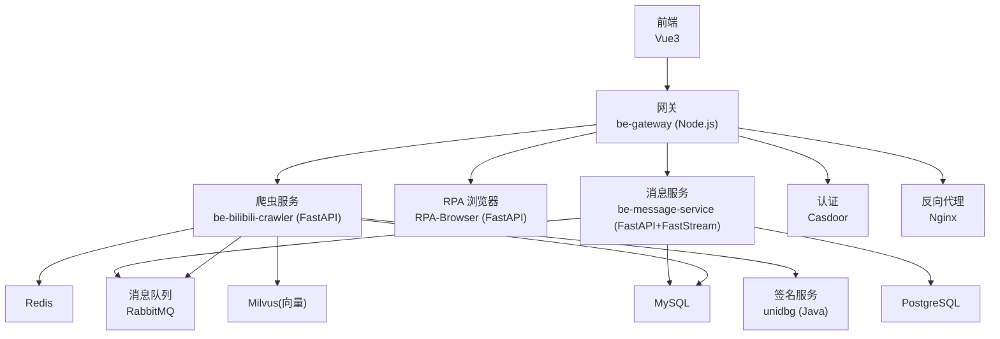
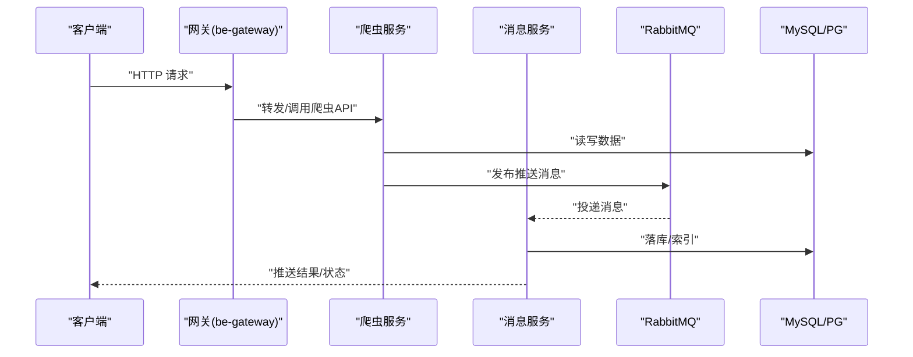
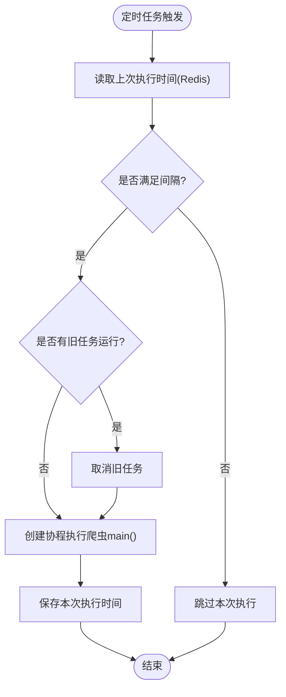
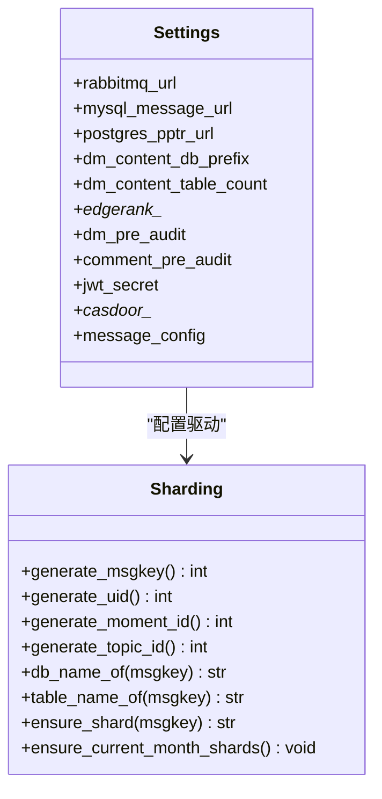
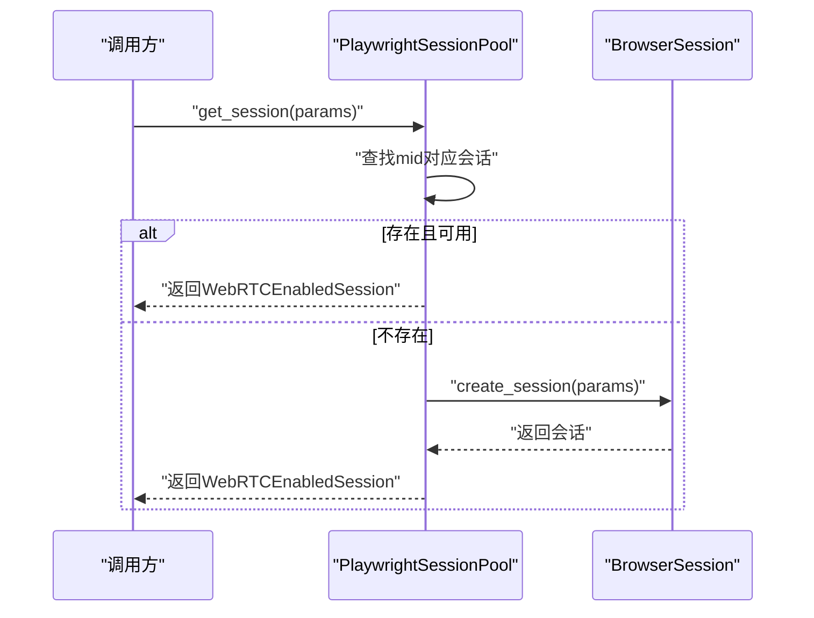
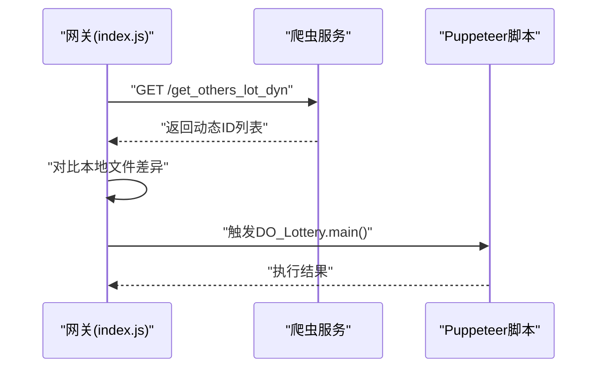
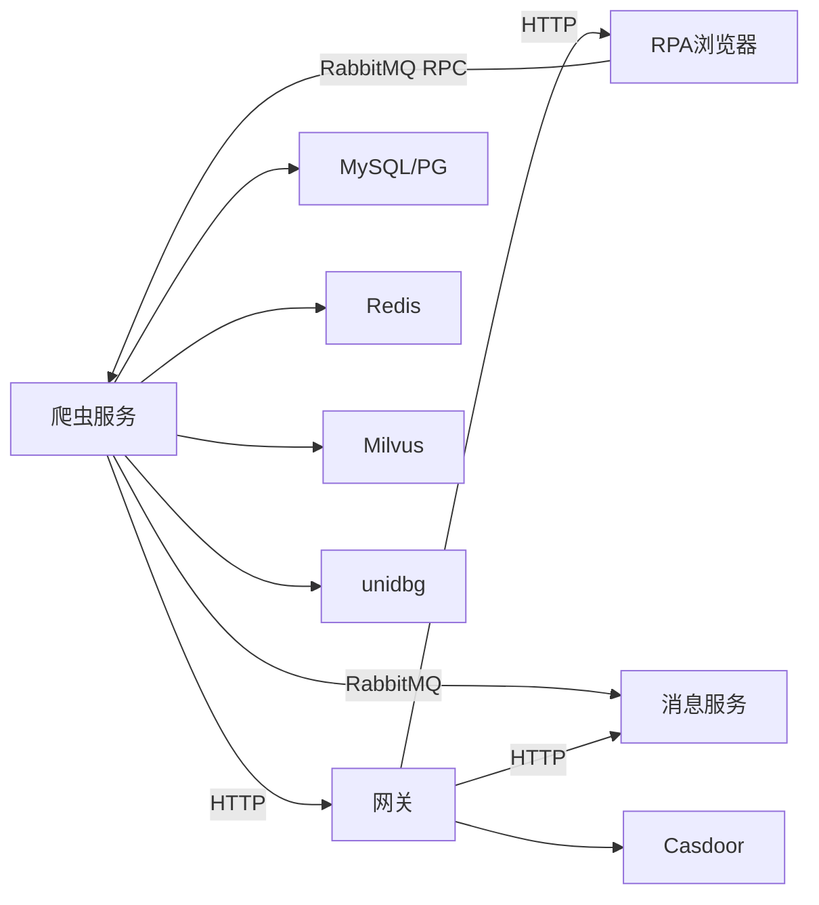
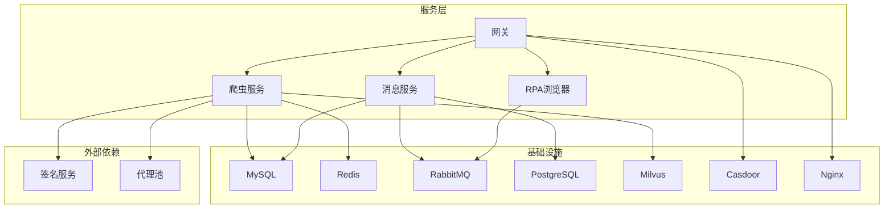

# 架构设计

<cite>
**本文引用的文件**
- [README.md](file://README.md)
- [docker-compose.yml](file://docker-compose.yml)
- [be-bilibili-crawler/main.py](file://be-bilibili-crawler/main.py)
- [RPA-Browser/main.py](file://RPA-Browser/main.py)
- [be-gateway/index.js](file://be-gateway/index.js)
- [be-message-service/app/core/config.py](file://be-message-service/app/core/config.py)
- [be-message-service/app/core/sharding.py](file://be-message-service/app/core/sharding.py)
- [be-message-service/app/core/broker.py](file://be-message-service/app/core/broker.py)
- [be-bilibili-crawler/Service/BaseCrawler/launcher/scheduler_launcher.py](file://be-bilibili-crawler/Service/BaseCrawler/launcher/scheduler_launcher.py)
- [RPA-Browser/app/services/RPA_browser/browser_session_pool/playwright_pool.py](file://RPA-Browser/app/services/RPA_browser/browser_session_pool/playwright_pool.py)
- [be-bilibili-crawler/Service/MQ/message/message_pub.py](file://be-bilibili-crawler/Service/MQ/message/message_pub.py)
- [be-bilibili-crawler/Utils/网关/gateway_auth.py](file://be-bilibili-crawler/Utils/网关/gateway_auth.py)
</cite>

## 目录
1. [简介](#简介)
2. [项目结构](#项目结构)
3. [核心组件](#核心组件)
4. [架构总览](#架构总览)
5. [详细组件分析](#详细组件分析)
6. [依赖关系分析](#依赖关系分析)
7. [性能与可扩展性](#性能与可扩展性)
8. [故障排查指南](#故障排查指南)
9. [结论](#结论)
10. [附录](#附录)

## 简介
本架构文档面向 BilibiliExplosion 项目的微服务化设计与实现，覆盖爬虫采集、消息推送、RPA 浏览器自动化、统一网关入口等关键子系统。系统通过 Docker Compose 编排 MySQL、Redis、RabbitMQ、Milvus、PostgreSQL、Casdoor、Nginx 等中间件，并以 FastAPI（Python）、Express（Node.js）、Spring Boot（Java）、Go 等多语言服务协作完成数据采集、消息路由、会话管理与前端展示的全链路流程。

## 项目结构
仓库采用多子工程聚合的 monorepo 形态，按职责拆分为：
- be-bilibili-crawler：核心爬虫后端与数据 API
- be-message-service：统一消息推送与站内信/私信处理
- RPA-Browser：基于 Playwright 的 RPA 浏览器自动化服务
- be-gateway：Node.js 前端网关与账号/抽奖调度
- unidbgSpringBoot：B 站签名计算服务
- go-proxy-ipv6-pool-auto：IPv6 代理池
- bili-common：Python 公共库（被多个 Python 服务复用）
- Vue3FrontEndDemoExercise：前端工程（调用各后端 API）

**图表来源**
- [docker-compose.yml:120-164](file://docker-compose.yml#L120-L164)
- [docker-compose.yml:179-212](file://docker-compose.yml#L179-L212)
- [docker-compose.yml:227-260](file://docker-compose.yml#L227-L260)
- [docker-compose.yml:261-309](file://docker-compose.yml#L261-L309)
- [docker-compose.yml:357-371](file://docker-compose.yml#L357-L371)

**章节来源**
- [README.md:12-34](file://README.md#L12-L34)
- [docker-compose.yml:1-380](file://docker-compose.yml#L1-L380)

## 核心组件
- 爬虫服务（be-bilibili-crawler）
  - 提供数据采集与数据查询 API；内置定时调度器驱动爬虫任务；通过 RabbitMQ 发布推送请求；对接 Redis、MySQL、Milvus、签名服务。
- 消息服务（be-message-service）
  - 基于 FastStream + RabbitMQ 的消息中心；负责站内通知、私信内容落库（月度分库+库内分表）、第三方渠道推送；提供健康检查与配置管理。
- RPA 浏览器（RPA-Browser）
  - 基于 Playwright 的浏览器会话池化管理；支持创建/关闭会话、资源 RPC 服务端；通过 RabbitMQ RPC 与爬虫服务交互。
- 网关（be-gateway）
  - Node.js Express 网关，统一入口；集成 Casdoor 认证；调度本地 Puppeteer 脚本执行抽奖；转发到各后端服务。
- 其他支撑
  - 签名服务（unidbgSpringBoot）、代理池（go-proxy-ipv6-pool-auto）、向量检索（Milvus）、缓存（Redis）、数据库（MySQL/PostgreSQL）、认证（Casdoor）、反向代理（Nginx）。

**章节来源**
- [README.md:12-34](file://README.md#L12-L34)
- [docker-compose.yml:120-309](file://docker-compose.yml#L120-L309)

## 架构总览
系统以“网关统一入口 + 多微服务 + 消息总线”为核心模式：
- 网关层：对外暴露统一接口，鉴权、限流、路由转发。
- 业务层：爬虫、消息、RPA 浏览器各自独立部署，职责清晰。
- 数据层：MySQL/PostgreSQL 持久化，Redis 缓存，Milvus 向量检索。
- 消息层：RabbitMQ TOPIC 交换器按 routing_key 分流不同队列，解耦生产消费。

**图表来源**
- [be-gateway/index.js:47-170](file://be-gateway/index.js#L47-L170)
- [be-bilibili-crawler/main.py:48-60](file://be-bilibili-crawler/main.py#L48-L60)
- [be-message-service/app/core/broker.py:1-23](file://be-message-service/app/core/broker.py#L1-L23)
- [be-bilibili-crawler/Service/MQ/message/message_pub.py:15-43](file://be-bilibili-crawler/Service/MQ/message/message_pub.py#L15-L43)

**章节来源**
- [docker-compose.yml:120-309](file://docker-compose.yml#L120-L309)

## 详细组件分析

### 爬虫服务（be-bilibili-crawler）
- 启动与路由
  - FastAPI 应用初始化，注册路由（抽奖数据、统计、IP 信息、后台服务、MQ、验证码、山姆、专栏等），启用内存缓存。
  - 全局中间件记录请求耗时、IP、方法、路径、响应体（调试模式）。
  - 全局异常处理器捕获异常并推送告警。
- 异步采集与调度
  - 使用 APScheduler 实现定时任务调度，支持 Cron 表达式、任务合并、最大实例数限制、误触发宽限。
  - 每次触发前检查上次执行时间（Redis 存储），避免频繁重复执行；若上一次任务仍在运行则先终止旧任务再开新任务。
  - 任务执行在协程中异步进行，完成后保存执行时间。
- 消息发布
  - 通过 FastStream 的 RabbitMQ 生产者将推送请求发布到 message_exchange，routing_key 为 message.#，由消息服务消费。

**图表来源**
- [be-bilibili-crawler/Service/BaseCrawler/launcher/scheduler_launcher.py:82-199](file://be-bilibili-crawler/Service/BaseCrawler/launcher/scheduler_launcher.py#L82-L199)

**章节来源**
- [be-bilibili-crawler/main.py:48-112](file://be-bilibili-crawler/main.py#L48-L112)
- [be-bilibili-crawler/Service/BaseCrawler/launcher/scheduler_launcher.py:17-199](file://be-bilibili-crawler/Service/BaseCrawler/launcher/scheduler_launcher.py#L17-L199)
- [be-bilibili-crawler/Service/MQ/message/message_pub.py:15-43](file://be-bilibili-crawler/Service/MQ/message/message_pub.py#L15-L43)

### 消息服务（be-message-service）
- 配置与运行时
  - 通过 pydantic-settings 加载环境变量，包含 RabbitMQ、日志级别、MySQL/PostgreSQL 连接串、分库分表策略、EdgeRank 推荐参数、私信策略、评论策略、JWT、Casdoor、推送渠道等。
  - 健康检查端点 /health 校验 broker 连通性。
- 消息路由与消费者
  - 定义 TOPIC exchange message_exchange，按 routing_key 分流至独立队列：message.push（外部渠道推送）、message.dm.content（私信内容异步落库）。
  - 消费者模块与 HTTP 接口共用 broker 定义，避免绑定不一致。
- 私信内容分库分表
  - 按月分库（bili_msg_content_YYYYMM），每月固定 100 张表（msg_content_00~99），通过 msgkey % 100 路由。
  - 懒创建策略：首次写入时自动建库建表，减少元数据开销；启动时可预热当月分片。
  - 生成 msgkey（毫秒级雪花 ID）与短雪花 ID（uid/moment_id/topic_id），位布局与 epoch/worker 隔离避免碰撞。

**图表来源**
- [be-message-service/app/core/config.py:5-375](file://be-message-service/app/core/config.py#L5-L375)
- [be-message-service/app/core/sharding.py:33-235](file://be-message-service/app/core/sharding.py#L33-L235)

**章节来源**
- [be-message-service/app/core/config.py:5-375](file://be-message-service/app/core/config.py#L5-L375)
- [be-message-service/app/core/sharding.py:1-235](file://be-message-service/app/core/sharding.py#L1-L235)
- [be-message-service/app/core/broker.py:1-23](file://be-message-service/app/core/broker.py#L1-L23)

### RPA 浏览器（RPA-Browser）
- 生命周期与依赖
  - lifespan 中执行 Alembic 迁移、Schema 一致性检查、初始化依赖、启动后台任务、连接 RabbitMQ RPC 客户端、启动 RPA 资源 RPC 服务端。
- 浏览器会话池
  - 按 mid 维护活跃会话字典，使用 asyncio.Lock 保证并发安全。
  - get_session 优先复用已有会话，不存在则创建新会话；创建后验证有效性，失败抛出未启动异常。
  - 支持释放单个或全部会话，空会话清理。

**图表来源**
- [RPA-Browser/app/services/RPA_browser/browser_session_pool/playwright_pool.py:18-127](file://RPA-Browser/app/services/RPA_browser/browser_session_pool/playwright_pool.py#L18-L127)

**章节来源**
- [RPA-Browser/main.py:36-63](file://RPA-Browser/main.py#L36-L63)
- [RPA-Browser/app/services/RPA_browser/browser_session_pool/playwright_pool.py:18-127](file://RPA-Browser/app/services/RPA_browser/browser_session_pool/playwright_pool.py#L18-L127)

### 网关（be-gateway）
- 统一入口与调度
  - 通过 index.js 主循环获取最新抽奖动态（调用爬虫服务 API），写入本地文件，触发 Puppeteer 脚本执行抽奖。
  - 支持直播弹幕发送服务事件注册与触发。
- 认证与权限
  - 集成 Casdoor 认证；权限模块使用 Trie 树匹配路径与通配符，实现细粒度权限控制。
- 转发与集成
  - 环境变量注入各后端 URI（爬虫、RPA、消息服务），统一转发请求。

**图表来源**
- [be-gateway/index.js:47-170](file://be-gateway/index.js#L47-L170)

**章节来源**
- [be-gateway/index.js:47-361](file://be-gateway/index.js#L47-L361)
- [be-bilibili-crawler/Utils/网关/gateway_auth.py:95-121](file://be-bilibili-crawler/Utils/网关/gateway_auth.py#L95-L121)

## 依赖关系分析
- 服务间通信
  - RESTful API：网关与爬虫、RPA、消息服务之间通过 HTTP 调用。
  - 消息队列：RabbitMQ TOPIC 交换器按 routing_key 分发消息，解耦生产消费。
  - RPC：RPA 浏览器通过 RabbitMQ RPC 与爬虫服务交互（auto_attach_auth 模式）。
- 数据流向
  - 数据采集：爬虫从外部站点抓取数据，写入 MySQL/Redis/Milvus，并通过消息队列通知消息服务。
  - 消息处理：消息服务消费队列，落库私信内容（分库分表），并推送第三方渠道。
  - 前端展示：网关聚合数据，前端通过 API 拉取展示。
- 外部依赖
  - 认证：Casdoor 提供 OAuth2/OIDC。
  - 签名：unidbgSpringBoot 提供 B 站签名计算。
  - 代理：go-proxy-ipv6-pool-auto 提供 IPv6 代理池。

**图表来源**
- [docker-compose.yml:120-309](file://docker-compose.yml#L120-L309)
- [be-message-service/app/core/broker.py:1-23](file://be-message-service/app/core/broker.py#L1-L23)
- [be-bilibili-crawler/Service/MQ/message/message_pub.py:15-43](file://be-bilibili-crawler/Service/MQ/message/message_pub.py#L15-L43)

**章节来源**
- [docker-compose.yml:120-309](file://docker-compose.yml#L120-L309)

## 性能与可扩展性
- 异步与并发
  - 爬虫服务使用 uvloop 提升事件循环性能；调度器使用 APScheduler 支持 Cron 与协程任务。
  - RPA 浏览器会话池使用 asyncio.Lock 保证并发安全，避免竞态。
- 数据分片
  - 私信内容按月分库、库内 100 张表，通过 msgkey 精确定位物理表，避免单表膨胀。
  - 懒创建策略减少 DDL 开销，启动时预热当月分片提升首写性能。
- 缓存与向量
  - Redis 缓存执行时间与临时数据；Milvus 用于向量检索，支持相似内容召回。
- 扩展性
  - 微服务独立部署，可通过增加实例水平扩展；消息队列削峰填谷，提升吞吐。
  - EdgeRank 推荐算法可配置权重与半衰期，支持个性化与匿名随机化。

[本节为通用指导，无需特定文件来源]

## 故障排查指南
- 健康检查
  - 消息服务 /health 端点校验 broker 连通性，未连上返回 503。
- 日志与告警
  - 爬虫服务全局异常处理器捕获异常并推送告警；调度器任务执行异常也会推送错误。
- 常见问题
  - Milvus 无法读写：检查 docker_vol/milvus/data 权限。
  - WSL2 网络问题：重启 winnat。
  - 连接池过大：配置中防御性检查防止 pool_size + max_overflow > 100。

**章节来源**
- [docker-compose.yml:310-322](file://docker-compose.yml#L310-L322)
- [be-bilibili-crawler/main.py:94-112](file://be-bilibili-crawler/main.py#L94-L112)
- [be-bilibili-crawler/Service/BaseCrawler/launcher/scheduler_launcher.py:138-199](file://be-bilibili-crawler/Service/BaseCrawler/launcher/scheduler_launcher.py#L138-L199)
- [be-message-service/app/core/config.py:351-360](file://be-message-service/app/core/config.py#L351-L360)

## 结论
BilibiliExplosion 采用清晰的微服务架构，通过网关统一入口、消息总线解耦、数据分片与缓存优化，实现了高可用、可扩展的数据采集与消息推送系统。各服务职责明确，边界清晰，便于独立演进与维护。未来可进一步引入服务网格、分布式追踪与更完善的监控告警体系。

[本节为总结，无需特定文件来源]

## 附录
- 部署拓扑图

**图表来源**
- [docker-compose.yml:1-380](file://docker-compose.yml#L1-L380)