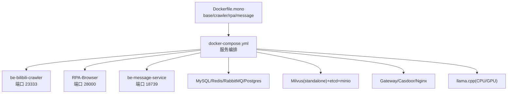
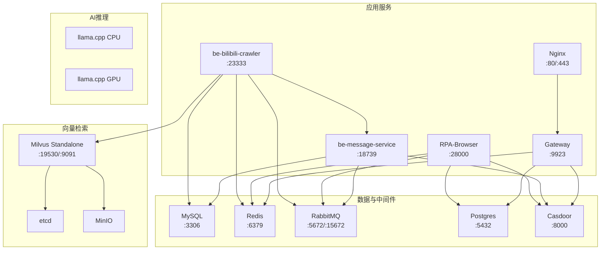
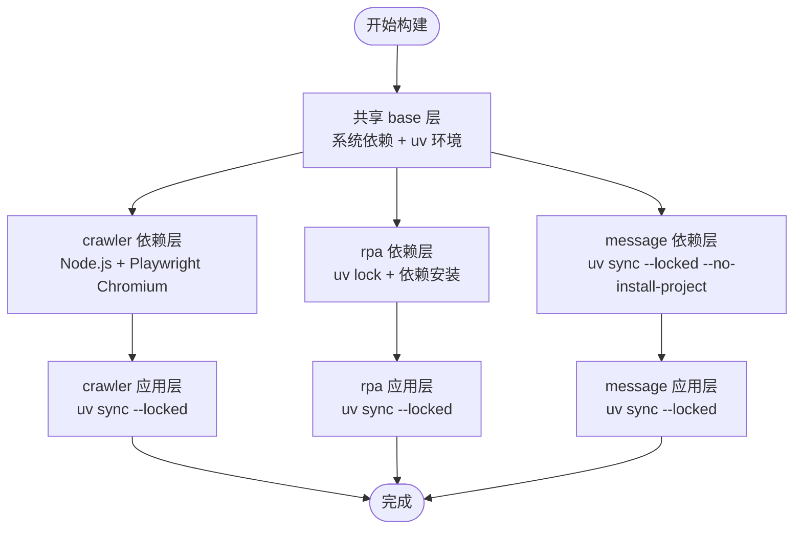
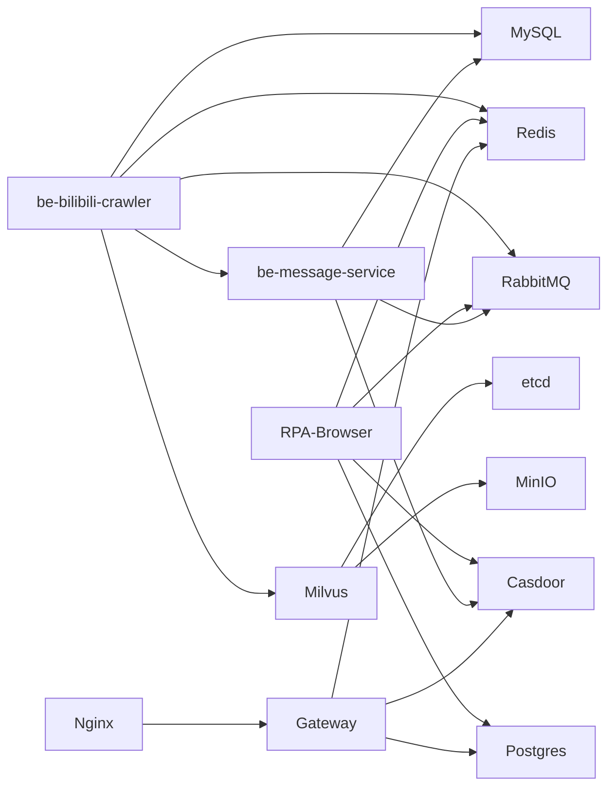

# 容器化策略

<cite>
**本文引用的文件**
- [Dockerfile.mono](file://Dockerfile.mono)
- [docker-compose.yml](file://docker-compose.yml)
- [.github/workflows/docker-publish.yml](file://.github/workflows/docker-publish.yml)
- [.dockerignore](file://.dockerignore)
- [be-bilibili-crawler/.dockerignore](file://be-bilibili-crawler/.dockerignore)
- [RPA-Browser/.dockerignore](file://RPA-Browser/.dockerignore)
- [be-message-service/.dockerignore](file://be-message-service/.dockerignore)
- [Makefile](file://Makefile)
- [be-bilibili-crawler/pyproject.toml](file://be-bilibili-crawler/pyproject.toml)
- [RPA-Browser/pyproject.toml](file://RPA-Browser/pyproject.toml)
- [be-message-service/pyproject.toml](file://be-message-service/pyproject.toml)
</cite>

## 目录
1. [简介](#简介)
2. [项目结构](#项目结构)
3. [核心组件](#核心组件)
4. [架构总览](#架构总览)
5. [详细组件分析](#详细组件分析)
6. [依赖关系分析](#依赖关系分析)
7. [性能与优化](#性能与优化)
8. [故障排查指南](#故障排查指南)
9. [结论](#结论)
10. [附录](#附录)

## 简介
本文件为 BilibiliExplosion 项目的容器化策略文档，聚焦于多阶段构建优化、镜像分层设计、缓存策略、资源限制与存储卷挂载、以及完整的镜像构建命令与最佳实践（含多架构支持、安全扫描与镜像压缩）。项目通过单一 Dockerfile.mono 实现三个 Python 服务目标（crawler、rpa、message）的共享基础层与差异化构建；并通过 docker-compose 编排数据库、消息队列、向量检索等基础设施。

## 项目结构
- 根级 Dockerfile.mono：定义共享 base 与 crawler/rpa/message 三个 target，统一使用 uv 进行依赖安装与虚拟环境管理。
- docker-compose.yml：编排 etcd、minio、milvus、MySQL、Redis、RabbitMQ、Postgres、Gateway、Casdoor、llama.cpp 等组件，并挂载数据卷与配置。
- .github/workflows/docker-publish.yml：CI 中基于 Buildx 构建与推送镜像，启用 GHA Cache 与签名流程。
- 各子模块 .dockerignore：排除无关文件，减小构建上下文体积。
- Makefile：提供常用 compose 操作命令。

图表来源
- [Dockerfile.mono:1-146](file://Dockerfile.mono#L1-L146)
- [docker-compose.yml:1-380](file://docker-compose.yml#L1-L380)

章节来源
- [Dockerfile.mono:1-146](file://Dockerfile.mono#L1-L146)
- [docker-compose.yml:1-380](file://docker-compose.yml#L1-L380)

## 核心组件
- 共享基础镜像 base：基于 astral-sh/uv 的 slim 镜像，预装系统依赖、设置 uv 环境变量、配置阿里云源与 Playwright 浏览器路径。
- crawler target：安装 Node.js 依赖、Playwright chromium、Python 依赖与 bili-common，暴露 23333 端口，启动 uvicorn。
- rpa target：生成并安装依赖、安装 bili-common，暴露 28000 端口，启动 uvicorn。
- message target：安装依赖与 bili-common，暴露 18739 端口，启动 uvicorn。
- 默认 meta-target：用于消除 unreachable stage 警告，不运行。

章节来源
- [Dockerfile.mono:1-146](file://Dockerfile.mono#L1-L146)

## 架构总览
下图展示了三个 Python 服务与其依赖的基础设施之间的关系，以及它们在 compose 中的部署方式。

图表来源
- [docker-compose.yml:1-380](file://docker-compose.yml#L1-L380)

## 详细组件分析

### 多阶段构建与镜像分层设计
- 共享 base 层：
  - 基础镜像：astral-sh/uv 的 python3.13-bookworm-slim，最小化运行时体积。
  - 环境变量：PYTHONUNBUFFERED、UV_COMPILE_BYTECODE、UV_LINK_MODE=copy、UV_CACHE_DIR=/cache/uv、UV_NO_DEV=1、UV_NO_EDITABLE=1、UV_TOOL_BIN_DIR、PLAYWRIGHT_SKIP_BROWSER_DOWNLOAD、PLAYWRIGHT_BROWSERS_PATH、PYTHONPATH=/app、RUSTUP 镜像地址。
  - 系统依赖：g++/gcc/make/nodejs/npm/curl/pkg-config/libssl-dev/git 及图形库（GL/GLib/SM/Xext/Xrender/GOMP），清理 apt 列表以减小体积。
- crawler 层：
  - 仅在此 target 安装 Node.js 依赖与 Playwright chromium。
  - 使用 --mount=type=bind 将 pyproject.toml、uv.lock、.python-version 挂载到构建上下文，避免源码变更导致依赖层失效。
  - 先 uv sync --locked --no-install-project 安装依赖，再 uv run playwright install chromium，最后 uv sync --locked 安装项目本体。
- rpa 层：
  - 当前未提交 uv.lock，先 uv lock 生成锁文件，再 uv sync --locked --no-install-project，随后拷贝源码并 uv sync --locked。
- message 层：
  - 与 crawler 类似，使用 bind 挂载 pyproject.toml 与 uv.lock，分两步安装依赖与项目本体。
- 默认 meta-target：
  - 仅复制 uv 可执行文件以建立构建依赖图，消除 unreachable stage 警告。

图表来源
- [Dockerfile.mono:24-146](file://Dockerfile.mono#L24-L146)

章节来源
- [Dockerfile.mono:1-146](file://Dockerfile.mono#L1-L146)

### 缓存策略与构建优化
- uv 缓存：
  - 通过 UV_CACHE_DIR=/cache/uv 与 --mount=type=cache,id=uv-cache,target=/cache/uv 复用依赖缓存，显著减少重复下载与编译时间。
- 依赖锁定：
  - 使用 uv.lock 与 --locked 确保依赖一致性，避免源码变更影响依赖层缓存。
- 构建上下文裁剪：
  - 根级与各子模块 .dockerignore 排除 __pycache__、.venv、node_modules、测试与日志等无关内容，降低构建上下文大小。
- 镜像体积优化：
  - 使用 slim 基础镜像、apt-get 后清理 /var/lib/apt/lists/*、仅安装必要系统依赖。
  - Playwright 浏览器安装至共享目录 /opt/playwright-browsers，避免重复下载。

章节来源
- [Dockerfile.mono:20-42](file://Dockerfile.mono#L20-L42)
- [Dockerfile.mono:48-78](file://Dockerfile.mono#L48-L78)
- [Dockerfile.mono:84-106](file://Dockerfile.mono#L84-L106)
- [Dockerfile.mono:112-134](file://Dockerfile.mono#L112-L134)
- [.dockerignore:1-19](file://.dockerignore#L1-L19)
- [be-bilibili-crawler/.dockerignore:1-33](file://be-bilibili-crawler/.dockerignore#L1-L33)
- [RPA-Browser/.dockerignore:1-155](file://RPA-Browser/.dockerignore#L1-L155)
- [be-message-service/.dockerignore:1-4](file://be-message-service/.dockerignore#L1-L4)

### 容器资源限制与配置
- 内存限制：
  - be-bilibili-crawler 在 compose 中设置 memory: 5G，防止爬虫进程占用过多内存。
- CPU 限制：
  - 当前未在 compose 中显式设置 CPU 限制；可按需添加 cpus 或 cpu_shares。
- 存储卷挂载：
  - 源码与迁移脚本挂载：例如 be-bilibili-crawler 挂载 ./be-bilibili-crawler:/app，保护 node_modules；RPA-Browser 挂载 app 与 alembic 目录；message-service 挂载 app 与 alembic，并挂载 GeoIP mmdb。
  - 数据持久化：MySQL、Redis、RabbitMQ、Postgres、Milvus、MinIO、etcd 均挂载数据目录，保障重启不丢失。
- 健康检查：
  - message-service 提供 /health 端点，结合 healthcheck 探测 broker 连通性。
  - etcd、minio、milvus 也配置了健康检查。

章节来源
- [docker-compose.yml:120-164](file://docker-compose.yml#L120-L164)
- [docker-compose.yml:227-260](file://docker-compose.yml#L227-L260)
- [docker-compose.yml:261-322](file://docker-compose.yml#L261-L322)
- [docker-compose.yml:2-67](file://docker-compose.yml#L2-L67)

### 镜像构建命令与最佳实践
- 本地构建指定 target：
  - 构建 crawler：docker build -f Dockerfile.mono --target crawler -t bilibiliexplosion/crawler:latest .
  - 构建 rpa：docker build -f Dockerfile.mono --target rpa -t bilibiliexplosion/rpa:latest .
  - 构建 message：docker build -f Dockerfile.mono --target message -t bilibiliexplosion/message:latest .
- 使用 Compose 构建：
  - docker compose up -d be-bilibili-crawler rpa-browser be-message-service
  - Compose 已内置 dockerfile: ./Dockerfile.mono 与 target 参数。
- CI 构建与推送：
  - GitHub Actions 使用 setup-buildx-action、build-push-action，启用 GHA Cache 与元数据标签；非 PR 分支推送时登录 ghcr.io 并推送镜像。
- 多架构支持：
  - 当前工作流未显式指定平台矩阵；可在 buildx 中增加 --platform linux/amd64,linux/arm64 以支持多架构。
- 安全扫描：
  - 建议在 CI 中加入 Trivy 或 Snyk 扫描步骤，对镜像漏洞与敏感信息进行检测。
- 镜像压缩优化：
  - 使用 slim 基础镜像、清理 apt 缓存、避免不必要的工具链、合并 RUN 指令以减少层数。
- 镜像签名：
  - CI 在非 PR 场景下使用 cosign 对镜像进行签名，增强供应链安全。

章节来源
- [Dockerfile.mono:1-146](file://Dockerfile.mono#L1-L146)
- [.github/workflows/docker-publish.yml:1-68](file://.github/workflows/docker-publish.yml#L1-L68)

### 依赖管理与包解析
- bili-common 作为本地路径依赖：
  - 各服务的 pyproject.toml 声明 bili-common 为 path 依赖，并在 Docker 构建时通过 UV_NO_EDITABLE=1 强制非 editable 安装，使 bili-common 被复制到 site-packages，便于静态分析与跨环境运行。
- 镜像源与索引：
  - 各服务配置多个 PyPI 镜像源（阿里云、腾讯云、清华、中科大等），加速依赖下载。
- Node.js 依赖：
  - crawler 使用 npm 安装前端相关依赖，并设置淘宝镜像源。

章节来源
- [be-bilibili-crawler/pyproject.toml:1-129](file://be-bilibili-crawler/pyproject.toml#L1-L129)
- [RPA-Browser/pyproject.toml:1-75](file://RPA-Browser/pyproject.toml#L1-L75)
- [be-message-service/pyproject.toml:1-85](file://be-message-service/pyproject.toml#L1-L85)
- [Dockerfile.mono:48-51](file://Dockerfile.mono#L48-L51)

## 依赖关系分析
- 服务间依赖：
  - be-bilibili-crawler 依赖 MySQL、Redis、RabbitMQ、Unidbg、Milvus、be-message-service。
  - RPA-Browser 依赖 Postgres、Redis、RabbitMQ、Casdoor。
  - be-message-service 依赖 RabbitMQ、MySQL、Casdoor。
- 基础设施依赖：
  - Milvus 依赖 etcd 与 MinIO。
  - Gateway 依赖 Postgres、Redis、Casdoor。
  - Nginx 反向代理至 Gateway。

图表来源
- [docker-compose.yml:1-380](file://docker-compose.yml#L1-L380)

章节来源
- [docker-compose.yml:1-380](file://docker-compose.yml#L1-L380)

## 性能与优化
- 构建性能：
  - 使用 uv 缓存与依赖锁定，减少重复安装与编译。
  - 通过 .dockerignore 裁剪构建上下文，提升构建速度。
- 运行性能：
  - 为 crawler 设置内存上限，避免 OOM。
  - 合理挂载数据卷，减少 I/O 开销。
  - 使用健康检查确保服务可用性。
- 网络与并发：
  - 根据业务负载调整 RabbitMQ、Redis、MySQL 的资源配额与连接池。
- 监控与日志：
  - 建议集中收集日志（如 ELK/Loki），并对关键指标（CPU、内存、磁盘、网络）进行监控。

[本节为通用指导，无需特定文件引用]

## 故障排查指南
- 构建失败：
  - 检查 .dockerignore 是否误排除必要文件。
  - 确认 uv.lock 与 pyproject.toml 一致，必要时重新生成 uv.lock。
  - 查看构建日志中依赖下载错误，切换镜像源或网络代理。
- 运行异常：
  - 检查环境变量是否正确注入（数据库、消息队列、Casdoor 等）。
  - 验证健康检查端点（如 /health）返回状态码。
  - 查看容器日志定位具体错误堆栈。
- 资源不足：
  - 调整 compose 中的 memory/cpu 限制。
  - 检查宿主机资源使用情况，必要时扩容。

章节来源
- [docker-compose.yml:261-322](file://docker-compose.yml#L261-L322)
- [Dockerfile.mono:1-146](file://Dockerfile.mono#L1-L146)

## 结论
本项目通过单文件多阶段构建实现了 crawler、rpa、message 三个服务的共享基础与差异化依赖安装，结合 uv 缓存与依赖锁定显著提升构建效率与可重现性。Compose 编排完整的基础设施并提供数据持久化与健康检查。建议在 CI 中补充多架构构建与安全扫描，进一步完善镜像供应链安全与兼容性。

[本节为总结，无需特定文件引用]

## 附录
- 常用命令：
  - 启动所有服务：make all
  - 启动除 fastapi 外的服务：make start-excluding-fastapi
  - 停止服务：make stop
  - 重启服务：make restart
  - 查看日志：make logs [SERVICE]
  - 清理容器与卷：make clean

章节来源
- [Makefile:1-71](file://Makefile#L1-L71)