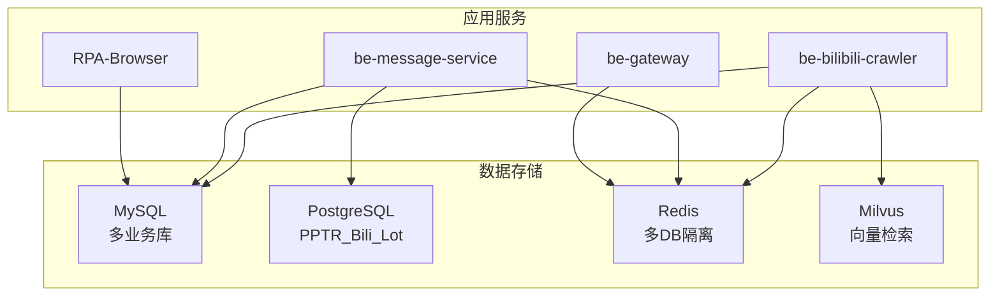
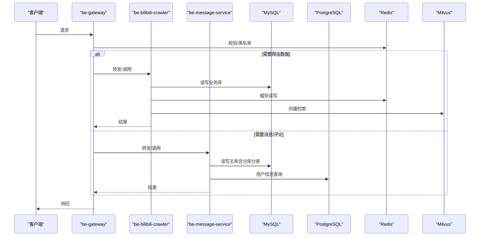
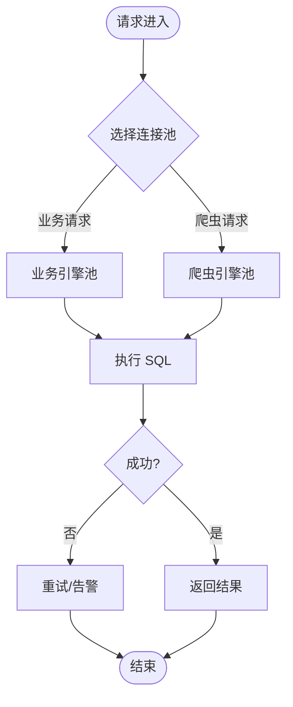
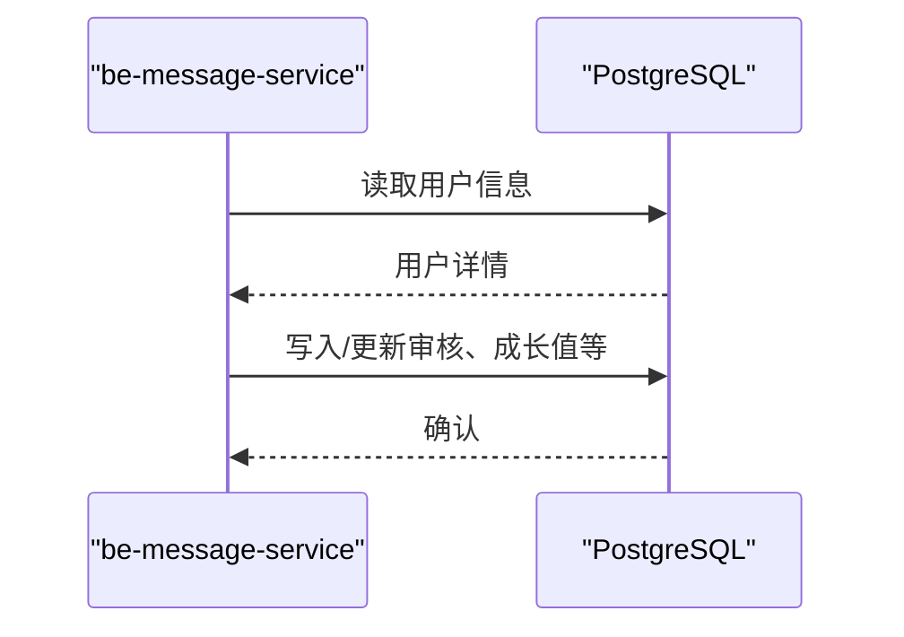
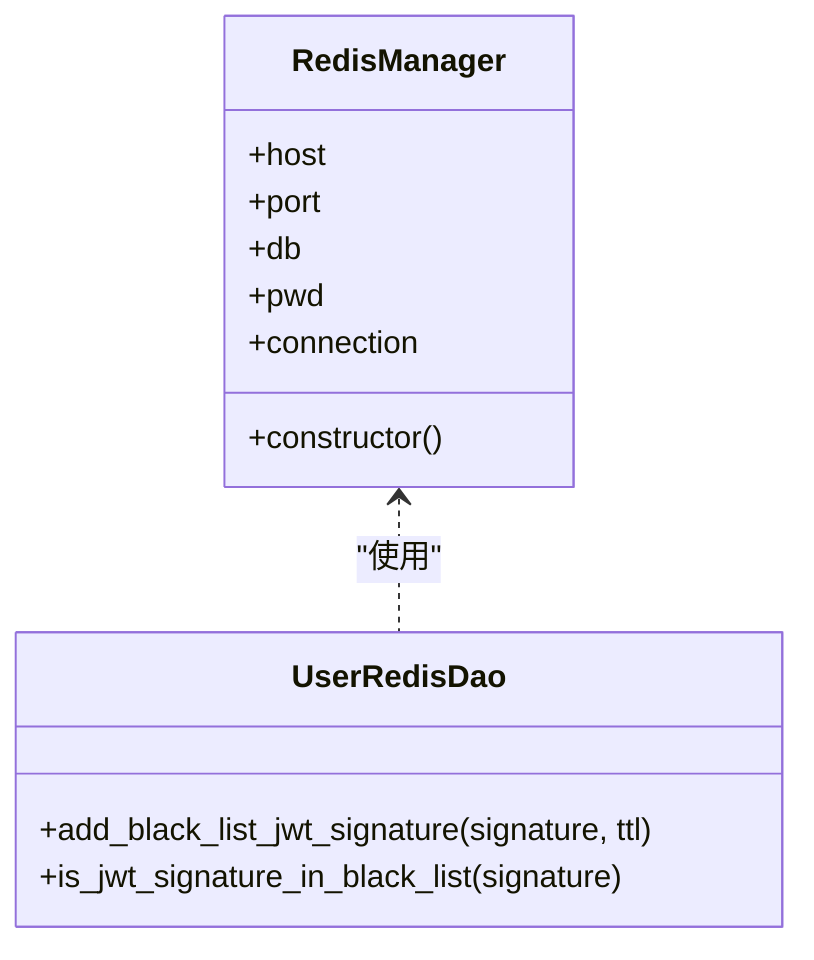
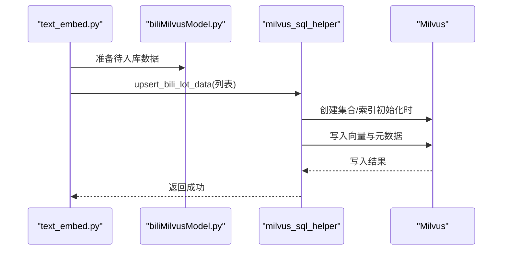
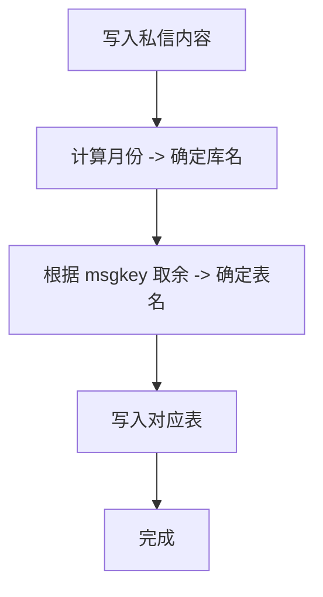
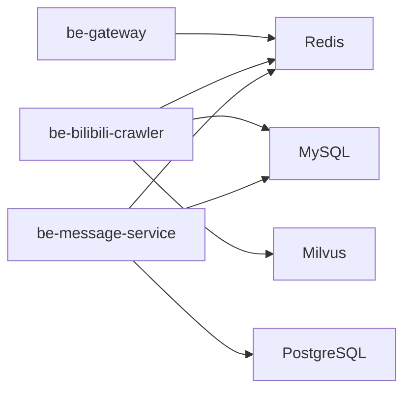

# 数据存储架构

<cite>
**本文引用的文件**
- [docker-compose.yml](file://docker-compose.yml)
- [dc-dev.yml](file://dc-dev.yml)
- [CONFIG.py](file://be-bilibili-crawler/CONFIG.py)
- [SqlalchemyTool.py](file://be-bilibili-crawler/Utils/数据库/SqlalchemyTool.py)
- [create_collection.py](file://be-bilibili-crawler/scripts/database/同步向量数据库/create_collection.py)
- [text_embed.py](file://be-bilibili-crawler/Service/LangChainCompo/text_embed.py)
- [biliMilvusModel.py](file://be-bilibili-crawler/Models/lottery_database/milvusModel/biliMilvusModel.py)
- [config.py](file://be-message-service/app/core/config.py)
- [RedisManager.js](file://be-gateway/ExpressServerEnd/DAO/Redis/RedisManager.js)
- [UserRedisDao.js](file://be-gateway/ExpressServerEnd/DAO/UserRedisDao.js)
</cite>

## 目录
1. [简介](#简介)
2. [项目结构](#项目结构)
3. [核心组件](#核心组件)
4. [架构总览](#架构总览)
5. [详细组件分析](#详细组件分析)
6. [依赖关系分析](#依赖关系分析)
7. [性能与容量规划](#性能与容量规划)
8. [故障排查指南](#故障排查指南)
9. [结论](#结论)
10. [附录](#附录)

## 简介
本文件面向 BilibiliExplosion 项目的多数据库存储架构，系统性阐述 MySQL 主库、PostgreSQL 用户库、Redis 缓存、Milvus 向量数据库的职责分工与协作模式；给出连接池配置、索引策略、分库分表方案、数据持久化（卷挂载、备份恢复、迁移机制）、以及监控与调优要点。目标是帮助读者在不深入源码的情况下理解整体设计，并在运维中快速定位问题与优化性能。

## 项目结构
本项目采用多服务、多语言、多数据库的混合架构：
- be-bilibili-crawler（Python/FastAPI）：负责爬虫与抽奖数据处理，使用 MySQL 多个业务库、Redis 多 DB、Milvus 向量检索。
- be-message-service（Python/FastAPI）：消息/通知/评论等系统，使用 MySQL 主库（含私信内容按月分库+库内分表），并接管 be-gateway 的 PostgreSQL 用户库。
- be-gateway（Node.js/Express）：网关层，使用 Redis 做黑名单等缓存。
- RPA-Browser（Python/FastAPI）：浏览器自动化与任务执行，通过 Alembic 管理自身数据库迁移。
- 基础设施：MySQL、PostgreSQL、Redis、Milvus 通过 docker-compose 编排，数据通过 docker_vol 持久化。

图表来源
- [docker-compose.yml:43-92](file://docker-compose.yml#L43-L92)
- [CONFIG.py:330-419](file://be-bilibili-crawler/CONFIG.py#L330-L419)
- [config.py:41-74](file://be-message-service/app/core/config.py#L41-L74)
- [RedisManager.js:1-21](file://be-gateway/ExpressServerEnd/DAO/Redis/RedisManager.js#L1-L21)

章节来源
- [docker-compose.yml:43-92](file://docker-compose.yml#L43-L92)
- [dc-dev.yml:36-76](file://dc-dev.yml#L36-L76)

## 核心组件
- MySQL 主库（多业务库）
  - 用途：爬虫业务库（bilidb、bili_reserve、biliopusdb、dyndetail、samsclub、proxy_db 等）。
  - 连接池：按“业务”和“爬虫”两套独立引擎池，避免爬虫高并发抢占业务连接。
  - 持久化：容器数据卷挂载到 docker_vol/mysql_data/data。
- PostgreSQL 用户库（PPTR_Bili_Lot）
  - 用途：用户信息、@搜索、展示信息等（由 be-message-service 接管读写）。
  - 连接池：只读池为主，支持较高并发读取。
  - 持久化：容器数据卷挂载到 docker_vol/postgres/data。
- Redis 缓存
  - 用途：代理状态、IP 信息、抽奖数据缓存、JWT 黑名单等。
  - 多 DB 隔离：不同业务使用不同 DB 号（如 0、2、6、15）。
  - 持久化：容器数据卷挂载到 docker_vol/redis/data。
- Milvus 向量数据库
  - 用途：抽奖奖品文本的向量检索与相似匹配。
  - 集合字段：主键、奖项 ID、时间戳、768 维向量、中文分词字符串等。
  - 持久化：容器数据卷挂载到 docker_vol/milvus/data。

章节来源
- [CONFIG.py:330-419](file://be-bilibili-crawler/CONFIG.py#L330-L419)
- [config.py:41-74](file://be-message-service/app/core/config.py#L41-L74)
- [RedisManager.js:1-21](file://be-gateway/ExpressServerEnd/DAO/Redis/RedisManager.js#L1-L21)
- [create_collection.py:8-71](file://be-bilibili-crawler/scripts/database/同步向量数据库/create_collection.py#L8-L71)
- [docker-compose.yml:43-92](file://docker-compose.yml#L43-L92)

## 架构总览
下图展示了各服务与数据库之间的调用关系与职责边界：

图表来源
- [RedisManager.js:1-21](file://be-gateway/ExpressServerEnd/DAO/Redis/RedisManager.js#L1-L21)
- [UserRedisDao.js:1-27](file://be-gateway/ExpressServerEnd/DAO/UserRedisDao.js#L1-L27)
- [CONFIG.py:330-419](file://be-bilibili-crawler/CONFIG.py#L330-L419)
- [config.py:41-74](file://be-message-service/app/core/config.py#L41-L74)
- [create_collection.py:8-71](file://be-bilibili-crawler/scripts/database/同步向量数据库/create_collection.py#L8-L71)

## 详细组件分析

### MySQL 主库（多业务库）
- 职责
  - 承载爬虫相关多个业务库：proxy_db、bilidb、bili_reserve、biliopusdb、dyndetail、samsclub。
  - 提供结构化数据的强一致读写能力。
- 连接池与引擎
  - 业务与爬虫分别使用独立的 SQLAlchemy 异步引擎与连接池，避免相互影响。
  - 关键参数：pool_size、max_overflow、pool_pre_ping、pool_recycle、session 的 autoflush/expire_on_commit。
- 持久化
  - 通过 docker-compose 将 /var/lib/mysql 映射到 docker_vol/mysql_data/data。
- 索引与查询
  - 建议在高频查询列建立复合索引（如 lottery_id + prize_cmt、时间范围过滤列）。
  - 对大表进行分区或归档策略（例如历史动态清理脚本）。
- 分库分表
  - 当前为“多库”划分（按业务域拆分），未实现单库水平分片。
  - 若未来单库压力增大，可考虑按时间或业务维度进行水平分片。

图表来源
- [SqlalchemyTool.py:11-47](file://be-bilibili-crawler/Utils/数据库/SqlalchemyTool.py#L11-L47)
- [CONFIG.py:381-419](file://be-bilibili-crawler/CONFIG.py#L381-L419)

章节来源
- [CONFIG.py:330-419](file://be-bilibili-crawler/CONFIG.py#L330-L419)
- [SqlalchemyTool.py:11-47](file://be-bilibili-crawler/Utils/数据库/SqlalchemyTool.py#L11-L47)
- [docker-compose.yml:68-81](file://docker-compose.yml#L68-L81)

### PostgreSQL 用户库（PPTR_Bili_Lot）
- 职责
  - 用户基础信息与展示信息（昵称、头像、等级、性别、签名等），被 be-message-service 完全接管读写。
- 连接池
  - 以只读为主，配置了较大的 max_overflow 以应对高并发读取场景。
- 迁移
  - 使用 alembic_pptr 分支管理该库的 Schema 演进，支持离线与在线迁移。
- 持久化
  - 容器数据卷挂载到 docker_vol/postgres/data。

图表来源
- [config.py:60-74](file://be-message-service/app/core/config.py#L60-L74)
- [be-message-service/alembic_pptr/env.py:68-89](file://be-message-service/alembic_pptr/env.py#L68-L89)

章节来源
- [config.py:60-74](file://be-message-service/app/core/config.py#L60-L74)
- [be-message-service/alembic_pptr/env.py:68-89](file://be-message-service/alembic_pptr/env.py#L68-L89)

### Redis 缓存
- 职责
  - 代理状态、IP 信息、抽奖数据缓存、JWT 黑名单等。
  - 多 DB 隔离：不同业务使用不同 DB 号（0、2、6、15）。
- 连接与配置
  - Node 侧通过 ioredis 构建连接，支持密码与 DB 选择。
  - Python 侧通过 URL 构造连接串，按业务划分 DB。
- 持久化
  - 容器数据卷挂载到 docker_vol/redis/data。

图表来源
- [RedisManager.js:1-21](file://be-gateway/ExpressServerEnd/DAO/Redis/RedisManager.js#L1-L21)
- [UserRedisDao.js:1-27](file://be-gateway/ExpressServerEnd/DAO/UserRedisDao.js#L1-L27)
- [CONFIG.py:360-379](file://be-bilibili-crawler/CONFIG.py#L360-L379)

章节来源
- [RedisManager.js:1-21](file://be-gateway/ExpressServerEnd/DAO/Redis/RedisManager.js#L1-L21)
- [UserRedisDao.js:1-27](file://be-gateway/ExpressServerEnd/DAO/UserRedisDao.js#L1-L27)
- [CONFIG.py:360-379](file://be-bilibili-crawler/CONFIG.py#L360-L379)
- [docker-compose.yml:82-92](file://docker-compose.yml#L82-L92)

### Milvus 向量数据库
- 职责
  - 存储抽奖奖品文本的向量表示，支持相似度检索与召回。
- 集合与索引
  - 集合包含主键、奖项 ID、时间戳、768 维向量、中文分词字符串等字段。
  - 为 pk、lottery_time、prize_vec、lottery_id、prize_cmt 建立索引。
- 嵌入与写入
  - 通过 OpenAI 兼容 API 生成文本嵌入，批量 upsert 到 Milvus。
  - 使用锁防止并发过高导致服务端压力过大。
- 持久化
  - 容器数据卷挂载到 docker_vol/milvus/data。

图表来源
- [text_embed.py:1-39](file://be-bilibili-crawler/Service/LangChainCompo/text_embed.py#L1-L39)
- [biliMilvusModel.py:1-10](file://be-bilibili-crawler/Models/lottery_database/milvusModel/biliMilvusModel.py#L1-L10)
- [create_collection.py:8-71](file://be-bilibili-crawler/scripts/database/同步向量数据库/create_collection.py#L8-L71)

章节来源
- [create_collection.py:8-71](file://be-bilibili-crawler/scripts/database/同步向量数据库/create_collection.py#L8-L71)
- [text_embed.py:1-39](file://be-bilibili-crawler/Service/LangChainCompo/text_embed.py#L1-L39)
- [biliMilvusModel.py:1-10](file://be-bilibili-crawler/Models/lottery_database/milvusModel/biliMilvusModel.py#L1-L10)
- [docker-compose.yml:43-67](file://docker-compose.yml#L43-L67)

### 私信内容分库分表（be-message-service）
- 设计
  - 私信内容按月分库：库名前缀 bili_msg_content_YYYYMM。
  - 单月库内分表：表名前缀 msg_content_{00..99}，共 100 张表。
  - 路由策略：基于 msgkey 取余分配到具体表。
- 优势
  - 控制单表规模，提升查询与写入性能。
  - 便于按月归档与清理。

图表来源
- [config.py:41-58](file://be-message-service/app/core/config.py#L41-L58)

章节来源
- [config.py:41-58](file://be-message-service/app/core/config.py#L41-L58)

## 依赖关系分析
- 服务间依赖
  - be-gateway 依赖 Redis 做鉴权与黑名单。
  - be-bilibili-crawler 依赖 MySQL、Redis、Milvus。
  - be-message-service 依赖 MySQL（主库）、PostgreSQL（用户库）、Redis。
- 数据流
  - 爬虫采集数据后写入 MySQL，同时生成向量存入 Milvus，部分中间态缓存至 Redis。
  - 消息服务从 MySQL 与 PostgreSQL 聚合用户与消息数据，必要时访问 Redis。

图表来源
- [RedisManager.js:1-21](file://be-gateway/ExpressServerEnd/DAO/Redis/RedisManager.js#L1-L21)
- [CONFIG.py:330-419](file://be-bilibili-crawler/CONFIG.py#L330-L419)
- [config.py:41-74](file://be-message-service/app/core/config.py#L41-L74)

章节来源
- [RedisManager.js:1-21](file://be-gateway/ExpressServerEnd/DAO/Redis/RedisManager.js#L1-L21)
- [CONFIG.py:330-419](file://be-bilibili-crawler/CONFIG.py#L330-L419)
- [config.py:41-74](file://be-message-service/app/core/config.py#L41-L74)

## 性能与容量规划
- 连接池调优
  - MySQL：区分业务与爬虫池，设置 pool_pre_ping 与 pool_recycle，避免陈旧连接与超时断开。
  - PostgreSQL：只读池较大 max_overflow，满足高并发读取。
  - Redis：按业务划分 DB，减少热点冲突。
- 索引策略
  - MySQL：为高频查询列建立复合索引（如 lottery_id、prize_cmt、时间范围）。
  - Milvus：为向量字段与筛选字段建立索引，优化相似度检索与过滤。
- 分库分表
  - 私信内容按月分库+库内分表，降低单表规模，提升吞吐。
- 容量规划
  - 评估 MySQL 连接数上限与池大小，避免 Too many connections。
  - 评估 Milvus 向量维度与集合规模，预留存储空间与内存。
  - 评估 Redis 内存使用，合理设置过期策略与淘汰策略。
- 监控指标
  - MySQL：QPS、慢查询、连接数、InnoDB 缓冲池命中率。
  - PostgreSQL：连接数、查询延迟、索引使用率。
  - Redis：内存使用、命中率、命令耗时。
  - Milvus：集合大小、向量数量、检索延迟、资源占用。
- 慢查询分析
  - 开启 MySQL 慢查询日志，定期分析 top N 慢查询。
  - 对 Milvus 检索进行压测，观察不同索引与过滤条件下的延迟。

[本节为通用指导，不直接分析具体文件]

## 故障排查指南
- MySQL 连接异常
  - 现象：Too many connections、连接丢失（错误码 2013）。
  - 排查：检查连接池大小与回收周期，确认 pool_pre_ping 启用；核对 MySQL wait_timeout。
  - 参考路径：[CONFIG.py:381-419](file://be-bilibili-crawler/CONFIG.py#L381-L419)、[SqlalchemyTool.py:11-47](file://be-bilibili-crawler/Utils/数据库/SqlalchemyTool.py#L11-L47)
- Redis 鉴权失败
  - 现象：JWT 黑名单校验失败或无法写入。
  - 排查：检查环境变量 REDIS_HOST/PORT/PWD/DB；确认连接串正确。
  - 参考路径：[RedisManager.js:1-21](file://be-gateway/ExpressServerEnd/DAO/Redis/RedisManager.js#L1-L21)、[UserRedisDao.js:1-27](file://be-gateway/ExpressServerEnd/DAO/UserRedisDao.js#L1-L27)
- Milvus 集合不存在或写入失败
  - 现象：向量检索报错或写入无数据。
  - 排查：确认集合已创建且索引已建立；检查向量维度与字段类型。
  - 参考路径：[create_collection.py:8-71](file://be-bilibili-crawler/scripts/database/同步向量数据库/create_collection.py#L8-L71)、[text_embed.py:1-39](file://be-bilibili-crawler/Service/LangChainCompo/text_embed.py#L1-L39)
- PostgreSQL 只读压力大
  - 现象：查询延迟升高。
  - 排查：检查连接池与 max_overflow；优化查询与索引。
  - 参考路径：[config.py:60-74](file://be-message-service/app/core/config.py#L60-L74)

章节来源
- [CONFIG.py:381-419](file://be-bilibili-crawler/CONFIG.py#L381-L419)
- [SqlalchemyTool.py:11-47](file://be-bilibili-crawler/Utils/数据库/SqlalchemyTool.py#L11-L47)
- [RedisManager.js:1-21](file://be-gateway/ExpressServerEnd/DAO/Redis/RedisManager.js#L1-L21)
- [UserRedisDao.js:1-27](file://be-gateway/ExpressServerEnd/DAO/UserRedisDao.js#L1-L27)
- [create_collection.py:8-71](file://be-bilibili-crawler/scripts/database/同步向量数据库/create_collection.py#L8-L71)
- [text_embed.py:1-39](file://be-bilibili-crawler/Service/LangChainCompo/text_embed.py#L1-L39)
- [config.py:60-74](file://be-message-service/app/core/config.py#L60-L74)

## 结论
本项目采用多数据库协同的架构：MySQL 作为主库承载结构化业务数据，PostgreSQL 承担用户库读写，Redis 提供高性能缓存与隔离，Milvus 支撑向量检索。通过连接池隔离、分库分表、索引优化与容器卷持久化，系统在可扩展性与稳定性方面具备良好基础。运维中应重点关注连接池配置、慢查询与容量规划，确保在高并发场景下的稳定运行。

## 附录
- 环境与服务编排
  - 通过 docker-compose 启动 MySQL、PostgreSQL、Redis、Milvus，并使用 docker_vol 进行数据持久化。
  - 开发环境与生产环境的端口与环境变量可通过 .env 或 compose 文件覆盖。
- 迁移与版本管理
  - be-bilibili-crawler 与 RPA-Browser 使用 Alembic 管理各自数据库迁移。
  - be-message-service 使用 alembic 与 alembic_pptr 分别管理 MySQL 与 PostgreSQL 的 Schema 演进。

章节来源
- [docker-compose.yml:43-92](file://docker-compose.yml#L43-L92)
- [dc-dev.yml:36-76](file://dc-dev.yml#L36-L76)
- [be-message-service/alembic_pptr/env.py:68-89](file://be-message-service/alembic_pptr/env.py#L68-L89)