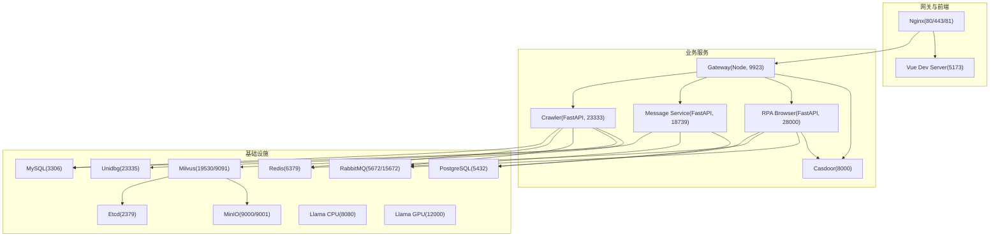
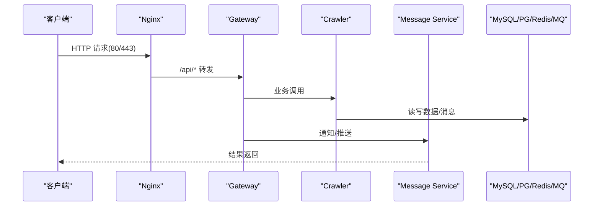
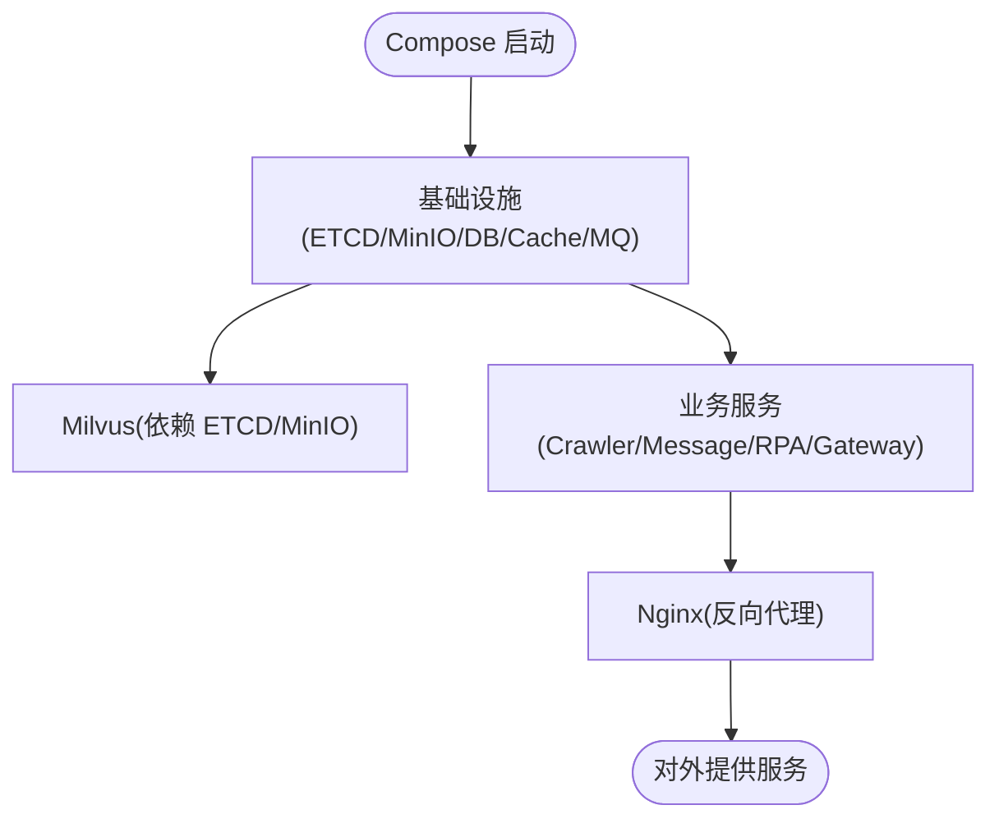
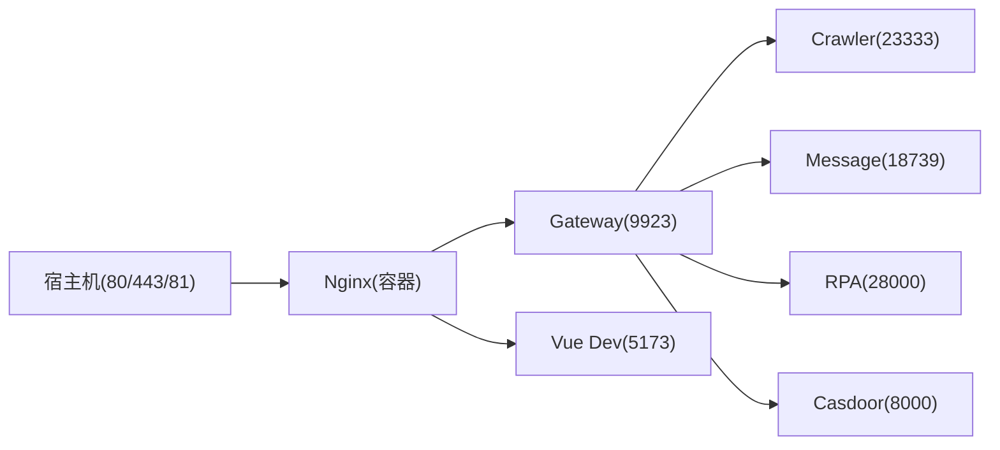
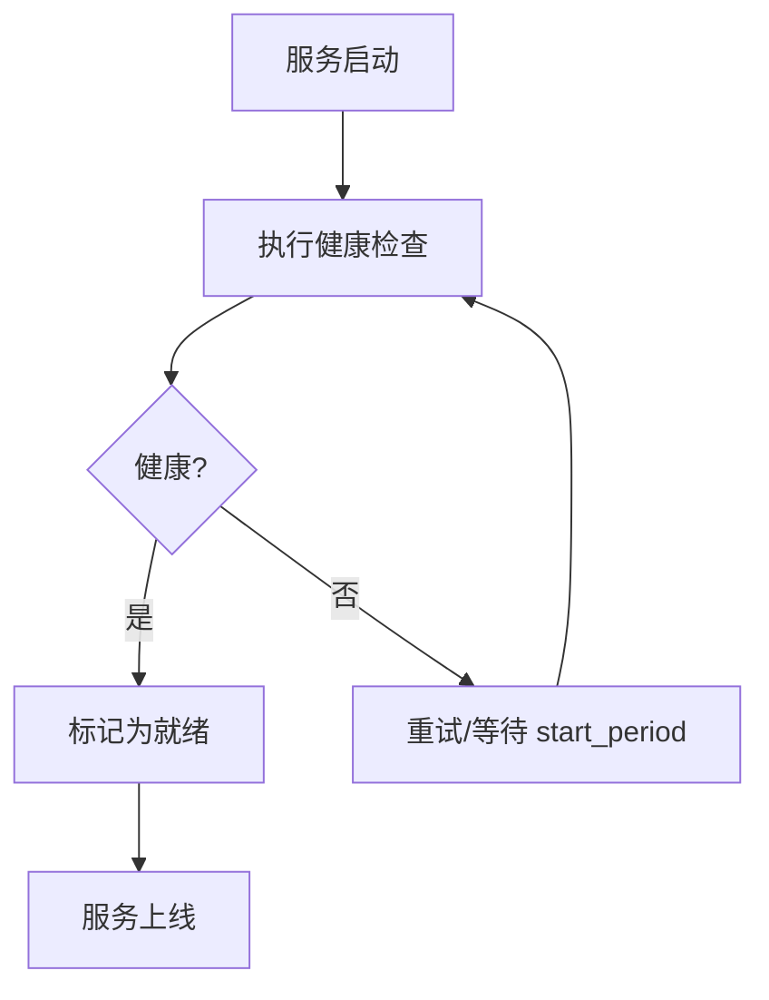
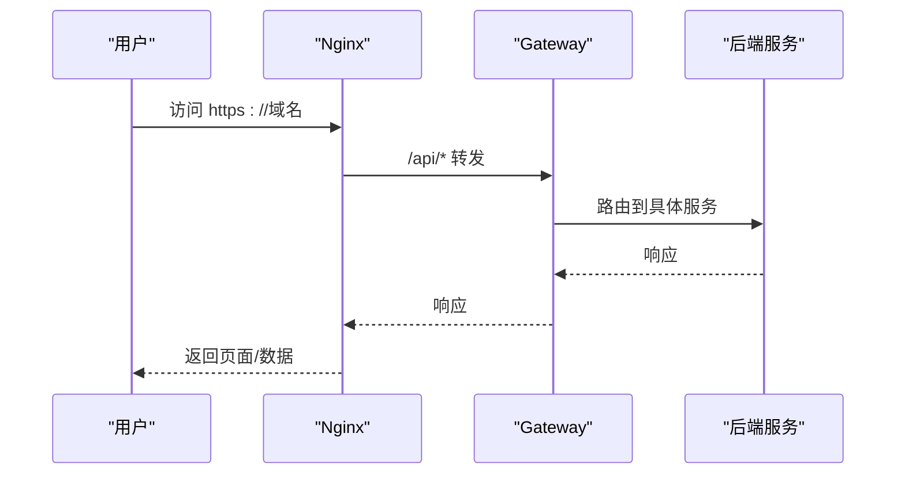

# 服务编排设计

<cite>
**本文引用的文件**
- [docker-compose.yml](file://docker-compose.yml)
- [dc-dev.yml](file://dc-dev.yml)
- [.env](file://.env)
- [.env.example](file://.env.example)
- [Dockerfile.mono](file://Dockerfile.mono)
- [be-gateway/Dockerfile](file://be-gateway/Dockerfile)
- [docker_vol/nginx/conf/nginx.conf](file://docker_vol/nginx/conf/nginx.conf)
- [Makefile](file://Makefile)
</cite>

## 目录
1. [简介](#简介)
2. [项目结构](#项目结构)
3. [核心组件](#核心组件)
4. [架构总览](#架构总览)
5. [详细组件分析](#详细组件分析)
6. [依赖关系与启动顺序](#依赖关系与启动顺序)
7. [环境变量与环境隔离](#环境变量与环境隔离)
8. [网络拓扑与服务发现](#网络拓扑与服务发现)
9. [数据卷管理](#数据卷管理)
10. [健康检查与故障恢复](#健康检查与故障恢复)
11. [部署流程与端口映射](#部署流程与端口映射)
12. [性能与扩展性](#性能与扩展性)
13. [故障排查指南](#故障排查指南)
14. [结论](#结论)

## 简介
本设计文档围绕 BilibiliExplosion 项目的 Docker Compose 编排，系统性阐述服务定义、网络拓扑、数据卷管理、依赖与启动顺序、健康检查与故障恢复、环境变量管理与环境隔离策略，并给出完整的部署流程图与网络通信模型（含服务发现、负载均衡、端口映射）。文档面向不同技术背景的读者，提供从概览到代码级细节的渐进式说明。

## 项目结构
本项目采用多服务编排，包含：
- 基础设施：etcd、MinIO、Milvus、MySQL、PostgreSQL、Redis、RabbitMQ、Llama.cpp（CPU/GPU）
- 业务服务：be-bilibili-crawler、be-message-service、rpa-browser、be-gateway（Node.js）、Casdoor（认证）
- 网关与前端：Nginx（反向代理/静态资源），Vue 前端开发服务器（由 Nginx 转发）
- 构建镜像：Dockerfile.mono 为 Python 三服务共享基础镜像；be-gateway 使用独立 Node 镜像

图表来源
- [docker-compose.yml:1-380](file://docker-compose.yml#L1-L380)
- [docker_vol/nginx/conf/nginx.conf:1-71](file://docker_vol/nginx/conf/nginx.conf#L1-L71)

章节来源
- [docker-compose.yml:1-380](file://docker-compose.yml#L1-L380)
- [Dockerfile.mono:1-146](file://Dockerfile.mono#L1-L146)
- [be-gateway/Dockerfile:1-26](file://be-gateway/Dockerfile#L1-L26)

## 核心组件
- etcd：Milvus 元数据存储，具备健康检查与自动压缩配置
- MinIO：对象存储，暴露控制台端口用于运维
- Milvus：向量数据库，依赖 etcd 与 MinIO，暴露 gRPC 与管理端点
- MySQL：主业务数据库（消息系统元库等）
- PostgreSQL：PPTR 相关数据（只读场景）
- Redis：缓存与会话
- RabbitMQ：消息队列（管理界面便于调试）
- Llama.cpp：LLM 推理服务（CPU/GPU 双实例）
- be-bilibili-crawler：爬虫与数据处理 FastAPI 服务
- be-message-service：消息推送与通知服务
- rpa-browser：浏览器自动化服务
- be-gateway：Node.js 网关，聚合 API 路由与鉴权
- Casdoor：统一身份认证
- Nginx：反向代理、静态资源与 HTTPS 入口

章节来源
- [docker-compose.yml:1-380](file://docker-compose.yml#L1-L380)

## 架构总览
整体采用“网关 + 微服务 + 基础设施”的分层架构：
- 外部流量经 Nginx 进入，按路径分发至 Gateway 或 Vue 开发服务器
- Gateway 负责路由到各后端服务，并集成 Casdoor 进行鉴权
- 业务服务通过容器内 DNS 名称互相访问（服务发现）
- 数据持久化与缓存分别落盘至 MySQL、PostgreSQL、Redis、MinIO、Milvus
- 异步任务通过 RabbitMQ 解耦

图表来源
- [docker_vol/nginx/conf/nginx.conf:1-71](file://docker_vol/nginx/conf/nginx.conf#L1-L71)
- [docker-compose.yml:179-212](file://docker-compose.yml#L179-L212)

## 详细组件分析

### 基础设施服务
- etcd：以 revision 模式自动压缩，设置配额与快照阈值，确保高可用与可恢复
- MinIO：默认凭据用于开发，生产应替换；控制台端口便于对象管理
- Milvus：standalone 模式，依赖 etcd 与 MinIO，暴露健康端点供编排检测
- MySQL/PostgreSQL：数据持久化，挂载宿主机目录保证数据不丢失
- Redis/RabbitMQ：缓存与消息总线，均启用日志与数据持久化
- Llama.cpp：CPU 版与 CUDA GPU 版并行部署，GPU 版声明 nvidia 设备

章节来源
- [docker-compose.yml:2-67](file://docker-compose.yml#L2-L67)
- [docker-compose.yml:68-119](file://docker-compose.yml#L68-L119)
- [docker-compose.yml:323-357](file://docker-compose.yml#L323-L357)

### 业务服务
- be-bilibili-crawler：FastAPI 服务，依赖 MySQL/Redis/RabbitMQ/Unidbg/Milvus/Message Service，暴露 23333
- be-message-service：FastAPI 服务，依赖 RabbitMQ/MySQL/PostgreSQL/Casdoor，暴露 18739，提供 /health 健康检查
- rpa-browser：FastAPI 服务，依赖 Postgres/Redis/RabbitMQ/Casdoor，暴露 28000，支持 Chromium 运行态数据持久化
- be-gateway：Node.js 服务，依赖 Postgres/Redis/Casdoor，暴露 9923，作为统一入口

章节来源
- [docker-compose.yml:120-164](file://docker-compose.yml#L120-L164)
- [docker-compose.yml:165-212](file://docker-compose.yml#L165-L212)
- [docker-compose.yml:227-260](file://docker-compose.yml#L227-L260)
- [docker-compose.yml:261-309](file://docker-compose.yml#L261-L309)

### 网关与前端
- Nginx：监听 80/443/81，将 /api/* 转发至 Gateway，/ 转发至 Vue 开发服务器，同时代理 Casdoor
- Vue 前端：在开发模式下由 Nginx 代理至 5173，支持 HMR WebSocket

章节来源
- [docker_vol/nginx/conf/nginx.conf:1-71](file://docker_vol/nginx/conf/nginx.conf#L1-L71)

## 依赖关系与启动顺序
- Milvus 依赖 etcd 与 MinIO，通过 depends_on 控制启动顺序
- 业务服务通过 depends_on 声明对数据库、缓存、消息队列、认证服务的依赖
- Nginx 作为入口，不声明依赖但需等待上游服务就绪
- Makefile 提供便捷命令，支持选择性启动/重启/查看日志

图表来源
- [docker-compose.yml:41-67](file://docker-compose.yml#L41-L67)
- [docker-compose.yml:120-164](file://docker-compose.yml#L120-L164)
- [docker-compose.yml:179-212](file://docker-compose.yml#L179-L212)
- [docker-compose.yml:227-260](file://docker-compose.yml#L227-L260)
- [docker-compose.yml:261-309](file://docker-compose.yml#L261-L309)

章节来源
- [docker-compose.yml:1-380](file://docker-compose.yml#L1-L380)
- [Makefile:20-40](file://Makefile#L20-L40)

## 环境变量与环境隔离
- .env/.env.example：集中管理端口、密码、时区、服务地址、CASDOOR 配置、LLM APIs、推送渠道配置等
- 敏感信息保护：密码、密钥、证书等通过 .env 注入，避免硬编码；示例文件仅含占位符
- 环境隔离：通过不同 .env 与 compose 文件（如 dc-dev.yml）实现开发与生产差异；dc-dev.yml 精简了部分服务与挂载
- 服务间通信：使用容器名作为主机名（如 mysql、redis、rabbitmq），无需硬编码 IP

章节来源
- [.env:1-59](file://.env#L1-L59)
- [.env.example:1-65](file://.env.example#L1-L65)
- [dc-dev.yml:1-213](file://dc-dev.yml#L1-L213)

## 网络拓扑与服务发现
- 自定义桥接网络 fastapi，启用 IPv6，容器间通过服务名解析（服务发现）
- Nginx 通过 host.docker.internal 访问宿主或其他容器（开发场景）
- 端口映射：关键服务端口映射至宿主机，便于本地调试与监控

图表来源
- [docker-compose.yml:357-371](file://docker-compose.yml#L357-L371)
- [docker_vol/nginx/conf/nginx.conf:1-71](file://docker_vol/nginx/conf/nginx.conf#L1-L71)

章节来源
- [docker-compose.yml:372-380](file://docker-compose.yml#L372-L380)
- [docker_vol/nginx/conf/nginx.conf:1-71](file://docker_vol/nginx/conf/nginx.conf#L1-L71)

## 数据卷管理
- 持久化目录：MySQL、PostgreSQL、Redis、RabbitMQ、Milvus、MinIO、Llama 模型缓存等均挂载至 docker_vol 下对应目录
- 命名卷：be-gateway_node_modules 用于保存 node_modules，加速重建
- 源码挂载：Python 服务与 Gateway 源码以只读/读写方式挂载，便于热更新与调试
- 配置文件：Nginx 配置、Casdoor 配置、MySQL 自定义配置等通过卷挂载

章节来源
- [docker-compose.yml:10-11](file://docker-compose.yml#L10-L11)
- [docker-compose.yml:30-32](file://docker-compose.yml#L30-L32)
- [docker-compose.yml:51-53](file://docker-compose.yml#L51-L53)
- [docker-compose.yml:74-77](file://docker-compose.yml#L74-L77)
- [docker-compose.yml:87-90](file://docker-compose.yml#L87-L90)
- [docker-compose.yml:104-106](file://docker-compose.yml#L104-L106)
- [docker-compose.yml:168-170](file://docker-compose.yml#L168-L170)
- [docker-compose.yml:188-190](file://docker-compose.yml#L188-L190)
- [docker-compose.yml:238-244](file://docker-compose.yml#L238-L244)
- [docker-compose.yml:267-272](file://docker-compose.yml#L267-L272)
- [docker-compose.yml:326-329](file://docker-compose.yml#L326-L329)
- [docker-compose.yml:348-350](file://docker-compose.yml#L348-L350)
- [docker-compose.yml:365-369](file://docker-compose.yml#L365-L369)
- [docker-compose.yml:372-374](file://docker-compose.yml#L372-L374)

## 健康检查与故障恢复
- etcd：etcdctl endpoint health 探测
- MinIO：HTTP 健康端点
- Milvus：/healthz 健康检查
- be-message-service：/health 校验 broker 连通性
- 所有服务均配置 restart: unless-stopped，保证异常退出后自动重启
- 通过 depends_on 与 start_period 控制启动顺序与宽限期

图表来源
- [docker-compose.yml:14-18](file://docker-compose.yml#L14-L18)
- [docker-compose.yml:34-38](file://docker-compose.yml#L34-L38)
- [docker-compose.yml:54-59](file://docker-compose.yml#L54-L59)
- [docker-compose.yml:310-322](file://docker-compose.yml#L310-L322)

章节来源
- [docker-compose.yml:14-18](file://docker-compose.yml#L14-L18)
- [docker-compose.yml:34-38](file://docker-compose.yml#L34-L38)
- [docker-compose.yml:54-59](file://docker-compose.yml#L54-L59)
- [docker-compose.yml:310-322](file://docker-compose.yml#L310-L322)

## 部署流程与端口映射
- 入口端口：Nginx 暴露 80/443/81，HTTPS 与 HTTP 并存
- 业务端口：Gateway(9923)、Crawler(23333)、Message(18739)、RPA(28000)、Casdoor(8000)
- 基础设施端口：MySQL(3306)、PostgreSQL(5432)、Redis(6379)、RabbitMQ(5672/15672)、Milvus(19530/9091)、Llama CPU(8080)、Llama GPU(12000)
- 开发/生产差异：dc-dev.yml 精简服务与挂载，适合快速迭代；生产建议使用完整 docker-compose.yml

图表来源
- [docker-compose.yml:357-371](file://docker-compose.yml#L357-L371)
- [docker-compose.yml:179-212](file://docker-compose.yml#L179-L212)

章节来源
- [docker-compose.yml:357-371](file://docker-compose.yml#L357-L371)
- [docker-compose.yml:179-212](file://docker-compose.yml#L179-L212)
- [dc-dev.yml:122-155](file://dc-dev.yml#L122-L155)

## 性能与扩展性
- 资源限制：crawler 服务设置内存上限，避免占用过多资源
- GPU 加速：llama_cpp_gpu_cuda 声明 nvidia 设备，提升推理性能
- 缓存与消息：Redis 与 RabbitMQ 降低数据库压力，提高吞吐
- 水平扩展：各服务无状态化（除数据卷），可通过增加实例与负载均衡器横向扩展
- 构建优化：Dockerfile.mono 使用多阶段构建与缓存，减少镜像体积与构建时间

章节来源
- [docker-compose.yml:121-125](file://docker-compose.yml#L121-L125)
- [docker-compose.yml:341-347](file://docker-compose.yml#L341-L347)
- [Dockerfile.mono:1-146](file://Dockerfile.mono#L1-L146)

## 故障排查指南
- 健康检查失败：检查对应服务的健康端点与依赖是否就绪（如 message /health）
- 数据库连接失败：确认环境变量中的用户名、密码、端口与容器网络可达
- 消息队列问题：登录 RabbitMQ 管理界面查看队列与消费者状态
- 向量检索异常：检查 Milvus 健康端点与 etcd/MinIO 连通性
- 前端无法访问：确认 Nginx 配置与上游服务端口映射是否正确

章节来源
- [docker-compose.yml:310-322](file://docker-compose.yml#L310-L322)
- [docker-compose.yml:14-18](file://docker-compose.yml#L14-L18)
- [docker-compose.yml:34-38](file://docker-compose.yml#L34-L38)
- [docker-compose.yml:54-59](file://docker-compose.yml#L54-L59)

## 结论
本项目通过 Docker Compose 实现了清晰的服务分层与依赖管理，结合健康检查与自动重启机制保障稳定性；Nginx 作为统一入口提供反向代理与 HTTPS；环境变量集中管理便于环境隔离与敏感信息保护；数据卷与命名卷确保数据持久化与构建效率。建议在生产环境中强化安全配置（如替换默认凭据、最小权限原则）与监控告警，以实现更高可用性与可观测性。