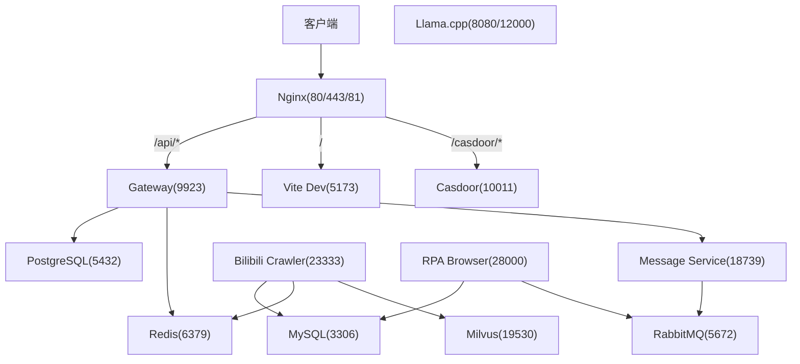
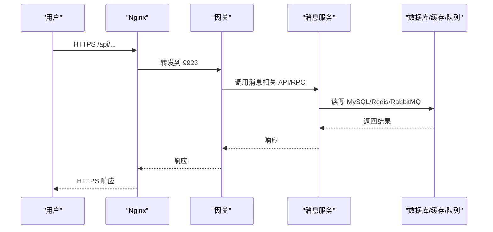
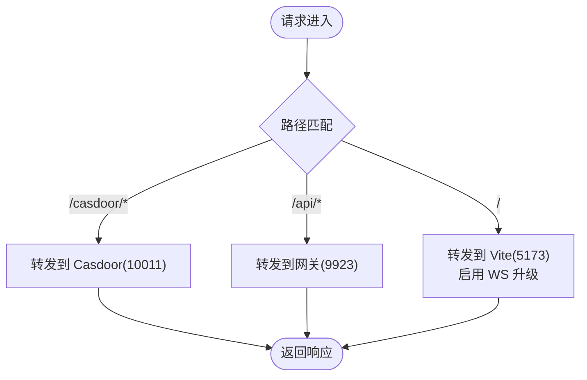
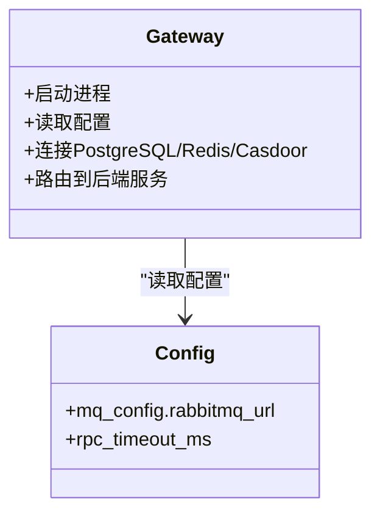
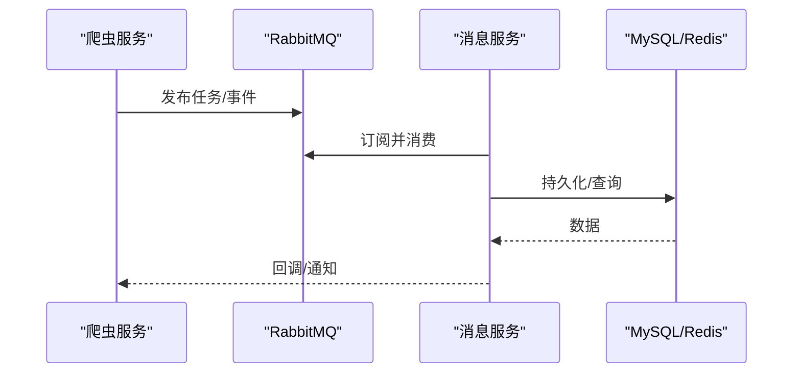
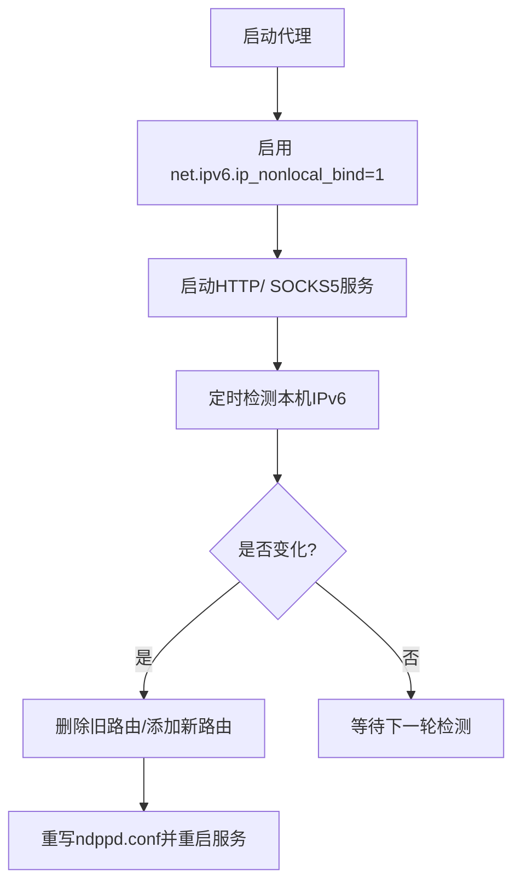
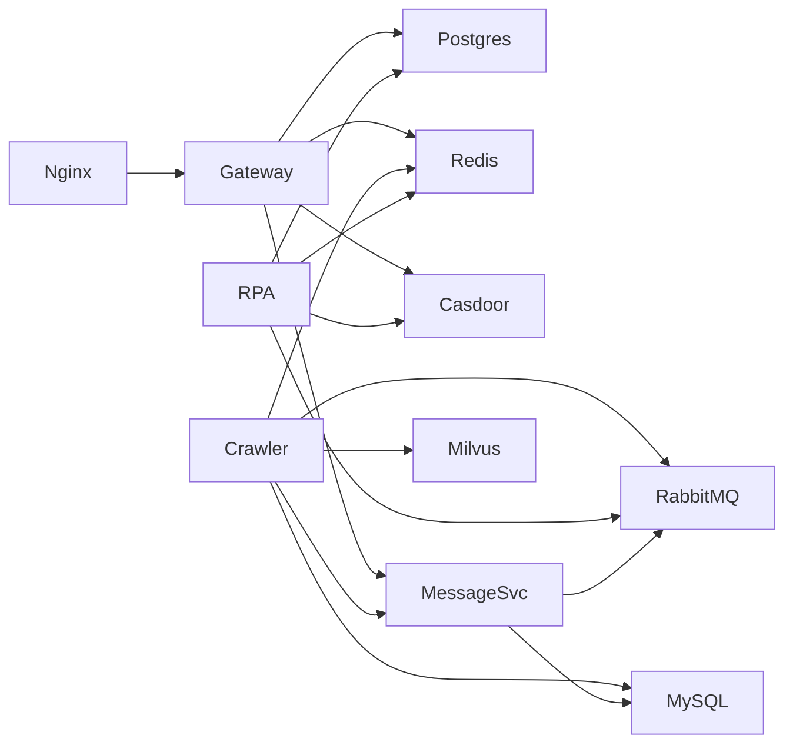

# 网络拓扑规划

<cite>
**本文引用的文件**
- [docker-compose.yml](file://docker-compose.yml)
- [dc-dev.yml](file://dc-dev.yml)
- [nginx.conf](file://docker_vol/nginx/conf/nginx.conf)
- [go-proxy-ipv6-pool-auto/docker-compose.yml](file://go-proxy-ipv6-pool-auto/docker-compose.yml)
- [main.go](file://go-proxy-ipv6-pool-auto/go-proxy-ipv6-pool/main.go)
- [ipv6_monitor.go](file://go-proxy-ipv6-pool-auto/go-proxy-ipv6-pool/ipv6_monitor.go)
- [config.yml](file://be-gateway/ExpressServerEnd/config/config.yml)
- [nodejs_backend.config.js](file://be-gateway/nodejs_backend.config.js)
</cite>

## 目录
1. [简介](#简介)
2. [项目结构](#项目结构)
3. [核心组件](#核心组件)
4. [架构总览](#架构总览)
5. [详细组件分析](#详细组件分析)
6. [依赖关系分析](#依赖关系分析)
7. [性能考虑](#性能考虑)
8. [故障排查指南](#故障排查指南)
9. [结论](#结论)
10. [附录](#附录)

## 简介
本规划文档面向 BilibiliExplosion 项目的容器化部署，聚焦网络拓扑与流量路径：Docker 网络模式、服务间通信、外部访问路由；Nginx 反向代理的转发规则、负载均衡策略与 SSL 证书管理；IPv6 双栈支持与代理池集成；以及防火墙与安全策略、端口映射表和网络监控方案。目标是帮助运维与开发快速理解并正确配置生产环境。

## 项目结构
本项目通过 docker-compose 编排多个服务（数据库、缓存、消息队列、向量检索、网关、业务后端、RPA 浏览器、认证、LLM、Nginx 等），并使用独立的 IPv6 代理池子项目提供出站 IPv6 出口。Nginx 作为统一入口，将 HTTP/HTTPS 请求转发到内部网关或前端开发服务器，同时暴露必要的管理端口。

图表来源
- [docker-compose.yml:120-164](file://docker-compose.yml#L120-L164)
- [docker-compose.yml:179-212](file://docker-compose.yml#L179-L212)
- [docker-compose.yml:227-260](file://docker-compose.yml#L227-L260)
- [docker-compose.yml:261-322](file://docker-compose.yml#L261-L322)
- [docker-compose.yml:323-356](file://docker-compose.yml#L323-L356)
- [docker-compose.yml:357-371](file://docker-compose.yml#L357-L371)

章节来源
- [docker-compose.yml:1-380](file://docker-compose.yml#L1-L380)
- [dc-dev.yml:1-213](file://dc-dev.yml#L1-L213)

## 核心组件
- 反向代理与入口：Nginx 负责对外 80/443/81 端口监听，按路径转发至网关、前端和认证服务。
- 网关服务：Node.js Express 网关，聚合后端能力，连接 PostgreSQL、Redis、Casdoor 及消息服务。
- 业务后端：Python FastAPI 爬虫服务，连接 MySQL、Redis、RabbitMQ、Milvus、Message Service。
- 消息服务：FastAPI 消息中心，消费 RabbitMQ 消息，读写 MySQL，调用 RPC 接口。
- RPA 浏览器：基于 Playwright 的浏览器自动化服务，连接数据库与消息队列。
- 存储与中间件：MySQL、PostgreSQL、Redis、RabbitMQ、MinIO、etcd、Milvus。
- AI 推理：llama.cpp 提供本地模型推理服务。
- IPv6 代理池：Go 实现的 HTTP/ SOCKS5 代理，动态维护 IPv6 地址并更新 NDP 配置，供需要出站 IPv6 的服务使用。

章节来源
- [docker-compose.yml:1-380](file://docker-compose.yml#L1-L380)
- [go-proxy-ipv6-pool-auto/docker-compose.yml:1-19](file://go-proxy-ipv6-pool-auto/docker-compose.yml#L1-L19)

## 架构总览
整体采用“Nginx 统一入口 + 网关聚合 + 微服务”的分层架构。Nginx 承担 TLS 终止、路径路由、WebSocket 升级与跨域头设置；网关负责鉴权、限流、路由分发；各业务服务通过 Docker 网络互相发现与通信；IPv6 代理池为需要公网 IPv6 出站的组件提供出口。

图表来源
- [nginx.conf:9-48](file://docker_vol/nginx/conf/nginx.conf#L9-L48)
- [docker-compose.yml:179-212](file://docker-compose.yml#L179-L212)
- [docker-compose.yml:261-322](file://docker-compose.yml#L261-L322)

## 详细组件分析

### Nginx 反向代理与外部访问路由
- 监听端口：80、443、81；支持 IPv6 双栈监听。
- 路径路由：
  - /casdoor/* 转发到宿主机的 Casdoor 服务。
  - /api/* 转发到网关（当前指向宿主机 9923）。
  - / 转发到 Vite 开发服务器（5173），并启用 WebSocket 升级以支持 HMR。
- 头部透传：Host、X-Forwarded-Proto、X-Real-IP、X-Forwarded-For、自定义 x-bili-* 头。
- 证书管理：挂载证书目录，用于 443 端口的 TLS 终止（需确保证书文件存在且权限正确）。
- 管理面板：81 端口转发到 10011（通常为管理界面）。

图表来源
- [nginx.conf:9-68](file://docker_vol/nginx/conf/nginx.conf#L9-L68)

章节来源
- [nginx.conf:1-71](file://docker_vol/nginx/conf/nginx.conf#L1-L71)

### 网关服务与内部服务通信
- 网关启动脚本由 PM2 管理，生产与开发两种运行模式。
- 环境变量中配置数据库连接、Redis、消息服务 URI、Casdoor 参数等。
- 与消息服务的 RPC 超时与连接参数在配置文件中定义。

图表来源
- [nodejs_backend.config.js:1-27](file://be-gateway/nodejs_backend.config.js#L1-L27)
- [config.yml:20-29](file://be-gateway/ExpressServerEnd/config/config.yml#L20-L29)

章节来源
- [nodejs_backend.config.js:1-27](file://be-gateway/nodejs_backend.config.js#L1-L27)
- [config.yml:1-29](file://be-gateway/ExpressServerEnd/config/config.yml#L1-L29)

### 业务后端与消息服务
- 爬虫服务（be-bilibili-crawler）：连接 MySQL、Redis、RabbitMQ、Milvus、Message Service，并通过环境变量注入代理与 LLM 配置。
- 消息服务（be-message-service）：消费 RabbitMQ 消息，读写 MySQL，加载 GeoIP 库，提供健康检查端点。

图表来源
- [docker-compose.yml:120-164](file://docker-compose.yml#L120-L164)
- [docker-compose.yml:261-322](file://docker-compose.yml#L261-L322)

章节来源
- [docker-compose.yml:120-164](file://docker-compose.yml#L120-L164)
- [docker-compose.yml:261-322](file://docker-compose.yml#L261-L322)

### IPv6 代理池与双栈网络
- 独立子项目提供 HTTP/ SOCKS5 代理服务，监听 3128/3129 端口。
- 通过系统命令启用非本地绑定，并周期性检测本机公网 IPv6 地址，动态更新 NDP 配置以确保邻居可达性。
- Docker Compose 中启用 IPv6 网段，便于容器内获取 IPv6 地址。

图表来源
- [main.go:45-64](file://go-proxy-ipv6-pool-auto/go-proxy-ipv6-pool/main.go#L45-L64)
- [ipv6_monitor.go:73-93](file://go-proxy-ipv6-pool-auto/go-proxy-ipv6-pool/ipv6_monitor.go#L73-L93)
- [ipv6_monitor.go:95-151](file://go-proxy-ipv6-pool-auto/go-proxy-ipv6-pool/ipv6_monitor.go#L95-L151)
- [go-proxy-ipv6-pool-auto/docker-compose.yml:12-19](file://go-proxy-ipv6-pool-auto/docker-compose.yml#L12-L19)

章节来源
- [main.go:1-110](file://go-proxy-ipv6-pool-auto/go-proxy-ipv6-pool/main.go#L1-L110)
- [ipv6_monitor.go:1-152](file://go-proxy-ipv6-pool-auto/go-proxy-ipv6-pool/ipv6_monitor.go#L1-L152)
- [go-proxy-ipv6-pool-auto/docker-compose.yml:1-19](file://go-proxy-ipv6-pool-auto/docker-compose.yml#L1-L19)

### 端口映射表与服务暴露
- Nginx：80、443、81（对外）
- MySQL：3306（${MYSQL_PORT}）
- Redis：6379（${REDIS_PORT}）
- RabbitMQ：5672、15672（${RABBITMQ_PORT}/${RABBITMQ_WEBUI_PORT}）
- Milvus：19530、9091（${MILVUS_PORT}/固定）
- MinIO：9000、9001（固定）
- PostgreSQL：5432（${POSTGRES_PORT}）
- 网关：9923（${NODEJS_PPTR_PORT}）
- 爬虫服务：23333（${FASTAPI_PORT}）
- RPA 浏览器：28000（${RPA_BROWSER_PORT}）
- 消息服务：18739（${MESSAGE_SERVICE_PORT}）
- Llama.cpp：8080、12000（${LLAMA_PORT}/固定）
- IPv6 代理：3128、3129（固定）

章节来源
- [docker-compose.yml:21-37](file://docker-compose.yml#L21-L37)
- [docker-compose.yml:68-93](file://docker-compose.yml#L68-L93)
- [docker-compose.yml:94-119](file://docker-compose.yml#L94-L119)
- [docker-compose.yml:120-164](file://docker-compose.yml#L120-L164)
- [docker-compose.yml:165-178](file://docker-compose.yml#L165-L178)
- [docker-compose.yml:179-212](file://docker-compose.yml#L179-L212)
- [docker-compose.yml:213-226](file://docker-compose.yml#L213-L226)
- [docker-compose.yml:227-260](file://docker-compose.yml#L227-L260)
- [docker-compose.yml:261-322](file://docker-compose.yml#L261-L322)
- [docker-compose.yml:323-356](file://docker-compose.yml#L323-L356)
- [docker-compose.yml:357-371](file://docker-compose.yml#L357-L371)
- [go-proxy-ipv6-pool-auto/docker-compose.yml:1-19](file://go-proxy-ipv6-pool-auto/docker-compose.yml#L1-L19)

### 负载均衡策略
- Nginx 当前未配置 upstream 多实例，仅单节点转发；如需水平扩展，可在 http 块定义 upstream 并配置权重或轮询策略。
- 网关与消息服务可通过多副本部署配合容器编排实现横向扩展，但需在 Nginx 层增加上游列表与健康检查。

章节来源
- [nginx.conf:1-71](file://docker_vol/nginx/conf/nginx.conf#L1-L71)
- [docker-compose.yml:179-212](file://docker-compose.yml#L179-L212)
- [docker-compose.yml:261-322](file://docker-compose.yml#L261-L322)

### SSL 证书管理
- Nginx 挂载证书目录，需在容器中放置有效的证书与私钥文件，并在 server 块中启用 ssl_certificate 与 ssl_certificate_key（当前配置未显式声明，建议补充）。
- 建议使用自动化工具（如 certbot）续签证书，并将证书写入挂载目录以便容器热重载。

章节来源
- [nginx.conf:9-19](file://docker_vol/nginx/conf/nginx.conf#L9-L19)

### 防火墙规则与网络安全策略
- 仅开放必要端口到公网：80、443、81；其余端口（数据库、缓存、队列、AI 服务）应限制为容器网络或内网访问。
- 对管理面板（81）建议限制来源 IP 或使用 VPN/跳板机访问。
- 建议在云安全组/主机防火墙层面实施最小暴露原则。

章节来源
- [docker-compose.yml:357-371](file://docker-compose.yml#L357-L371)

### 网络监控方案
- Nginx 日志：访问日志与错误日志挂载到宿主机，便于集中采集与分析。
- GoAccess：可结合 Nginx 日志生成可视化报告（项目包含 goaccess 配置与镜像）。
- 服务健康检查：部分服务定义了 healthcheck（如 Milvus、MinIO、Message Service），可用于编排层面的状态探测。

章节来源
- [docker-compose.yml:357-371](file://docker-compose.yml#L357-L371)
- [docker-compose.yml:310-322](file://docker-compose.yml#L310-L322)

## 依赖关系分析
- 网关依赖：PostgreSQL、Redis、Casdoor、消息服务。
- 爬虫服务依赖：MySQL、Redis、RabbitMQ、Milvus、消息服务。
- 消息服务依赖：RabbitMQ、MySQL、GeoIP 库。
- RPA 浏览器依赖：PostgreSQL、Redis、RabbitMQ、Casdoor。
- Nginx 依赖：无（静态资源与反向代理）。

图表来源
- [docker-compose.yml:120-164](file://docker-compose.yml#L120-L164)
- [docker-compose.yml:179-212](file://docker-compose.yml#L179-L212)
- [docker-compose.yml:227-260](file://docker-compose.yml#L227-L260)
- [docker-compose.yml:261-322](file://docker-compose.yml#L261-L322)

章节来源
- [docker-compose.yml:120-164](file://docker-compose.yml#L120-L164)
- [docker-compose.yml:179-212](file://docker-compose.yml#L179-L212)
- [docker-compose.yml:227-260](file://docker-compose.yml#L227-L260)
- [docker-compose.yml:261-322](file://docker-compose.yml#L261-L322)

## 性能考虑
- Nginx worker 数量设为 auto，连接数上限合理；可根据 CPU 核数调整。
- 对静态资源与 API 分离缓存策略，可减少后端压力。
- 消息队列与数据库连接池需根据负载调优，避免连接耗尽。
- IPv6 代理池的 NDP 刷新周期较长（10 分钟），适合稳定网络；若频繁切换，可降低间隔以提升可用性。

[本节为通用指导，不直接分析具体文件]

## 故障排查指南
- Nginx 无法访问：
  - 检查证书文件是否存在且权限正确。
  - 确认上游服务（网关、Vite、Casdoor）在宿主机端口可连通。
- 网关连接失败：
  - 校验环境变量中的数据库、Redis、Casdoor 地址与凭据。
  - 查看 PM2 日志定位启动异常。
- 消息服务健康检查失败：
  - 检查 RabbitMQ 与 MySQL 连通性。
  - 确认 /health 端点返回预期状态码。
- IPv6 代理异常：
  - 检查 ndppd 配置是否正确写入并重启。
  - 验证本机公网 IPv6 地址是否变更，必要时手动刷新。

章节来源
- [nginx.conf:9-68](file://docker_vol/nginx/conf/nginx.conf#L9-L68)
- [docker-compose.yml:310-322](file://docker-compose.yml#L310-L322)
- [ipv6_monitor.go:73-93](file://go-proxy-ipv6-pool-auto/go-proxy-ipv6-pool/ipv6_monitor.go#L73-L93)

## 结论
本网络拓扑以 Nginx 为统一入口，网关聚合业务路由，各微服务通过 Docker 网络解耦协作；IPv6 代理池为出站需求提供灵活出口。生产环境应严格限制端口暴露、完善证书管理与监控告警，并根据负载进行横向扩展与参数调优。

[本节为总结性内容，不直接分析具体文件]

## 附录
- 环境变量参考：
  - 网关：DB、REDIS_HOST、REDIS_PORT、REDIS_PWD、CASDOOR_*、MESSAGE_SERVICE_URI 等。
  - 爬虫服务：MYSQL_*、REDIS_*、RABBITMQ_*、MILVUS_*、MESSAGE_SERVICE_*、PROXY_SERVER、LLM_* 等。
  - 消息服务：RABBITMQ_URL、MYSQL_MESSAGE_URL、POSTGRES_PPTR_URL、MESSAGE_CONFIG、CASDOOR_*、GEOIP_MMDB_DIR 等。
- 开发环境与生产环境的差异主要体现在端口映射、挂载卷与调试开关。

章节来源
- [docker-compose.yml:120-164](file://docker-compose.yml#L120-L164)
- [docker-compose.yml:179-212](file://docker-compose.yml#L179-L212)
- [docker-compose.yml:261-322](file://docker-compose.yml#L261-L322)