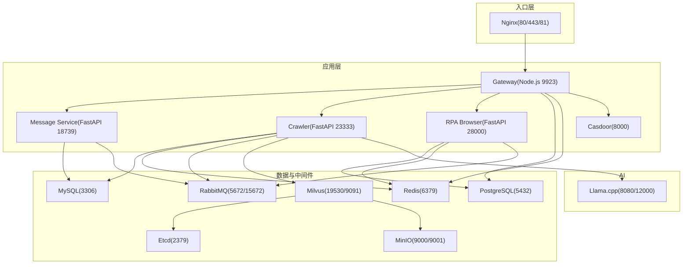
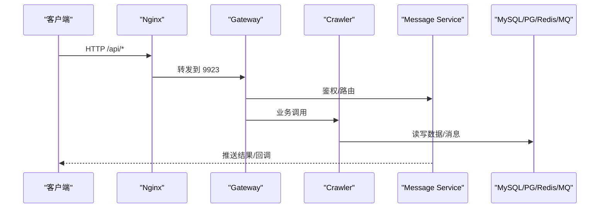
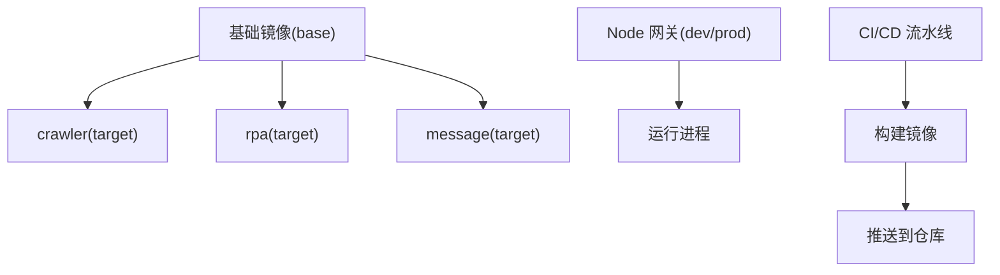
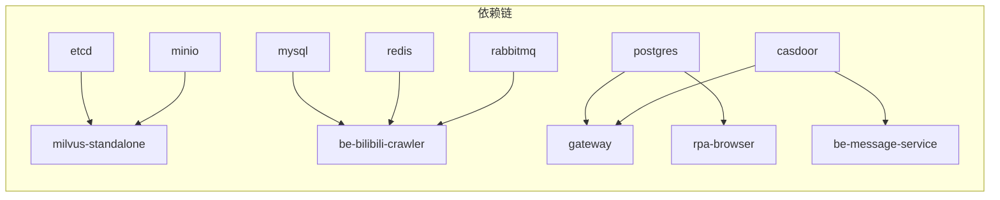
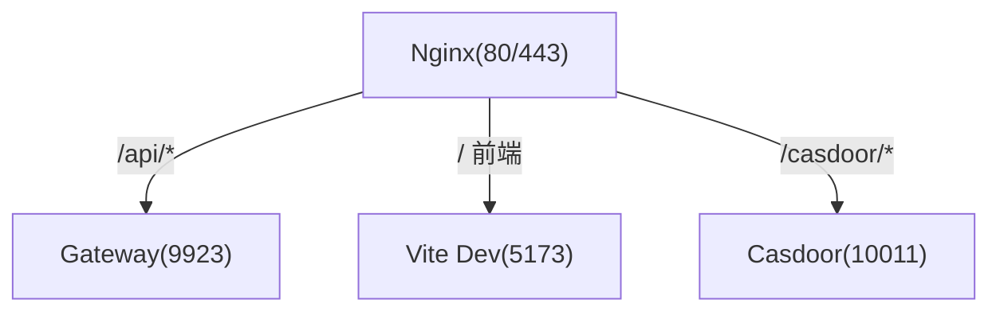
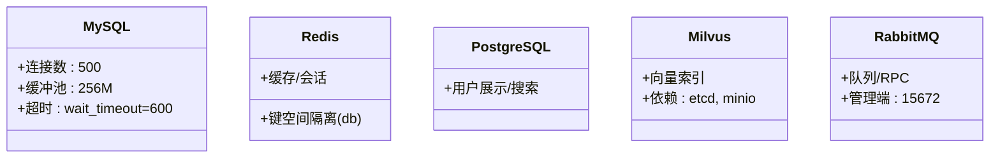
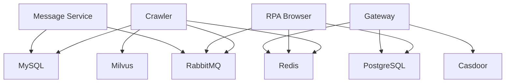

# 部署拓扑设计

<cite>
**本文引用的文件**
- [docker-compose.yml](file://docker-compose.yml)
- [dc-dev.yml](file://dc-dev.yml)
- [Dockerfile.mono](file://Dockerfile.mono)
- [be-gateway/Dockerfile](file://be-gateway/Dockerfile)
- [.github/workflows/docker-publish.yml](file://.github/workflows/docker-publish.yml)
- [Makefile](file://Makefile)
- [docker_vol/nginx/conf/nginx.conf](file://docker_vol/nginx/conf/nginx.conf)
- [docker_vol/mysql_data/conf.d/custom_mysql.cnf](file://docker_vol/mysql_data/conf.d/custom_mysql.cnf)
- [be-bilibili-crawler/CONFIG.py](file://be-bilibili-crawler/CONFIG.py)
- [RPA-Browser/app/config.py](file://RPA-Browser/app/config.py)
- [be-message-service/app/core/config.py](file://be-message-service/app/core/config.py)
- [be-gateway/ExpressServerEnd/DAO/Redis/RedisManager.js](file://be-gateway/ExpressServerEnd/DAO/Redis/RedisManager.js)
</cite>

## 目录
1. [简介](#简介)
2. [项目结构](#项目结构)
3. [核心组件](#核心组件)
4. [架构总览](#架构总览)
5. [详细组件分析](#详细组件分析)
6. [依赖关系分析](#依赖关系分析)
7. [性能与容量规划](#性能与容量规划)
8. [故障排查指南](#故障排查指南)
9. [结论](#结论)
10. [附录：环境变量与端口清单](#附录环境变量与端口清单)

## 简介
本文件为 BilibiliExplosion 项目的部署拓扑设计文档，覆盖开发、测试、生产环境的部署差异；容器化策略（多阶段构建、镜像优化、资源限制）；服务编排（Docker Compose 配置、依赖管理、网络拓扑）；数据存储（MySQL、Redis、PostgreSQL、Milvus）的部署方案与优化；以及完整的部署流程与环境配置说明（环境变量、端口映射、卷挂载）。

## 项目结构
仓库采用多服务微服务架构，通过 Docker Compose 统一编排。核心服务包括：
- 网关与前端：Nginx、Node.js 网关（be-gateway）、Vue 前端（由 Nginx 反向代理到 Vite dev server）
- 业务后端：Python FastAPI 爬虫服务（be-bilibili-crawler）、RPA 浏览器服务（RPA-Browser）、消息服务（be-message-service）
- 基础设施：MySQL、Redis、RabbitMQ、PostgreSQL、Casdoor、Milvus（etcd + MinIO + standalone）
- AI/向量：llama.cpp（CPU/GPU 两种镜像）
- 其他：unidbg 等辅助服务

图表来源
- [docker-compose.yml:1-380](file://docker-compose.yml#L1-L380)
- [docker_vol/nginx/conf/nginx.conf:1-71](file://docker_vol/nginx/conf/nginx.conf#L1-L71)

章节来源
- [docker-compose.yml:1-380](file://docker-compose.yml#L1-L380)
- [Makefile:1-71](file://Makefile#L1-L71)

## 核心组件
- 网关（be-gateway）：Node.js 服务，负责鉴权、路由转发、与 Casdoor 集成，连接 PostgreSQL 与 Redis。
- 爬虫服务（be-bilibili-crawler）：FastAPI 服务，连接 MySQL、Redis、RabbitMQ、Milvus、LLM，执行采集与数据处理。
- RPA 浏览器服务（RPA-Browser）：FastAPI 服务，驱动 Chromium，持久化会话，调用 RabbitMQ RPC 与消息服务协作。
- 消息服务（be-message-service）：FastAPI 服务，基于 RabbitMQ 消费/投递消息，使用 MySQL 存储元数据，支持 GeoIP。
- 基础设施：MySQL、Redis、RabbitMQ、PostgreSQL、Casdoor、Milvus（etcd+minio+standalone）、Nginx、Llama.cpp。

章节来源
- [docker-compose.yml:1-380](file://docker-compose.yml#L1-L380)
- [be-gateway/Dockerfile:1-26](file://be-gateway/Dockerfile#L1-L26)
- [Dockerfile.mono:1-146](file://Dockerfile.mono#L1-L146)

## 架构总览
系统以 Nginx 作为统一入口，将 API 请求转发至 Node.js 网关，再由网关分发到各后端服务。数据层通过 MySQL、PostgreSQL、Redis、RabbitMQ、Milvus 提供持久化、缓存、消息队列与向量检索能力。Casdoor 提供统一认证。Llama.cpp 提供本地 LLM 推理能力。

图表来源
- [docker_vol/nginx/conf/nginx.conf:1-71](file://docker_vol/nginx/conf/nginx.conf#L1-L71)
- [docker-compose.yml:179-212](file://docker-compose.yml#L179-L212)
- [docker-compose.yml:120-164](file://docker-compose.yml#L120-L164)
- [docker-compose.yml:261-309](file://docker-compose.yml#L261-L309)

## 详细组件分析

### 容器化与多阶段构建
- 共享基础镜像：基于 uv Python 环境，预装系统依赖与 Node.js，统一 PYTHONPATH，减少重复安装。
- 三目标镜像：crawler、rpa、message，分别暴露不同端口并独立安装依赖与源码，避免相互污染。
- Node.js 网关：dev/prod 双阶段，prod 暴露 9923 端口，使用 npm 镜像源加速。
- CI/CD：GitHub Actions 构建并推送镜像，可选签名。

图表来源
- [Dockerfile.mono:1-146](file://Dockerfile.mono#L1-L146)
- [be-gateway/Dockerfile:1-26](file://be-gateway/Dockerfile#L1-L26)
- [.github/workflows/docker-publish.yml:1-68](file://.github/workflows/docker-publish.yml#L1-L68)

章节来源
- [Dockerfile.mono:1-146](file://Dockerfile.mono#L1-L146)
- [be-gateway/Dockerfile:1-26](file://be-gateway/Dockerfile#L1-L26)
- [.github/workflows/docker-publish.yml:1-68](file://.github/workflows/docker-publish.yml#L1-L68)

### 服务编排与依赖管理
- 服务启动顺序：通过 depends_on 与 healthcheck 控制依赖就绪（如 Milvus 依赖 etcd/minio）。
- 命名卷与宿主机卷：node_modules、数据库数据、日志、模型缓存等通过卷持久化。
- 网络：默认 bridge 网络，启用 IPv6，服务间通过容器名通信。
- Makefile 快捷命令：一键启停、查看日志、清理等。

图表来源
- [docker-compose.yml:1-380](file://docker-compose.yml#L1-L380)
- [Makefile:20-40](file://Makefile#L20-L40)

章节来源
- [docker-compose.yml:1-380](file://docker-compose.yml#L1-L380)
- [Makefile:1-71](file://Makefile#L1-L71)

### 网络拓扑与反向代理
- Nginx 监听 80/443/81，将 /api/* 转发到网关 9923，静态资源或前端开发服务器通过 host.docker.internal 访问。
- 支持 WebSocket 升级，便于 Vite HMR。
- 外部域名与证书挂载于 docker_vol/nginx/cert。

图表来源
- [docker_vol/nginx/conf/nginx.conf:1-71](file://docker_vol/nginx/conf/nginx.conf#L1-L71)

章节来源
- [docker_vol/nginx/conf/nginx.conf:1-71](file://docker_vol/nginx/conf/nginx.conf#L1-L71)

### 数据存储架构与优化
- MySQL：用于爬虫与消息服务的元数据与内容分库；自定义配置关闭 Binlog/慢查询日志，调整连接池与超时，InnoDB 缓冲与线程参数优化。
- Redis：缓存与会话、限流、临时数据；通过环境变量注入连接信息。
- PostgreSQL：网关与 RPA 服务读取用户展示信息与 @ 搜索；数据持久化于 docker_vol/postgres/data。
- Milvus：向量检索，依赖 etcd 与 MinIO；standalone 模式暴露 19530/9091。
- RabbitMQ：消息队列与 RPC；management 界面 15672。

图表来源
- [docker_vol/mysql_data/conf.d/custom_mysql.cnf:1-67](file://docker_vol/mysql_data/conf.d/custom_mysql.cnf#L1-L67)
- [docker-compose.yml:68-178](file://docker-compose.yml#L68-L178)

章节来源
- [docker_vol/mysql_data/conf.d/custom_mysql.cnf:1-67](file://docker_vol/mysql_data/conf.d/custom_mysql.cnf#L1-L67)
- [docker-compose.yml:68-178](file://docker-compose.yml#L68-L178)

### 环境变量与配置中心
- 爬虫服务：集中定义数据库、Redis、RabbitMQ、Milvus、LLM、代理等配置，支持 JSON 全局推送渠道配置。
- RPA 服务：浏览器路径、JWT、代理、RabbitMQ URL、Alembic 迁移开关、动作日志保留策略等。
- 消息服务：RabbitMQ 连接、MySQL 消息主库、GeoIP 目录、Casdoor 管理员凭据、日志等级等。
- 网关：PostgreSQL 连接、Redis、Casdoor OAuth2 配置、后端服务 URI。

章节来源
- [be-bilibili-crawler/CONFIG.py:225-277](file://be-bilibili-crawler/CONFIG.py#L225-L277)
- [RPA-Browser/app/config.py:140-215](file://RPA-Browser/app/config.py#L140-L215)
- [be-message-service/app/core/config.py:1-17](file://be-message-service/app/core/config.py#L1-L17)
- [docker-compose.yml:179-212](file://docker-compose.yml#L179-L212)

### 开发与测试环境差异
- 开发环境（dc-dev.yml）：精简服务集，仅包含必要的基础设施与消息服务，便于快速迭代；不强制启动所有服务。
- 生产环境（docker-compose.yml）：完整服务集，含 Milvus、Nginx、Casdoor、Llama.cpp 等；更严格的健康检查与资源限制。
- 构建目标：开发时可使用 dev target 运行 Node 网关；生产使用 prod target。

章节来源
- [dc-dev.yml:1-213](file://dc-dev.yml#L1-L213)
- [docker-compose.yml:1-380](file://docker-compose.yml#L1-L380)
- [be-gateway/Dockerfile:1-26](file://be-gateway/Dockerfile#L1-L26)

## 依赖关系分析
- 服务耦合：
  - be-bilibili-crawler 强依赖 MySQL、Redis、RabbitMQ、Milvus、LLM。
  - RPA-Browser 依赖 PostgreSQL、Redis、RabbitMQ、Casdoor。
  - be-message-service 依赖 MySQL、RabbitMQ、Casdoor。
  - gateway 依赖 PostgreSQL、Redis、Casdoor。
- 数据流向：
  - 前端 -> Nginx -> Gateway -> 各后端服务 -> 数据层。
  - 异步任务通过 RabbitMQ 解耦，消息服务统一处理推送。
- 向量检索：
  - 爬虫服务向 Milvus 写入/查询向量，依赖 etcd 与 MinIO。

图表来源
- [docker-compose.yml:120-309](file://docker-compose.yml#L120-L309)

章节来源
- [docker-compose.yml:120-309](file://docker-compose.yml#L120-L309)

## 性能与容量规划
- 内存与 CPU：
  - 爬虫服务设置内存上限 5G，适合高并发抓取与解析。
  - Llama.cpp GPU 版本可分配全部 GPU 设备，提升推理吞吐。
- 数据库优化：
  - MySQL 关闭不必要日志，调小缓冲区尺寸防止 OOM，合理设置连接数与超时。
  - InnoDB 缓冲池与日志大小按 8G 服务器黄金配置设定。
- 缓存与队列：
  - Redis 用于高频读与短期状态；RabbitMQ 心跳 180s 适配长耗时消费者。
- 向量检索：
  - Milvus standalone 模式适合中小规模；etcd 与 MinIO 需保证稳定与容量。

章节来源
- [docker-compose.yml:120-164](file://docker-compose.yml#L120-L164)
- [docker-compose.yml:323-356](file://docker-compose.yml#L323-L356)
- [docker_vol/mysql_data/conf.d/custom_mysql.cnf:1-67](file://docker_vol/mysql_data/conf.d/custom_mysql.cnf#L1-L67)

## 故障排查指南
- 健康检查：
  - Milvus 通过 /healthz 探活；消息服务通过 /health 校验 broker 连通性。
- 常见问题：
  - 数据库连接失败：检查环境变量与端口映射；确认 MySQL/PG 已启动且账号权限正确。
  - Redis 连接失败：检查密码与 db 号；确认防火墙放行 6379。
  - RabbitMQ 连接失败：检查用户名/密码与 vhost；management 界面 15672 可诊断。
  - Milvus 启动失败：确认 etcd 与 MinIO 健康；查看 19530/9091 端口占用。
  - Nginx 转发异常：检查 host.docker.internal 可达性与上游端口映射。
- 日志定位：
  - 使用 make logs SERVICE 查看指定容器日志；Nginx 日志挂载于 docker_vol/nginx/logs。

章节来源
- [docker-compose.yml:54-67](file://docker-compose.yml#L54-L67)
- [docker-compose.yml:310-322](file://docker-compose.yml#L310-L322)
- [Makefile:42-48](file://Makefile#L42-L48)

## 结论
本项目通过 Docker Compose 实现多服务编排，结合多阶段构建与镜像优化，满足开发与生产的差异化需求。数据层采用 MySQL、PostgreSQL、Redis、RabbitMQ、Milvus 的组合，兼顾事务、缓存、异步与向量检索。Nginx 作为统一入口，配合 Casdoor 完成鉴权与路由。整体架构清晰、可扩展性强，具备完善的健康检查与日志体系，便于运维与排障。

## 附录：环境变量与端口清单
- 关键环境变量（示例）：
  - 数据库：MYSQL_PASSWORD、POSTGRES_USER、POSTGRES_PASSWORD
  - 缓存与队列：REDIS_PORT、RABBITMQ_USER、RABBITMQ_PASSWORD
  - 服务地址：BILI_CRAWLER_URI、RPA_SERVICE_URI、MESSAGE_SERVICE_URI
  - 认证：CASDOOR_ENDPOINT、CASDOOR_CLIENT_ID、CASDOOR_CLIENT_SECRET
  - 时间与时区：ENV_TZ
- 端口映射（宿主机:容器）：
  - Nginx: 80:80, 443:443, 81:81
  - Milvus: ${MILVUS_PORT}:19530, 9091:9091
  - MySQL: ${MYSQL_PORT}:3306
  - Redis: ${REDIS_PORT}:6379
  - RabbitMQ: ${RABBITMQ_PORT}:5672, ${RABBITMQ_WEBUI_PORT}:15672
  - Postgres: ${POSTGRES_PORT}:5432
  - Gateway: ${NODEJS_PPTR_PORT}:9923
  - Crawler: ${FASTAPI_PORT}:23333
  - RPA Browser: ${RPA_BROWSER_PORT}:28000
  - Message Service: ${MESSAGE_SERVICE_PORT}:18739
  - Llama.cpp: ${LLAMA_PORT}:8080, 12000:12000

章节来源
- [docker-compose.yml:1-380](file://docker-compose.yml#L1-L380)
- [be-gateway/ExpressServerEnd/DAO/Redis/RedisManager.js:1-21](file://be-gateway/ExpressServerEnd/DAO/Redis/RedisManager.js#L1-L21)