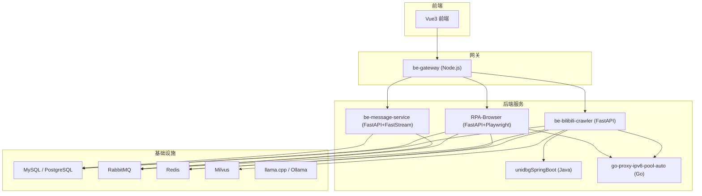
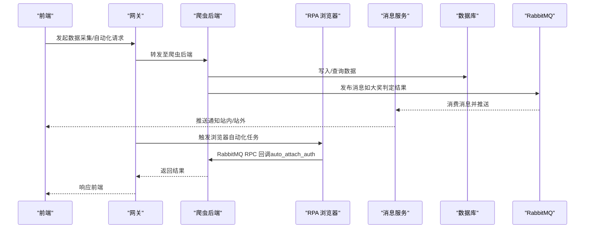
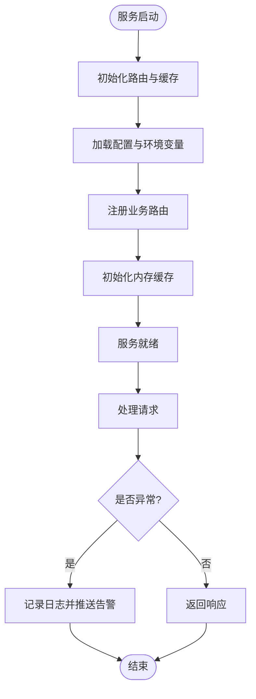
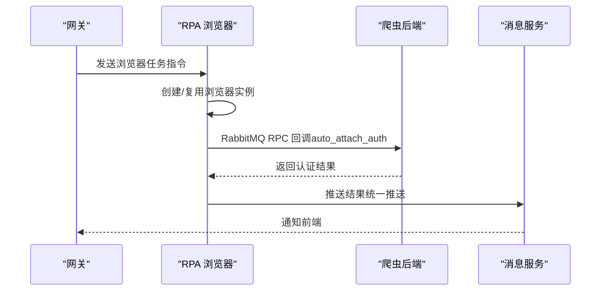
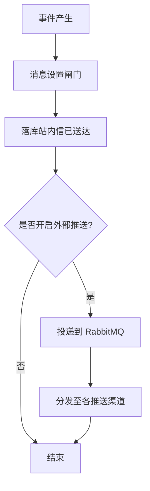
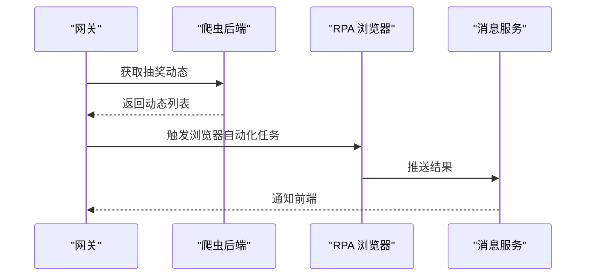
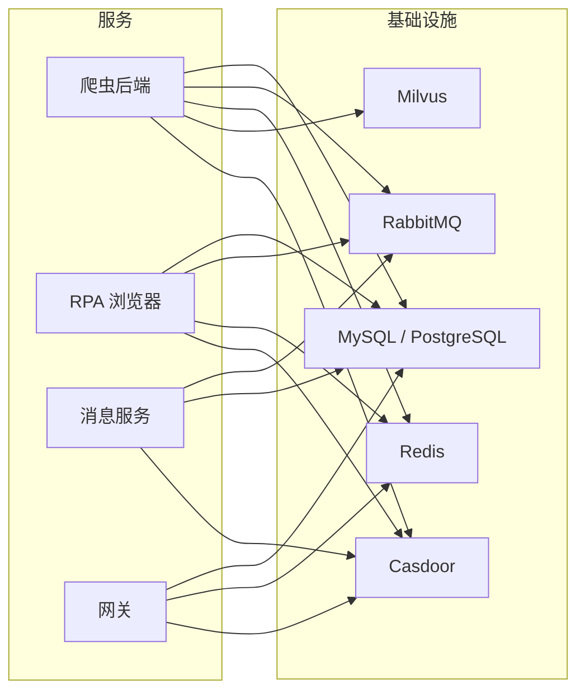

# 系统介绍

<cite>
**本文引用的文件**
- [README.md](file://README.md)
- [docker-compose.yml](file://docker-compose.yml)
- [be-bilibili-crawler/main.py](file://be-bilibili-crawler/main.py)
- [be-bilibili-crawler/CONFIG.py](file://be-bilibili-crawler/CONFIG.py)
- [RPA-Browser/README.md](file://RPA-Browser/README.md)
- [Vue3FrontEndDemoExercise/README.md](file://Vue3FrontEndDemoExercise/README.md)
- [be-gateway/index.js](file://be-gateway/index.js)
- [be-message-service/README.md](file://be-message-service/README.md)
</cite>

## 目录
1. [引言](#引言)
2. [项目结构](#项目结构)
3. [核心组件](#核心组件)
4. [架构总览](#架构总览)
5. [详细组件分析](#详细组件分析)
6. [依赖关系分析](#依赖关系分析)
7. [性能与可靠性考量](#性能与可靠性考量)
8. [故障排查指南](#故障排查指南)
9. [结论](#结论)
10. [附录：适用场景与目标用户](#附录适用场景与目标用户)

## 引言
BilibiliExplosion 是一个自建的多平台数据采集与自动化系统，聚焦 B 站（动态、官方、话题、预约等抽奖）以及山姆会员店等数据源。系统通过微服务化架构，将爬虫、浏览器自动化、消息推送、前端网关与签名计算等服务解耦，借助 Docker Compose 一键编排，提供从数据采集、处理、存储到展示与推送的完整能力链。其核心价值在于：
- 解决多平台数据采集复杂性：统一接入 B 站与山姆会员店等数据源，屏蔽反爬、验证码、登录态维护等复杂细节。
- 满足自动化需求：支持定时任务、事件驱动、批量执行与重试补偿，降低人工干预成本。
- 多平台支持与扩展性：以微服务拆分职责，便于新增数据源、渠道与业务模块。
- 业务价值明确：覆盖抽奖数据监控、用户行为分析、市场情报收集等场景，为运营与决策提供数据支撑。

## 项目结构
系统由多个子工程组成，通过 git submodule 聚合，并使用 docker-compose 统一编排运行。主要目录包括：
- be-bilibili-crawler：核心爬虫后端与数据 API，负责 B 站与山姆会员店的数据采集、清洗、存储与对外接口。
- RPA-Browser：基于 FastAPI + Playwright 的 RPA 浏览器自动化服务，负责受控浏览器执行、登录态续期、验证码处理与页面自动化。
- be-message-service：统一消息推送微服务，承载站内通知、事件提醒、私信与外部推送，提供 RabbitMQ RPC 与 HTTP 接口。
- be-gateway：Node.js 前端网关与账号/抽奖后端，协调各服务并驱动自动化流程。
- unidbgSpringBoot：Java Spring Boot 签名计算服务，用于 B 站签名生成。
- go-proxy-ipv6-pool-auto：Go 实现的自动 IPv6 代理池，提升网络稳定性与并发能力。
- bili-common：Python 公共依赖库，被多个 Python 服务复用。
- Vue3FrontEndDemoExercise：前端管理界面，提供抽奖数据可视化、任务管理与用户中心等功能。

**图表来源**
- [docker-compose.yml:120-164](file://docker-compose.yml#L120-L164)
- [docker-compose.yml:179-212](file://docker-compose.yml#L179-L212)
- [docker-compose.yml:227-260](file://docker-compose.yml#L227-L260)
- [docker-compose.yml:261-309](file://docker-compose.yml#L261-L309)
- [docker-compose.yml:323-356](file://docker-compose.yml#L323-L356)

**章节来源**
- [README.md:1-22](file://README.md#L1-L22)
- [docker-compose.yml:1-380](file://docker-compose.yml#L1-L380)

## 核心组件
- 爬虫后端（be-bilibili-crawler）：提供 B 站与山姆会员店数据采集、清洗、存储与 API 暴露；集成缓存、向量检索、LLM 辅助判定与消息推送。
- RPA 浏览器（RPA-Browser）：受控浏览器执行引擎，负责登录态续期、验证码处理、Cookie 维护与页面自动化，并通过 RabbitMQ RPC 与爬虫后端协作。
- 消息服务（be-message-service）：统一站内信与外部推送，采用读扩散与写扩散策略，支持分片存储、死信补偿与免打扰时段。
- 网关（be-gateway）：Node.js 网关与自动化调度入口，协调抽奖流程、直播弹幕与第三方服务调用。
- 签名服务（unidbgSpringBoot）：提供 B 站签名计算能力，保障请求合法性。
- 代理池（go-proxy-ipv6-pool-auto）：自动 IPv6 代理池，提升网络稳定性与并发能力。
- 前端（Vue3FrontEndDemoExercise）：提供数据可视化、任务管理、用户中心与主题切换等能力。

**章节来源**
- [be-bilibili-crawler/main.py:48-60](file://be-bilibili-crawler/main.py#L48-L60)
- [RPA-Browser/README.md:1-27](file://RPA-Browser/README.md#L1-L27)
- [be-message-service/README.md:1-30](file://be-message-service/README.md#L1-L30)
- [be-gateway/index.js:176-256](file://be-gateway/index.js#L176-L256)
- [Vue3FrontEndDemoExercise/README.md:15-43](file://Vue3FrontEndDemoExercise/README.md#L15-L43)

## 架构总览
系统采用微服务架构，前后端分离，中间件与基础设施容器化部署。关键交互如下：
- 前端通过网关访问后端服务，网关负责认证、路由与自动化调度。
- 爬虫后端负责数据采集与处理，调用签名服务生成合法请求，使用 Redis/Milvus 进行缓存与向量检索，通过 RabbitMQ 与消息服务异步通信。
- RPA 浏览器在受控环境中执行页面自动化，处理验证码与登录态，通过 RabbitMQ RPC 回调爬虫后端。
- 消息服务统一管理站内信与外部推送，提供 RabbitMQ RPC 与 HTTP 接口，支持分片存储与死信补偿。
- 代理池为爬虫与 RPA 提供稳定的 IPv6 代理出口，提升成功率与并发能力。

**图表来源**
- [be-gateway/index.js:176-256](file://be-gateway/index.js#L176-L256)
- [be-bilibili-crawler/main.py:48-60](file://be-bilibili-crawler/main.py#L48-L60)
- [RPA-Browser/README.md:88-97](file://RPA-Browser/README.md#L88-L97)
- [be-message-service/README.md:293-303](file://be-message-service/README.md#L293-L303)

## 详细组件分析

### 爬虫后端（be-bilibili-crawler）
- 功能：提供 B 站与山姆会员店数据采集、清洗、存储与 API；集成缓存、向量检索、LLM 辅助判定与消息推送。
- 关键点：
  - 启动时注册路由与缓存，提供健康检查与异常处理。
  - 配置集中管理，支持环境变量注入与多环境适配。
  - 通过 RabbitMQ 与消息服务异步通信，实现大奖判定与推送。
  - 使用 Milvus 进行向量检索，提升数据分析能力。

**图表来源**
- [be-bilibili-crawler/main.py:48-112](file://be-bilibili-crawler/main.py#L48-L112)

**章节来源**
- [be-bilibili-crawler/main.py:48-112](file://be-bilibili-crawler/main.py#L48-L112)
- [be-bilibili-crawler/CONFIG.py:225-277](file://be-bilibili-crawler/CONFIG.py#L225-L277)

### RPA 浏览器（RPA-Browser）
- 功能：受控浏览器执行引擎，负责登录态续期、验证码处理、Cookie 维护与页面自动化。
- 关键点：
  - 基于 FastAPI + Playwright，支持任务调度与指纹管理。
  - 通过 RabbitMQ RPC 与爬虫后端协作，实现 auto_attach_auth 模式。
  - 对接消息服务，实现统一推送。

**图表来源**
- [RPA-Browser/README.md:88-97](file://RPA-Browser/README.md#L88-L97)

**章节来源**
- [RPA-Browser/README.md:1-27](file://RPA-Browser/README.md#L1-L27)
- [RPA-Browser/README.md:88-104](file://RPA-Browser/README.md#L88-L104)

### 消息服务（be-message-service）
- 功能：统一站内信与外部推送，支持读扩散与写扩散策略，提供 RabbitMQ RPC 与 HTTP 接口。
- 关键点：
  - 站内信采用读扩散（通知）与写扩散（事件/私信），保证高可用与可扩展性。
  - 私信正文按月分库分表，支持死信补偿与预热建表。
  - 外部推送独立于站内信，支持多种渠道（PushMe、钉钉、飞书等）。

**图表来源**
- [be-message-service/README.md:31-48](file://be-message-service/README.md#L31-L48)

**章节来源**
- [be-message-service/README.md:1-30](file://be-message-service/README.md#L1-L30)
- [be-message-service/README.md:52-68](file://be-message-service/README.md#L52-L68)
- [be-message-service/README.md:293-303](file://be-message-service/README.md#L293-L303)

### 网关（be-gateway）
- 功能：Node.js 网关与自动化调度入口，协调抽奖流程、直播弹幕与第三方服务调用。
- 关键点：
  - 定时获取抽奖动态，驱动自动化流程。
  - 支持多账号并行执行，具备错误重试与日志记录。
  - 与爬虫后端、RPA 浏览器与消息服务协同工作。

**图表来源**
- [be-gateway/index.js:47-170](file://be-gateway/index.js#L47-L170)

**章节来源**
- [be-gateway/index.js:176-256](file://be-gateway/index.js#L176-L256)

### 前端（Vue3FrontEndDemoExercise）
- 功能：提供数据可视化、任务管理、用户中心与主题切换等能力。
- 关键点：
  - 基于 Vue 3 + TypeScript，支持响应式设计与多设备适配。
  - 集成 GraphQL 与 RESTful API，提供类型安全的请求封装。
  - 支持深色/浅色主题切换与全局加载遮罩。

**章节来源**
- [Vue3FrontEndDemoExercise/README.md:15-43](file://Vue3FrontEndDemoExercise/README.md#L15-L43)
- [Vue3FrontEndDemoExercise/README.md:136-161](file://Vue3FrontEndDemoExercise/README.md#L136-L161)

## 依赖关系分析
系统依赖关系清晰，各服务通过 Docker Compose 编排，共享基础设施（MySQL、Redis、RabbitMQ、Milvus、PostgreSQL）。关键依赖如下：
- 爬虫后端依赖 MySQL、Redis、RabbitMQ、Milvus、签名服务与消息服务。
- RPA 浏览器依赖 PostgreSQL、Redis、RabbitMQ、Casdoor 与消息服务。
- 消息服务依赖 RabbitMQ、MySQL 与 Casdoor。
- 网关依赖 PostgreSQL、Redis 与 Casdoor。

**图表来源**
- [docker-compose.yml:120-164](file://docker-compose.yml#L120-L164)
- [docker-compose.yml:179-212](file://docker-compose.yml#L179-L212)
- [docker-compose.yml:227-260](file://docker-compose.yml#L227-L260)
- [docker-compose.yml:261-309](file://docker-compose.yml#L261-L309)

**章节来源**
- [docker-compose.yml:1-380](file://docker-compose.yml#L1-L380)

## 性能与可靠性考量
- 连接池优化：爬虫后端与业务服务使用独立的 SQLAlchemy 连接池，避免爬虫高并发影响业务请求。
- 缓存与向量检索：使用 Redis 与 Milvus 提升查询性能与分析能力。
- 异步处理：通过 RabbitMQ 实现异步消息处理，提升系统吞吐量与可靠性。
- 分片存储：消息服务私信正文按月分库分表，支持死信补偿与预热建表，保证高可用与可扩展性。
- 代理池：IPv6 代理池提升网络稳定性与并发能力，降低反爬风险。

**章节来源**
- [be-bilibili-crawler/CONFIG.py:381-419](file://be-bilibili-crawler/CONFIG.py#L381-L419)
- [be-message-service/README.md:52-68](file://be-message-service/README.md#L52-L68)

## 故障排查指南
- 常见问题：
  - Milvus 无法读写：检查权限与挂载目录。
  - WSL2 网络连接问题：重启 winnat。
  - 消息服务健康检查失败：检查 RabbitMQ 连通性。
- 排查步骤：
  - 查看服务日志与错误堆栈。
  - 检查依赖服务状态（MySQL、Redis、RabbitMQ 等）。
  - 验证配置文件与环境变量。

**章节来源**
- [README.md:116-121](file://README.md#L116-L121)
- [be-message-service/README.md:109-121](file://be-message-service/README.md#L109-L121)

## 结论
BilibiliExplosion 通过微服务化架构与容器化部署，提供了完整的 B 站与山姆会员店数据采集与自动化解决方案。系统具备高扩展性、高可用性与易维护性，适用于抽奖数据监控、用户行为分析、市场情报收集等场景。未来可进一步扩展数据源与推送渠道，提升智能化水平与用户体验。

## 附录：适用场景与目标用户
- 适用场景：
  - 抽奖数据监控：实时跟踪 B 站各类抽奖活动，及时获取中奖信息。
  - 用户行为分析：采集用户互动数据，分析行为模式与偏好。
  - 市场情报收集：监控山姆会员店等商品动态，支持市场决策。
- 目标用户：
  - 运营人员：需要自动化数据采集与监控工具。
  - 数据分析师：需要高质量数据进行分析与建模。
  - 开发者：需要可扩展的微服务架构与 API 接口。

**章节来源**
- [README.md:5-10](file://README.md#L5-L10)
- [Vue3FrontEndDemoExercise/README.md:15-28](file://Vue3FrontEndDemoExercise/README.md#L15-L28)