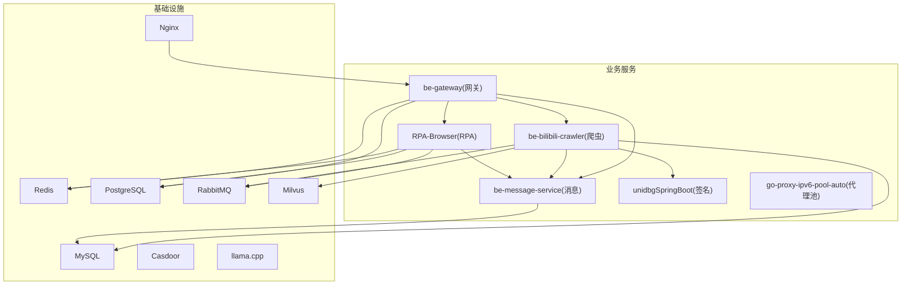
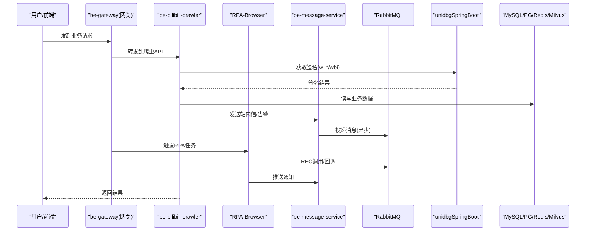
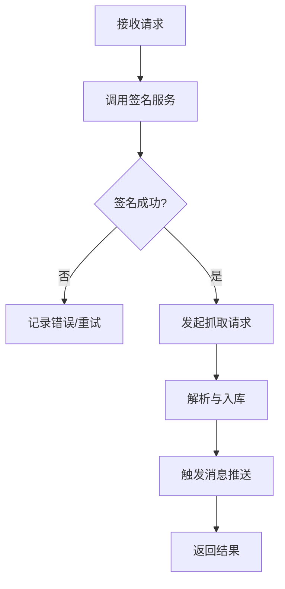
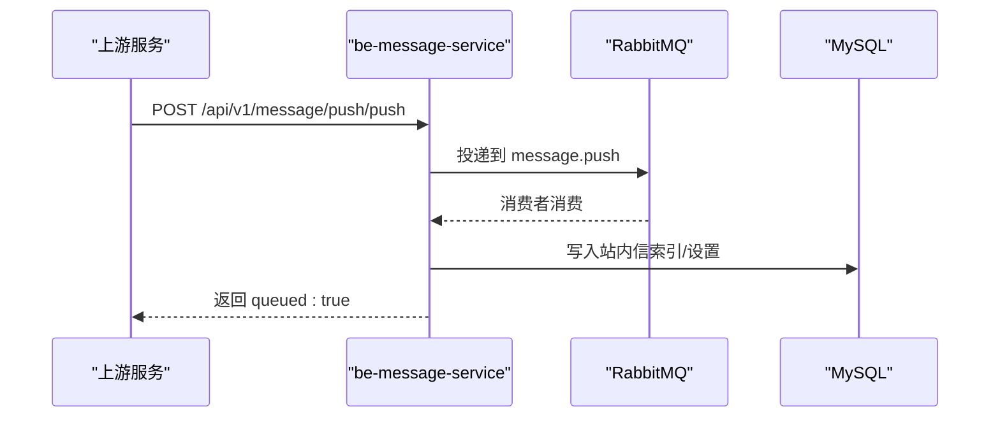
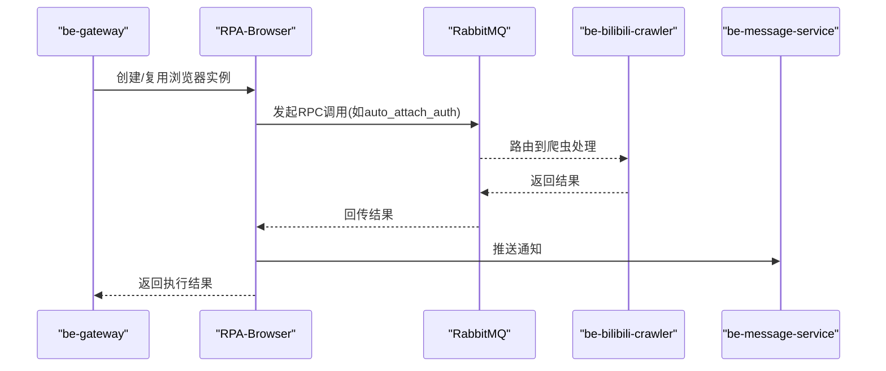
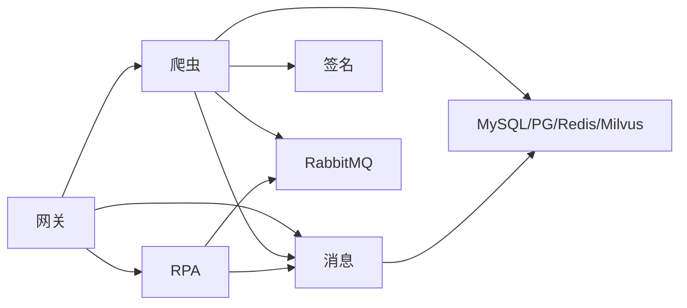

# 项目概述

<cite>
**本文引用的文件**
- [README.md](file://README.md)
- [docker-compose.yml](file://docker-compose.yml)
- [Makefile](file://Makefile)
- [be-bilibili-crawler/README.md](file://be-bilibili-crawler/README.md)
- [be-message-service/README.md](file://be-message-service/README.md)
- [RPA-Browser/README.md](file://RPA-Browser/README.md)
- [unidbgSpringBoot/README.md](file://unidbgSpringBoot/README.md)
- [go-proxy-ipv6-pool-auto/README.md](file://go-proxy-ipv6-pool-auto/README.md)
- [be-gateway/README.md](file://be-gateway/README.md)
</cite>

## 目录
1. [简介](#简介)
2. [项目结构](#项目结构)
3. [核心组件](#核心组件)
4. [架构总览](#架构总览)
5. [详细组件分析](#详细组件分析)
6. [依赖关系分析](#依赖关系分析)
7. [性能与扩展性](#性能与扩展性)
8. [部署与使用指南](#部署与使用指南)
9. [故障排查](#故障排查)
10. [结论](#结论)

## 简介
BilibiliExplosion 是一个自建 B 站（及山姆会员店等）数据采集与自动化系统。项目采用微服务架构，通过 Docker Compose 一键编排，覆盖爬虫后端、统一消息推送、RPA 浏览器自动化、签名计算、IPv6 代理池、前端网关与本地 LLM 判定等能力。其目标是：以稳定、可扩展的方式完成多平台数据采集、任务调度、结果入库与多渠道通知，并提供统一的 Web 入口与管理界面。

## 项目结构
根仓库聚合多个子工程，并通过 docker-compose 统一管理中间件与服务：
- 基础设施：MySQL、Redis、PostgreSQL、RabbitMQ、Milvus、Casdoor、Nginx、llama.cpp
- 业务服务：
  - be-bilibili-crawler：核心爬虫后端与数据 API
  - be-message-service：统一消息推送与站内信
  - RPA-Browser：基于 Playwright 的 RPA 浏览器自动化服务
  - unidbgSpringBoot：B 站签名计算服务
  - go-proxy-ipv6-pool-auto：自动 IPv6 代理池
  - be-gateway：前端网关与 Node.js 后端（反向代理、账号、任务调度）
- 公共库：bili-common（Python 公共依赖）
- 前端：Vue3FrontEndDemoExercise（管理端与用户端页面）

图表来源
- [docker-compose.yml:1-380](file://docker-compose.yml#L1-L380)

章节来源
- [README.md:12-52](file://README.md#L12-L52)
- [docker-compose.yml:1-380](file://docker-compose.yml#L1-L380)

## 核心组件
- 爬虫后端（be-bilibili-crawler）
  - 负责 B 站抽奖动态、话题抽奖、预约抽奖、山姆会员店等数据的抓取、解析、入库与判定；提供数据 API；对接签名服务、向量库、消息队列与统一推送。
- 统一消息服务（be-message-service）
  - 承载站内四大消息模块（系统通知、事件提醒、私信、消息设置），并集中接管外部推送渠道；提供 HTTP 与 RabbitMQ RPC 接口。
- RPA 浏览器（RPA-Browser）
  - 基于 Playwright 的受控浏览器自动化，执行登录态续期、验证码处理、Cookie 维护、页面自动化等；通过 RabbitMQ RPC 与消息服务联动。
- 签名计算（unidbgSpringBoot）
  - 加载 B 站 App 原生库进行签名计算，返回 w_*/wbi 等参数供爬虫请求使用。
- IPv6 代理池（go-proxy-ipv6-pool-auto）
  - 将宿主机可用 IPv6 地址暴露为 SOCKS5/HTTP 代理出口，实现请求级 IP 轮换，降低风控概率。
- 前端网关（be-gateway）
  - Express 网关，统一对外暴露 API，反向代理至各后端服务；集成 Casdoor 单点登录、账号管理、抽奖任务调度与队列面板。

章节来源
- [be-bilibili-crawler/README.md:1-17](file://be-bilibili-crawler/README.md#L1-L17)
- [be-message-service/README.md:1-20](file://be-message-service/README.md#L1-L20)
- [RPA-Browser/README.md:1-16](file://RPA-Browser/README.md#L1-L16)
- [unidbgSpringBoot/README.md:1-10](file://unidbgSpringBoot/README.md#L1-L10)
- [go-proxy-ipv6-pool-auto/README.md:1-13](file://go-proxy-ipv6-pool-auto/README.md#L1-L13)
- [be-gateway/README.md:1-15](file://be-gateway/README.md#L1-L15)

## 架构总览
系统采用“网关 + 微服务 + 中间件”的分层架构：
- 接入层：Nginx 作为静态资源与反向代理入口，be-gateway 提供统一 REST 网关与业务编排。
- 服务层：爬虫、消息、RPA、签名、代理池各自独立部署，通过 HTTP/RabbitMQ 通信。
- 数据层：MySQL/PostgreSQL 存储业务数据，Redis 缓存与队列，Milvus 向量检索，llama.cpp 本地推理。
- 安全与认证：Casdoor 统一身份认证，网关注入可信用户上下文。

图表来源
- [docker-compose.yml:120-164](file://docker-compose.yml#L120-L164)
- [docker-compose.yml:179-212](file://docker-compose.yml#L179-L212)
- [docker-compose.yml:227-260](file://docker-compose.yml#L227-L260)
- [docker-compose.yml:261-309](file://docker-compose.yml#L261-L309)
- [be-gateway/README.md:99-109](file://be-gateway/README.md#L99-L109)
- [be-bilibili-crawler/README.md:103-117](file://be-bilibili-crawler/README.md#L103-L117)
- [RPA-Browser/README.md:88-97](file://RPA-Browser/README.md#L88-L97)
- [be-message-service/README.md:293-303](file://be-message-service/README.md#L293-L303)

## 详细组件分析

### 爬虫后端（be-bilibili-crawler）
- 职责
  - 采集 B 站各类抽奖与山姆商品数据，解析入库，提供数据 API。
  - 对接签名服务、向量库、消息队列与统一推送。
  - 内置运维脚本（大奖判定、rawJsonStr 回填、Alembic 迁移）。
- 关键流程
  - 请求进入后，先向签名服务获取签名，再构造请求抓取数据。
  - 数据入库后，通过消息服务进行站内信或外部推送。
  - 可选调用本地 LLM 进行大奖判定。

图表来源
- [be-bilibili-crawler/README.md:103-117](file://be-bilibili-crawler/README.md#L103-L117)
- [unidbgSpringBoot/README.md:63-78](file://unidbgSpringBoot/README.md#L63-L78)

章节来源
- [be-bilibili-crawler/README.md:1-17](file://be-bilibili-crawler/README.md#L1-L17)
- [be-bilibili-crawler/README.md:58-101](file://be-bilibili-crawler/README.md#L58-L101)
- [be-bilibili-crawler/README.md:119-175](file://be-bilibili-crawler/README.md#L119-L175)

### 统一消息服务（be-message-service）
- 职责
  - 站内信四大模块：系统通知（读扩散）、事件提醒（写扩散）、私信（写扩散+分片）、消息设置（闸门）。
  - 外部推送：PushMe/PushPlus/邮箱/Bark/钉钉/飞书/Ntfy/WxPusher 等。
  - 提供 HTTP 与 RabbitMQ RPC 接口，供其他服务同步/异步调用。
- 关键机制
  - 首次部署无需手工 DDL，启动时自动建库与迁移。
  - 私信正文按月分库、库内分表，异步落库，死信补偿。
  - 健康检查 /health 同时校验 broker 连通性。

图表来源
- [be-message-service/README.md:125-142](file://be-message-service/README.md#L125-L142)
- [be-message-service/README.md:239-265](file://be-message-service/README.md#L239-L265)
- [docker-compose.yml:261-309](file://docker-compose.yml#L261-L309)

章节来源
- [be-message-service/README.md:1-20](file://be-message-service/README.md#L1-L20)
- [be-message-service/README.md:52-68](file://be-message-service/README.md#L52-L68)
- [be-message-service/README.md:84-121](file://be-message-service/README.md#L84-L121)
- [be-message-service/README.md:184-265](file://be-message-service/README.md#L184-L265)

### RPA 浏览器（RPA-Browser）
- 职责
  - 受控浏览器实例生命周期管理、登录态续期、验证码/滑块处理、Cookie 维护、指纹管理。
  - 通过 RabbitMQ RPC 与爬虫后端交互，并对接消息服务进行推送。
- 关键流程
  - 网关或爬虫触发 RPA 任务，RPA 在容器内执行浏览器操作，完成后回调或推送结果。

图表来源
- [RPA-Browser/README.md:88-97](file://RPA-Browser/README.md#L88-L97)
- [docker-compose.yml:227-260](file://docker-compose.yml#L227-L260)

章节来源
- [RPA-Browser/README.md:1-16](file://RPA-Browser/README.md#L1-L16)
- [RPA-Browser/README.md:29-50](file://RPA-Browser/README.md#L29-L50)
- [RPA-Browser/README.md:73-86](file://RPA-Browser/README.md#L73-L86)

### 签名计算（unidbgSpringBoot）
- 职责
  - 加载 B 站 App 原生库，模拟执行签名算法，返回 w_*/wbi 等参数。
- 关键点
  - 仅负责签名计算，不发起网络抓取。
  - 端口默认 23335，由 docker-compose 映射。

章节来源
- [unidbgSpringBoot/README.md:1-10](file://unidbgSpringBoot/README.md#L1-L10)
- [unidbgSpringBoot/README.md:36-55](file://unidbgSpringBoot/README.md#L36-L55)
- [unidbgSpringBoot/README.md:63-78](file://unidbgSpringBoot/README.md#L63-L78)

### IPv6 代理池（go-proxy-ipv6-pool-auto）
- 职责
  - 监控宿主机 IPv6 地址，为每个可用地址提供 SOCKS5/HTTP 代理出口，实现请求级 IP 轮换。
- 关键点
  - 需启用宿主 IPv6 并配置 ndppd。
  - 爬虫与 RPA 通过 proxy_server_url 指向该代理池。

章节来源
- [go-proxy-ipv6-pool-auto/README.md:1-13](file://go-proxy-ipv6-pool-auto/README.md#L1-L13)
- [go-proxy-ipv6-pool-auto/README.md:55-88](file://go-proxy-ipv6-pool-auto/README.md#L55-L88)

### 前端网关（be-gateway）
- 职责
  - 统一对外 API，反向代理至爬虫、RPA、消息服务；集成 Casdoor 单点登录、账号管理、抽奖任务调度与队列面板。
- 关键点
  - 环境变量注入上游服务地址（BILI_CRAWLER_URI、RPA_SERVICE_URI、MESSAGE_SERVICE_URI）。
  - 健康检查 /ping。

章节来源
- [be-gateway/README.md:1-15](file://be-gateway/README.md#L1-L15)
- [be-gateway/README.md:79-97](file://be-gateway/README.md#L79-L97)
- [be-gateway/README.md:99-109](file://be-gateway/README.md#L99-L109)

## 依赖关系分析
- 服务间耦合
  - 网关对爬虫、RPA、消息服务存在 HTTP 反向代理依赖。
  - 爬虫依赖签名服务、消息服务、向量库、数据库与代理池。
  - RPA 依赖消息服务、数据库、代理池与 RabbitMQ RPC。
  - 消息服务依赖数据库与 RabbitMQ。
- 中间件依赖
  - MySQL/PostgreSQL：持久化业务数据与消息索引。
  - Redis：缓存与队列。
  - RabbitMQ：异步消息与 RPC。
  - Milvus：向量检索（用于内容相似度等场景）。
  - llama.cpp：本地推理（大奖判定）。
  - Casdoor：统一认证。

图表来源
- [docker-compose.yml:120-164](file://docker-compose.yml#L120-L164)
- [docker-compose.yml:179-212](file://docker-compose.yml#L179-L212)
- [docker-compose.yml:227-260](file://docker-compose.yml#L227-L260)
- [docker-compose.yml:261-309](file://docker-compose.yml#L261-L309)

章节来源
- [docker-compose.yml:1-380](file://docker-compose.yml#L1-L380)

## 性能与扩展性
- 水平扩展
  - 消息服务支持多实例，MSGKEY_WORKER_ID 需互不相同以避免雪花 ID 冲突。
  - 爬虫与 RPA 可通过多实例配合代理池提升并发与抗风控能力。
- 异步与解耦
  - 大量写路径通过 RabbitMQ 异步处理，降低主链路 RT。
  - 私信正文异步落分片，失败走死信补偿，保证最终一致。
- 存储优化
  - 私信按时间分库分表，避免大表瓶颈。
  - 游标与唯一约束保障幂等与去重。
- 可观测性
  - 健康检查 /health 与日志输出便于排障。
  - 队列面板（网关）便于监控任务积压。

[本节为通用指导，不直接分析具体文件]

## 部署与使用指南
- 前置条件
  - 安装 uv（Python 依赖管理）、Node.js（网关）、Go（代理池）、Java/Maven（签名服务）。
  - 确保宿主机启用 IPv6 并配置 ndppd（代理池需要）。
- 克隆与初始化
  - 使用 git clone --recurse-submodules 拉取仓库，或执行 make submodule-init。
  - 更新子模块：make update。
- 启动服务
  - 推荐方式：docker compose up -d
  - 也可使用 Makefile 命令：make start / make stop / make logs 等。
- 常用命令
  - 启动所有服务：make all
  - 启动除 fastapi 外的服务：make start-excluding-fastapi
  - 查看日志：make logs [SERVICE]
  - 清理环境：make clean
- 各子工程本地运行
  - 爬虫：uv sync + npm install + uv run python main.py（端口 23333）
  - 消息：uv sync + uv run uvicorn app.main:app --port 18739
  - RPA：uv sync + uv run python main.py（端口 28000）
  - 签名：./mvnw clean package 后 java -jar target/*.jar（端口 23335）
  - 代理池：go build -o proxy-pool 并运行（SOCKS5/HTTP 端口）
  - 网关：npm install 后 npm run dev/prod（端口 9923）

章节来源
- [README.md:54-110](file://README.md#L54-L110)
- [Makefile:1-71](file://Makefile#L1-L71)
- [be-bilibili-crawler/README.md:58-80](file://be-bilibili-crawler/README.md#L58-L80)
- [be-message-service/README.md:145-164](file://be-message-service/README.md#L145-L164)
- [RPA-Browser/README.md:52-71](file://RPA-Browser/README.md#L52-L71)
- [unidbgSpringBoot/README.md:36-55](file://unidbgSpringBoot/README.md#L36-L55)
- [go-proxy-ipv6-pool-auto/README.md:38-63](file://go-proxy-ipv6-pool-auto/README.md#L38-L63)
- [be-gateway/README.md:48-77](file://be-gateway/README.md#L48-L77)

## 故障排查
- 常见环境问题
  - Milvus 无法读写：调整目录权限（chown 999:999）。
  - WSL2 mirrored 网络问题：重启 winnat。
  - IPv6 代理池为空：确认宿主机已分配 IPv6 段且 ndppd 正常。
- 服务健康检查
  - 消息服务：curl http://localhost:18739/health（204=存活且 broker 连通，503=未连）
  - 网关：/ping
- 日志与调试
  - 使用 make logs [SERVICE] 查看容器日志。
  - 网关提供队列面板（仅 localhost）观察任务状态。

章节来源
- [README.md:116-121](file://README.md#L116-L121)
- [be-message-service/README.md:109-121](file://be-message-service/README.md#L109-L121)
- [be-gateway/README.md:85-97](file://be-gateway/README.md#L85-L97)

## 结论
BilibiliExplosion 通过清晰的微服务拆分与统一的网关接入，实现了数据采集、自动化、消息推送与智能判定的全链路闭环。借助 Docker Compose 的一键编排与丰富的中间件生态，系统在可扩展性、稳定性与可维护性方面具备良好基础。对于初学者，建议从阅读各子工程的 README 开始，结合 docker compose 快速搭建环境，逐步理解各组件的职责与协作方式。